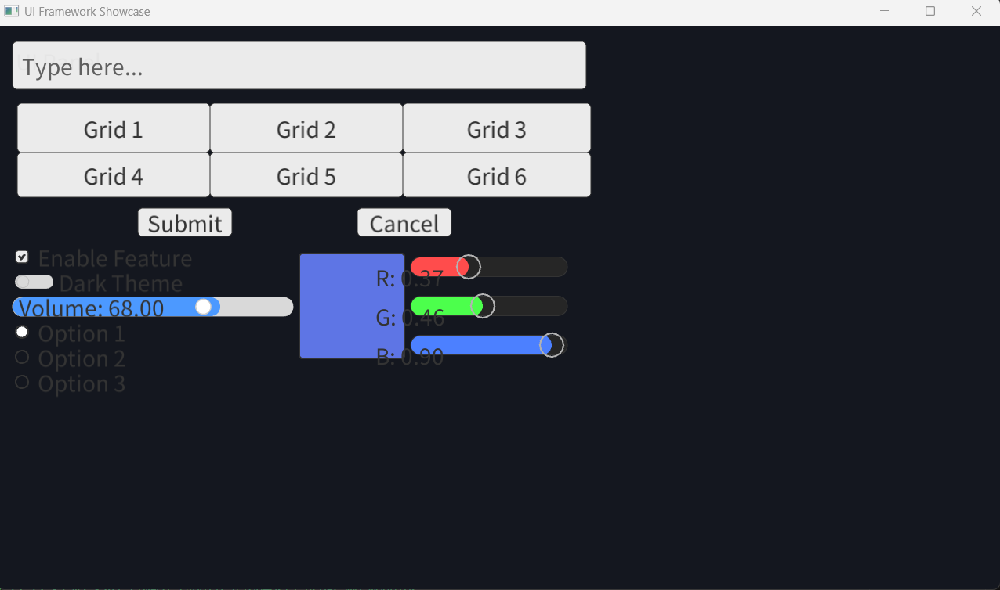
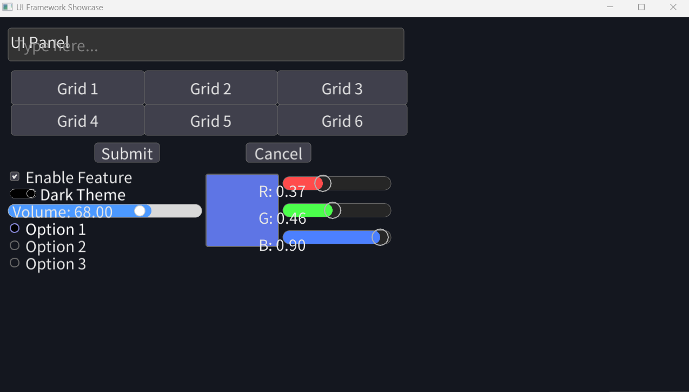
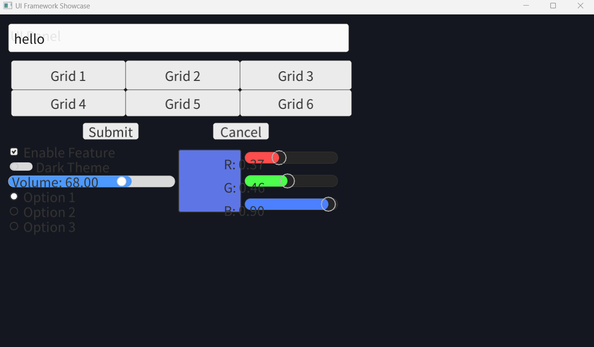
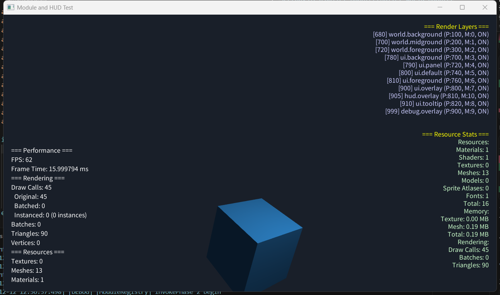
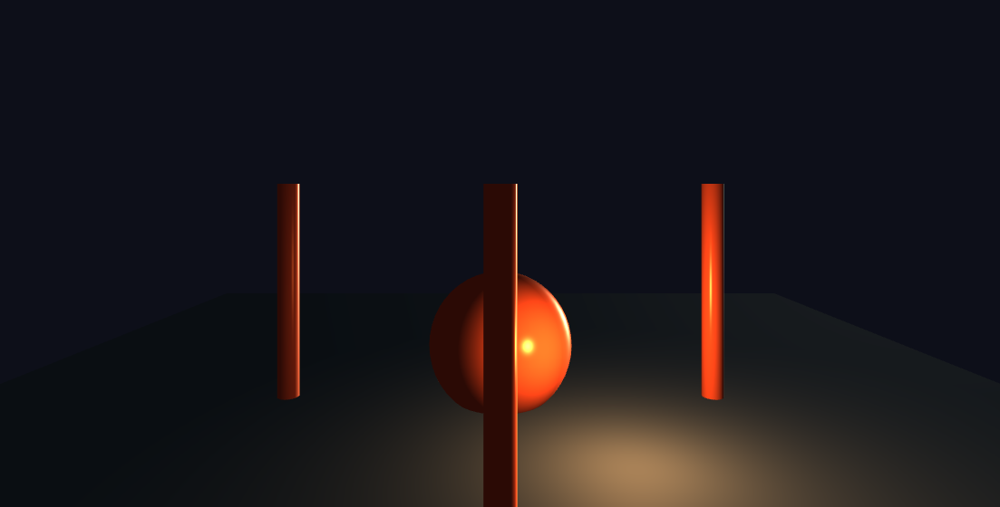
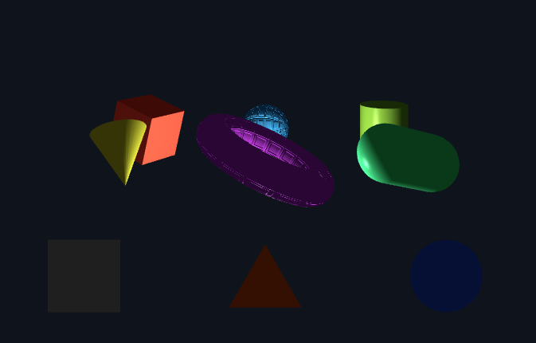
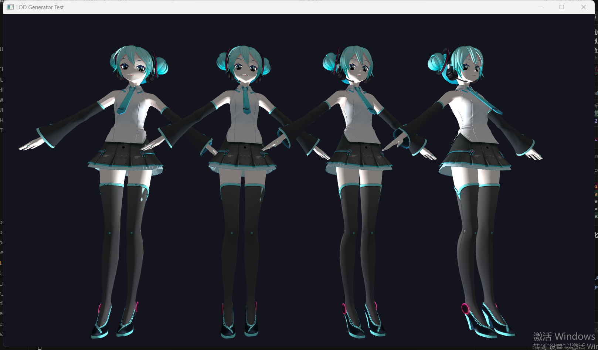
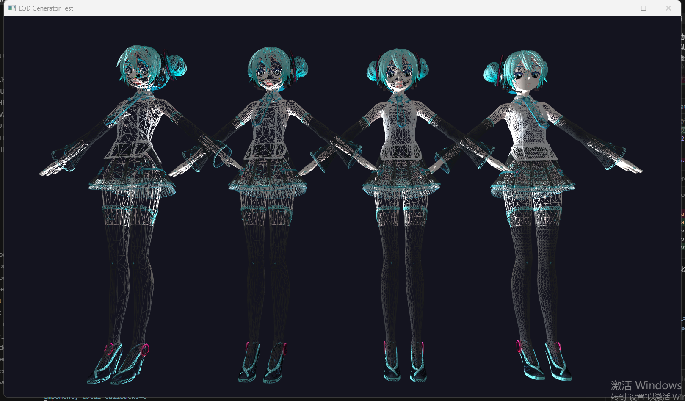

<p align="center">
  <h1 align="center">RenderEngine</h1>
</p>

<p align="center">
  
  
  
  
  
  
  
</p>

<p align="center">
  <a href="README.md">中文</a> | <a href="README_EN.md">English</a>
</p>

## 📸 Feature Showcase

### 🎨 UI System

Complete UI framework with light/dark theme support, text rendering, and modular HUD system.

<p align="center">
  
  
</p>

<p align="center">
  
  
</p>

### 💡 3D Rendering & Lighting

Supports multiple light types (directional lights, point lights, spotlights) and normal mapping for realistic 3D rendering effects.

<p align="center">
  
  
</p>

### 🎯 LOD System

Automatic mesh simplification system that dynamically adjusts model detail levels based on distance to improve rendering performance.

<p align="center">
  
  
</p>

---

A modern C++20-based 3D rendering engine featuring ECS (Entity Component System) architecture, supporting 2D/3D rendering, UI system, sprite animation, lighting system, and asynchronous resource loading.

## Core Features

### Rendering Engine Core
- ✅ **OpenGL 4.5+** rendering backend with modern graphics API support
- ✅ **SDL3** window management and input handling
- ✅ **Modular Architecture** Clear layered design with well-separated responsibilities
- ✅ **Shader System** Vertex/fragment/geometry shaders with hot-reload and caching support
- ✅ **Texture System** PNG/JPG/BMP/TGA support with asynchronous loading
- ✅ **Mesh System** 10+ preset geometries, Assimp model loading support (OBJ/FBX/GLTF, etc.)
- ✅ **Material System** Phong lighting model with normal mapping and skeletal animation support
- ✅ **Resource Manager** Unified interface with smart reference counting and dependency management
- ✅ **Fully Thread-Safe** Safe design for multi-threaded environments

### ECS Architecture System
- ✅ **Entity Component System** Flexible entity-component system
- ✅ **Component System** Core components: Transform, MeshRender, Sprite, Camera, Light, UI, etc.
- ✅ **System Architecture** RenderSystem, AnimationSystem, TransformSystem, UISystem, etc.
- ✅ **Scene Management** Scene switching, serialization, and scene graph support

### 2D Rendering System
- ✅ **Sprite System** Sprite, SpriteSheet, SpriteAtlas support
- ✅ **Sprite Animation** State machine-driven animation system with animation events
- ✅ **Sprite Batching** Efficient rendering of large numbers of sprites
- ✅ **Text Rendering** TTF font support with text renderer

### UI System
- ✅ **UI Framework** Complete UI control system (buttons, text boxes, sliders, menus, etc.)
- ✅ **Layout System** Flex and Grid layouts with responsive design
- ✅ **Theme System** Configurable UI themes
- ✅ **Menu System** UIMenu, UIPullDownMenu, inspired by Blender UI design

### 3D Rendering & Lighting
- ✅ **Lighting System** Directional lights, point lights, and spotlights
- ✅ **Normal Mapping** Complete normal mapping support
- ✅ **Skeletal Animation** Bone palette system
- ✅ **Post-Processing** Frame buffer support with post-processing effects foundation

### Performance Optimization System
- ✅ **LOD System** Automatic mesh simplification (meshoptimizer) with distance-based detail levels
- ✅ **Instanced Rendering** GPU instancing integrated with LOD system
- ✅ **Batching System** Multiple strategies: CPU batching and GPU instancing
- ✅ **Material Sorting** Reduces GPU state switches
- ✅ **Frustum Culling** Efficient culling system
- ✅ **Math Library Optimization** AVX2 SIMD, smart caching, OpenMP parallel processing

## Technology Stack

### Core Dependencies
- **C++20** Modern C++ standard, leveraging concepts, smart pointers, and other features
- **OpenGL 4.5+** Cross-platform graphics rendering API
- **SDL3** Window management, input handling, cross-platform support
- **Eigen3** High-performance math library (vectors, matrices, quaternions)
- **GLAD** OpenGL function loader

### Extended Functionality Libraries
- **Assimp** 3D model loading (OBJ, FBX, GLTF, Collada, MMD, etc.)
- **SDL3_image** Image format support (PNG, JPG, BMP, TGA)
- **SDL3_ttf** Font rendering and text support
- **meshoptimizer** Mesh optimization and LOD generation
- **nlohmann/json** JSON serialization and configuration

All third-party libraries are included in the `third_party/` directory and require no additional installation.

## Build Guide

### Prerequisites
- **CMake 3.15+**
- **C++20 compatible compiler** (MSVC 2019+, GCC 10+, Clang 12+)
- **OpenGL 4.5+** driver support

### Windows

Using Visual Studio 2022:

#### Method 1: Using Automated Script (Recommended)

Use the automated script to set up all dependencies in one step:

```powershell
# Run dependency setup script (automatically downloads and configures all third-party libraries)
PowerShell -ExecutionPolicy Bypass -File ".\setup-dependencies.ps1"

# Build Release version
mkdir build; cd build; cmake ..; cd ..
cmake --build build --config Release

# Run example
.\build\bin\Release\01_basic_window.exe
```

**Script Features**:
- Automatically clones all required third-party libraries
- Automatically runs Get-GitModules.ps1 script
- Automatically copies required cmake files for SDL3_ttf
- Automatically downloads and extracts Eigen3
- Intelligently detects existing libraries to avoid redundant downloads
- Supports selective skipping of certain libraries (using `-SkipEigen`, `-SkipSDL`, etc.)

#### Method 2: Manual Setup

If you need manual control over each step, follow these instructions:

```batch
# Get third-party libraries
cd third_party
git clone https://github.com/libsdl-org/SDL.git
git clone https://github.com/libsdl-org/SDL_image.git
cd SDL_image\external
PowerShell -ExecutionPolicy Bypass -File ".\Get-GitModules.ps1"
cd ..\..\SDL3_ttf-3.2.2\external
PowerShell -ExecutionPolicy Bypass -File ".\Get-GitModules.ps1"
cd ..\..
git clone https://github.com/nlohmann/json.git
git clone https://github.com/assimp/assimp.git
git clone https://github.com/zeux/meshoptimizer.git
git clone https://github.com/bulletphysics/bullet3.git

# Copy required cmake files for SDL3_ttf
copy "third_party\SDL\cmake\GetGitRevisionDescription.cmake" "third_party\SDL3_ttf-3.2.2\cmake\GetGitRevisionDescription.cmake"
copy "third_party\SDL\cmake\PkgConfigHelper.cmake" "third_party\SDL3_ttf-3.2.2\cmake\PkgConfigHelper.cmake"
copy "third_party\SDL\cmake\sdlcpu.cmake" "third_party\SDL3_ttf-3.2.2\cmake\sdlcpu.cmake"
copy "third_party\SDL\cmake\sdlplatform.cmake" "third_party\SDL3_ttf-3.2.2\cmake\sdlplatform.cmake"
copy "third_party\SDL\cmake\sdlmanpages.cmake" "third_party\SDL3_ttf-3.2.2\cmake\sdlmanpages.cmake"
copy "third_party\SDL_image\cmake\PrivateSdlFunctions.cmake" "third_party\SDL3_ttf-3.2.2\cmake\PrivateSdlFunctions.cmake"

# Get Eigen
wget "https://gitlab.com/libeigen/eigen/-/archive/3.4.0/eigen-3.4.0.zip" -OutFile "eigen-3.4.0.zip"
Expand-Archive -Path "eigen-3.4.0.zip" -DestinationPath "."

# Build Release version
cd .. # Return to main directory
mkdir build; cd build; cmake ..; cd ..
cmake --build build --config Release

# Run example
.\build\bin\Release\01_basic_window.exe
```

**Note**: If the SDL3_ttf-3.2.2 directory doesn't exist, please manually download and extract it to the `third_party/` directory.

### Build Options
- `BUILD_EXAMPLES=ON` Build example programs (enabled by default)
- `BUILD_TESTS=ON` Build test programs (enabled by default)
- `ENABLE_OPENMP=ON` Enable OpenMP parallel processing (enabled by default, improves batch operation performance)

## Example Programs

The project includes **63 complete example programs** covering various engine modules:

### Basic Rendering Examples
```batch
01_basic_window.exe              # Basic window creation
02_shader_test.exe               # Shader system test
05_texture_test.exe              # Texture loading and rendering
06_mesh_test.exe                 # Mesh rendering
12_material_test.exe             # Material system test
```

### ECS System Examples
```batch
31_ecs_basic_test.exe            # ECS basic functionality
32_ecs_renderer_test.exe         # ECS rendering system
35_ecs_comprehensive_test.exe    # ECS comprehensive test
```

### 2D Rendering Examples
```batch
38_sprite_render_test.exe        # Sprite rendering
39_sprite_api_test.exe           # Sprite API usage
40_sprite_animation_test.exe     # Sprite animation system
41_sprite_batch_test.exe         # Sprite batching
42_sprite_state_machine_test.exe # Animation state machine
44_text_render_test.exe          # Text rendering
```

### 3D Rendering Examples
```batch
20_camera_test.exe               # Camera system
45_lighting_test.exe             # Lighting system
46_normal_map_test.exe           # Normal mapping
47_skeleton_palette_test.exe     # Skeletal animation
48_model_render_test.exe         # Model rendering
49_miku_model_test.exe           # MMD model loading example
```

### UI System Examples
```batch
60_ui_framework_showcase.exe     # UI framework showcase (layout system, controls)
61_ui_menu_example.exe           # UI menu system example
```

### Performance Optimization Examples
```batch
37_batching_benchmark.exe        # Batching performance test
58_lod_generator_test.exe        # LOD generator test
59_lod_instanced_rendering_test.exe  # LOD instanced rendering
```

### Application Framework Examples
```batch
52_application_boot_demo.exe     # Application framework startup example
53_event_system_test.exe         # Event system
54_module_hud_test.exe           # Modular HUD system
55_scene_serialization_test.exe  # Scene serialization
```

### Toolchain Examples
```batch
57_toolchain_integration_test.exe  # Toolchain integration test
```

See the `examples/` directory for more examples, each with detailed comments explaining usage.

## Project Architecture

RenderEngine features a clear layered architecture design:

### Architecture Layers
1. **Hardware Abstraction Layer (HAL)** - OpenGL context management, extension detection, thread safety
2. **Core Rendering Layer** - Renderer, RenderState, RenderLayer, batching manager
3. **Resource Management Layer** - ResourceManager, asynchronous loading, cache system
4. **ECS Architecture Layer** - World, Entity, Component, System
5. **Application Framework Layer** - SceneManager, ModuleRegistry, EventBus

### Design Patterns
- **ECS Architecture** - Flexible entity-component system, easy to extend
- **RAII Resource Management** - Smart pointers and automatic resource management
- **Modular Design** - Plugin-based architecture, easy to add new features
- **Observer Pattern** - EventBus implements publish-subscribe mechanism

### Performance Optimization Strategies
- **LOD System** - Automatic mesh simplification, distance-based detail levels, batch computation support
- **Instanced Rendering** - GPU instancing integrated with LOD system
- **Batching Optimization** - Multiple strategies: CPU batching and GPU instancing
- **Material Sorting** - Reduces GPU state switches
- **SIMD Optimization** - AVX2 instruction set with smart caching mechanisms
- **Parallel Processing** - OpenMP support, 2-4x performance improvement for batch operations

## Documentation

### 📚 Core Documentation
- [Documentation Index](docs/README.md) - Complete documentation navigation
- [Project Structure Analysis](docs/PROJECT_STRUCTURE_ANALYSIS.md) - Detailed project architecture description
- [Project Structure Diagram](docs/PROJECT_STRUCTURE_DIAGRAM.md) - Visual architecture diagram
- [Architecture Design](docs/ARCHITECTURE.md) - Architecture design document
- [Feature List](docs/FEATURE_LIST.md) - Implemented and planned features

### 📖 API Reference
- [Core API](docs/api/README.md) - API documentation index
- **Rendering Core**: [Renderer](docs/api/Renderer.md), [Shader](docs/api/Shader.md), [Texture](docs/api/Texture.md), [Mesh](docs/api/Mesh.md), [Material](docs/api/Material.md)
- **ECS System**: [World](docs/api/World.md), [Component](docs/api/Component.md), [System](docs/api/System.md), [Entity](docs/api/Entity.md)
- **Resource Management**: [ResourceManager](docs/api/ResourceManager.md), [AsyncResourceLoader](docs/api/AsyncResourceLoader.md)
- **Math Utilities**: [Transform](docs/api/Transform.md), [MathUtils](docs/api/MathUtils.md)
- **LOD System**: [LOD](docs/api/LOD.md), [LODGenerator](docs/api/LODGenerator.md)
- **UI System**: [UICanvas](docs/api/UICanvas.md), [UIWidget](docs/api/UIWidget.md), [UIButton](docs/api/UIButton.md), etc.
- **2D Rendering**: [Sprite](docs/api/Sprite.md), [SpriteAnimation](docs/api/SpriteAnimation.md), [Text](docs/api/Text.md)

### 🎯 Usage Guides
- [ECS Quick Start](docs/ECS_QUICK_START.md) - ECS system usage guide
- [Scene Management Guide](docs/application/Scene_API.md) - Scene system usage
- [Module Development Guide](docs/application/Module_Guide.md) - Modular development
- [Resource Management Guide](docs/application/Resource_Management_Guide.md) - Resource management best practices
- [UI Development Guide](docs/application/UI_DEVELOPMENT_PROGRESS_REPORT.md) - UI system development

### 🔧 Technical Documentation
- [Material Sorting Architecture](docs/MATERIAL_SORTING_ARCHITECTURE.md) - Rendering optimization
- [JSON Serialization Guide](docs/JSON_SERIALIZATION_GUIDE.md) - Scene serialization

## Project Highlights

✅ **Modern C++20** - Fully leverages new features for type safety and excellent performance  
✅ **Complete Features** - Full 2D/3D rendering, UI, animation, lighting, and more  
✅ **High Performance** - Multiple optimization strategies suitable for real-time rendering applications  
✅ **Easy to Extend** - Modular architecture with plugin-based design  
✅ **Well Documented** - Detailed API documentation and usage guides  

## License

This project is licensed under the [GNU Affero General Public License v3.0 (AGPL-3.0)](LICENSE).

## Author

Li Chaoyu (2052046346@qq.com)
