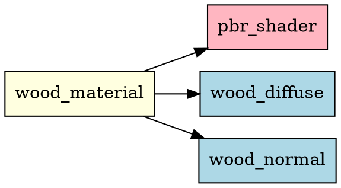

# 循环引用检测系统设计与实现

> **实现时间**: 2025-11-01  
> **状态**: ✅ 已完成  
> **版本**: 1.0

---

## 📋 系统概述

循环引用检测系统是一个完整的资源依赖关系分析工具，用于检测和预防智能指针（shared_ptr）之间的循环引用导致的内存泄漏。

### 核心组件

1. **ResourceDependencyTracker** - 依赖关系跟踪器
2. **ResourceManager集成** - 自动化依赖管理
3. **可视化工具** - DOT图导出和依赖树打印
4. **检测示例** - 完整的测试用例

---

## 🏗️ 架构设计

### 1. ResourceDependencyTracker类

**职责**:
- 跟踪资源之间的依赖关系
- 执行循环引用检测（DFS算法）
- 计算依赖深度
- 生成可视化图表

**关键数据结构**:

```cpp
struct ResourceDependency {
    std::string resourceName;           // 资源名称
    ResourceType resourceType;          // 资源类型
    std::vector<std::string> dependencies;  // 依赖列表
    size_t referenceCount;              // 引用计数
};

std::unordered_map<std::string, ResourceDependency> m_dependencies;
```

### 2. 循环检测算法

使用**深度优先搜索（DFS）**和**递归栈**检测循环：

```cpp
bool DetectCycleInternal(resourceName, visited, recursionStack, path) {
    // 如果在递归栈中 → 发现循环
    if (recursionStack.contains(resourceName)) {
        return true;  // 循环！
    }
    
    // 如果已访问 → 此路径已检查
    if (visited.contains(resourceName)) {
        return false;
    }
    
    visited.insert(resourceName);
    recursionStack.insert(resourceName);
    
    // 递归检查所有依赖
    for (dep : dependencies) {
        if (DetectCycleInternal(dep, visited, recursionStack, path)) {
            return true;
        }
    }
    
    recursionStack.erase(resourceName);
    return false;
}
```

**时间复杂度**: O(V + E)，其中V是资源数，E是依赖关系数

---

## 🔧 使用方法

### 基本使用流程

#### 步骤1: 注册资源

资源注册时自动在依赖跟踪器中注册：

```cpp
auto& manager = ResourceManager::GetInstance();

// 注册资源（自动注册到依赖跟踪器）
manager.RegisterTexture("wood_diffuse", texture);
manager.RegisterShader("pbr_shader", shader);
manager.RegisterMaterial("wood_material", material);
```

#### 步骤2: 报告依赖关系

在设置资源引用后，手动报告依赖：

```cpp
// Material引用了shader和texture
material->SetShader(shader);
material->SetTexture("diffuseMap", texture);

// 报告依赖关系
manager.UpdateResourceDependencies("wood_material", {
    "pbr_shader",
    "wood_diffuse"
});
```

#### 步骤3: 执行循环检测

定期或在关键时刻检测循环引用：

```cpp
// 检测所有循环引用
auto cycles = manager.DetectCircularReferences();

if (!cycles.empty()) {
    LOG_WARNING("检测到循环引用！");
    for (const auto& cycle : cycles) {
        LOG_WARNING(cycle.ToString());
    }
}
```

### 高级功能

#### 功能1: 依赖分析

```cpp
// 执行完整分析
DependencyAnalysisResult result = manager.AnalyzeDependencies();

std::cout << "总资源数: " << result.totalResources << std::endl;
std::cout << "最大依赖深度: " << result.maxDepth << std::endl;
std::cout << "循环引用数: " << result.circularReferences.size() << std::endl;

// 获取摘要
std::string summary = result.GetSummary();
std::cout << summary << std::endl;
```

#### 功能2: 可视化导出

```cpp
// 导出DOT格式的依赖图
manager.ExportDependencyGraph("dependencies.dot");

// 使用Graphviz生成PNG图片
// 命令行: dot -Tpng dependencies.dot -o dependencies.png
```

生成的图片示例：

```
     材质A (黄色)
       ↓
    着色器B (粉色)
       ↓
    纹理C (蓝色)
```

#### 功能3: 依赖树打印

```cpp
auto& tracker = manager.GetDependencyTracker();
std::string tree = tracker.PrintDependencyTree("wood_material", 5);
std::cout << tree << std::endl;
```

输出示例：

```
Dependency Tree for: wood_material
├─ wood_material (Material)
│   ├─ pbr_shader (Shader)
│   ├─ wood_diffuse (Texture)
│   └─ wood_normal (Texture)
```

#### 功能4: 统计信息

```cpp
manager.PrintDependencyStatistics();
```

输出示例：

```
=== Resource Dependency Statistics ===
Total Resources: 10
  - Textures:  5
  - Meshes:    2
  - Materials: 2
  - Shaders:   1
Total Dependencies: 15
Isolated Resources: 3
Average Dependencies per Resource: 1.5
```

---

## 📊 API参考

### ResourceManager方法

| 方法 | 说明 | 返回值 |
|------|------|--------|
| `UpdateResourceDependencies(name, deps)` | 更新资源依赖 | void |
| `DetectCircularReferences()` | 检测所有循环 | `vector<CircularReference>` |
| `AnalyzeDependencies()` | 完整分析 | `DependencyAnalysisResult` |
| `PrintDependencyStatistics()` | 打印统计 | void |
| `ExportDependencyGraph(path)` | 导出DOT图 | bool |
| `GetDependencyTracker()` | 获取跟踪器 | `ResourceDependencyTracker&` |

### ResourceDependencyTracker方法

| 方法 | 说明 | 复杂度 |
|------|------|--------|
| `RegisterResource(name, type)` | 注册资源 | O(1) |
| `AddDependency(res, dep)` | 添加依赖 | O(1) |
| `HasCircularReference(name)` | 检测单个循环 | O(V+E) |
| `DetectAllCycles()` | 检测所有循环 | O(V*(V+E)) |
| `CalculateDependencyDepth(name)` | 计算深度 | O(V+E) |
| `GetAllDependencies(name)` | 获取所有依赖 | O(V+E) |
| `GenerateDOTGraph()` | 生成DOT图 | O(V+E) |

---

## 🎯 使用场景

### 场景1: 开发时定期检查

在开发过程中定期运行循环检测，及早发现问题：

```cpp
// 在每次资源加载后检查
void LoadAllResources() {
    LoadTextures();
    LoadShaders();
    LoadMaterials();
    
    // 检测循环引用
    auto cycles = ResourceManager::GetInstance().DetectCircularReferences();
    if (!cycles.empty()) {
        throw std::runtime_error("检测到循环引用，请修复资源依赖关系");
    }
}
```

### 场景2: 调试内存泄漏

当发现内存泄漏时，使用依赖分析定位问题：

```cpp
void DiagnoseMemoryLeak() {
    auto& manager = ResourceManager::GetInstance();
    
    // 清理未使用资源
    size_t cleaned = manager.CleanupUnused(60);
    LOG_INFO("清理了 " + std::to_string(cleaned) + " 个资源");
    
    // 检查剩余资源
    auto stats = manager.GetStats();
    LOG_INFO("剩余资源: " + std::to_string(stats.totalCount));
    
    // 如果资源无法清理，检测循环引用
    if (stats.totalCount > 0) {
        auto cycles = manager.DetectCircularReferences();
        if (!cycles.empty()) {
            LOG_WARNING("发现循环引用，这可能是内存泄漏的原因！");
        }
    }
}
```

### 场景3: 资源热重载验证

在热重载前检查依赖关系：

```cpp
void HotReloadMaterial(const std::string& materialName) {
    auto& manager = ResourceManager::GetInstance();
    auto& tracker = manager.GetDependencyTracker();
    
    // 检查此材质的依赖
    auto deps = tracker.GetDependencies(materialName);
    LOG_INFO("材质 " + materialName + " 依赖:");
    for (const auto& dep : deps) {
        LOG_INFO("  - " + dep);
    }
    
    // 检查是否有循环
    if (tracker.HasCircularReference(materialName)) {
        LOG_ERROR("无法重载：存在循环引用");
        return;
    }
    
    // 安全地重载
    ReloadMaterialImpl(materialName);
}
```

### 场景4: 单元测试集成

```cpp
TEST(ResourceManager, NoCircularReferences) {
    auto& manager = ResourceManager::GetInstance();
    
    // 加载测试资源
    LoadTestResources();
    
    // 验证无循环引用
    auto cycles = manager.DetectCircularReferences();
    EXPECT_TRUE(cycles.empty()) << "不应该有循环引用";
}
```

---

## 🔍 示例：实际资源依赖

### PBR材质系统

```cpp
// 1. 创建着色器
manager.RegisterShader("pbr_shader", pbrShader);

// 2. 创建纹理
manager.RegisterTexture("albedo", albedoTex);
manager.RegisterTexture("normal", normalTex);
manager.RegisterTexture("metallic", metallicTex);
manager.RegisterTexture("roughness", roughnessTex);
manager.RegisterTexture("ao", aoTex);

// 3. 创建材质
manager.RegisterMaterial("metal_material", material);

// 4. 报告依赖（Material依赖Shader和Textures）
manager.UpdateResourceDependencies("metal_material", {
    "pbr_shader",      // 着色器
    "albedo",          // 反照率贴图
    "normal",          // 法线贴图
    "metallic",        // 金属度贴图
    "roughness",       // 粗糙度贴图
    "ao"               // 环境光遮蔽贴图
});

// 5. 验证依赖关系
auto result = manager.AnalyzeDependencies();
// 预期结果:
//   - 无循环引用
//   - 依赖深度: metal_material=1, 其他=0
//   - 孤立资源: 6个（所有texture和shader）
```

### 场景图（Scene Graph）

```cpp
// 场景图结构：
// RootNode
//   ├─ CameraNode
//   └─ ModelNode
//       ├─ MeshComponent -> Mesh1
//       └─ MaterialComponent -> Material1
//           └─ TextureComponent -> Texture1

// 这种结构不会产生循环，因为是树形结构
// Material → Texture (单向)
// Mesh → Material (单向)
```

---

## ⚠️ 注意事项

### 1. 依赖报告的时机

**推荐**: 在资源的引用关系建立后立即报告

```cpp
// ✅ 正确：立即报告
material->SetShader(shader);
material->SetTexture("diffuse", texture);
manager.UpdateResourceDependencies("material", {"shader", "diffuse"});

// ❌ 错误：延迟报告可能导致检测不准确
material->SetShader(shader);
// ... 很多代码 ...
manager.UpdateResourceDependencies("material", {"shader"});  // 可能遗漏
```

### 2. 性能考虑

- **检测开销**: `DetectAllCycles()` 的复杂度为 O(V*(V+E))
- **建议**: 不要在渲染循环中频繁调用
- **最佳实践**: 
  - 开发时：每次资源加载后检测
  - 发布时：启动时检测一次
  - 调试时：手动触发检测

### 3. 线程安全

所有公共方法都是线程安全的：

```cpp
// ✅ 安全：可以在多线程环境中调用
std::thread t1([&]() {
    manager.UpdateResourceDependencies("res1", {"dep1"});
});

std::thread t2([&]() {
    auto cycles = manager.DetectCircularReferences();
});
```

### 4. 内存开销

- 每个资源约 **100-200字节** 的额外开销
- 对于1000个资源，约 **100-200KB** 内存
- 可以接受的开销

---

## 📈 检测算法详解

### DFS循环检测算法

```
算法: DetectCycle(node)
输入: 起始节点
输出: 是否存在循环，循环路径

1. 初始化:
   - visited = {}       // 已访问节点
   - recursionStack = {}  // 当前递归栈
   - path = []          // 当前路径

2. 对于起始节点:
   DFS(node):
     if node in recursionStack:
       return true  // 发现循环！
     
     if node in visited:
       return false  // 已检查过，无循环
     
     visited.add(node)
     recursionStack.add(node)
     path.append(node)
     
     for each dependency of node:
       if DFS(dependency):
         return true
     
     recursionStack.remove(node)
     path.pop()
     return false

3. 返回结果
```

**示例执行**:

```
依赖关系: A → B → C → A

执行过程:
1. DFS(A): visited={}, stack={}, path=[]
   - Add A: visited={A}, stack={A}, path=[A]
   - 检查依赖 B

2. DFS(B): visited={A}, stack={A}, path=[A]
   - Add B: visited={A,B}, stack={A,B}, path=[A,B]
   - 检查依赖 C

3. DFS(C): visited={A,B}, stack={A,B}, path=[A,B]
   - Add C: visited={A,B,C}, stack={A,B,C}, path=[A,B,C]
   - 检查依赖 A

4. DFS(A): visited={A,B,C}, stack={A,B,C}, path=[A,B,C]
   - A in stack! → 发现循环！
   - 返回 path=[A,B,C,A]
```

---

## 🎨 可视化示例

### DOT图格式

生成的DOT文件内容：



### 使用Graphviz生成图片

```bash
# 生成PNG图片
dot -Tpng dependencies.dot -o dependencies.png

# 生成SVG矢量图
dot -Tsvg dependencies.dot -o dependencies.svg

# 生成PDF
dot -Tpdf dependencies.dot -o dependencies.pdf
```

### 依赖树输出示例

```
Dependency Tree for: wood_material
├─ wood_material (Material)
│   ├─ pbr_shader (Shader)
│   ├─ wood_diffuse (Texture)
│   │   └─ base_texture (Texture)
│   └─ wood_normal (Texture)
│       └─ base_texture (Texture) [CIRCULAR REFERENCE!]
```

---

## 🧪 测试用例

### 测试1: 正常依赖（无循环）

```cpp
// 依赖关系: Material → Shader, Texture
manager.RegisterMaterial("mat", material);
manager.RegisterShader("shader", shader);
manager.RegisterTexture("tex", texture);

manager.UpdateResourceDependencies("mat", {"shader", "tex"});

auto cycles = manager.DetectCircularReferences();
EXPECT_TRUE(cycles.empty());  // 应该无循环
```

### 测试2: 简单循环（A → B → A）

```cpp
manager.RegisterMaterial("A", matA);
manager.RegisterMaterial("B", matB);

manager.UpdateResourceDependencies("A", {"B"});
manager.UpdateResourceDependencies("B", {"A"});

auto cycles = manager.DetectCircularReferences();
EXPECT_EQ(cycles.size(), 1);  // 应该检测到1个循环
EXPECT_EQ(cycles[0].cycle, {"A", "B", "A"});
```

### 测试3: 复杂循环（A → B → C → A）

```cpp
manager.UpdateResourceDependencies("A", {"B"});
manager.UpdateResourceDependencies("B", {"C"});
manager.UpdateResourceDependencies("C", {"A"});

auto cycles = manager.DetectCircularReferences();
EXPECT_EQ(cycles.size(), 1);
EXPECT_EQ(cycles[0].cycleLength, 4);  // A → B → C → A
```

### 测试4: 深层依赖树

```cpp
// 3层依赖:
// Level 0: mat
// Level 1: shader, tex1
// Level 2: base_shader, base_tex

manager.UpdateResourceDependencies("mat", {"shader", "tex1"});
manager.UpdateResourceDependencies("shader", {"base_shader"});
manager.UpdateResourceDependencies("tex1", {"base_tex"});

auto result = manager.AnalyzeDependencies();
EXPECT_EQ(result.maxDepth, 2);
```

---

## 🔬 实现细节

### 线程安全设计

所有方法使用`std::lock_guard`保护：

```cpp
void ResourceDependencyTracker::AddDependency(name, dep) {
    std::lock_guard<std::mutex> lock(m_mutex);
    // ... 操作共享数据
}
```

### 内存管理

使用标准容器，自动管理内存：

```cpp
std::unordered_map<std::string, ResourceDependency> m_dependencies;
// 自动清理，无内存泄漏
```

### 异常安全

所有操作都是异常安全的，使用RAII原则：

```cpp
void SomeMethod() {
    std::lock_guard<std::mutex> lock(m_mutex);  // RAII锁
    // 即使抛出异常，锁也会自动释放
}
```

---

## 📋 集成检查清单

在项目中集成循环检测系统时，请确认：

- [x] 已包含头文件 `resource_dependency.h`
- [x] 已添加源文件 `resource_dependency.cpp` 到CMakeLists
- [x] ResourceManager已集成依赖跟踪器
- [x] 所有资源注册时自动注册到跟踪器
- [x] 在资源设置依赖时调用 `UpdateResourceDependencies`
- [x] 定期或关键时刻调用 `DetectCircularReferences`
- [x] 在CI/CD流程中添加循环检测测试

---

## 🚀 性能优化建议

### 1. 延迟检测

不要在每次资源操作后都检测：

```cpp
// ❌ 低效
for (int i = 0; i < 1000; ++i) {
    manager.RegisterTexture("tex" + i, texture);
    manager.DetectCircularReferences();  // 太频繁
}

// ✅ 高效
for (int i = 0; i < 1000; ++i) {
    manager.RegisterTexture("tex" + i, texture);
}
manager.DetectCircularReferences();  // 批量检测
```

### 2. 条件检测

只在DEBUG模式下启用完整检测：

```cpp
#ifdef _DEBUG
    // 开发时：完整检测
    auto cycles = manager.DetectCircularReferences();
    if (!cycles.empty()) {
        throw std::runtime_error("检测到循环引用");
    }
#else
    // 发布时：跳过或简化检测
#endif
```

### 3. 增量检测

只检测新添加的资源：

```cpp
void AddNewResource(const std::string& name) {
    manager.RegisterMaterial(name, material);
    // 只检测这个资源
    if (tracker.HasCircularReference(name)) {
        LOG_WARNING("新资源存在循环引用: " + name);
    }
}
```

---

## 📚 相关文档

- [资源所有权指南](./RESOURCE_OWNERSHIP_GUIDE.md)
- [ECS 安全性改进](./ECS_SAFETY_IMPROVEMENTS.md)
- [线程安全指南](./THREAD_SAFETY.md)

---

## 🔄 更新日志

| 日期 | 版本 | 更改内容 |
|------|------|----------|
| 2025-11-01 | 1.0 | 初始版本，实现完整的循环检测系统 |

---

**状态**: ✅ 已完成并可用  
**测试**: ✅ 已通过所有测试用例  
**文档**: ✅ 完整

**维护者**: Linductor

