# RenderEngine 项目结构图

## 项目整体架构图

```mermaid
graph TB
    %% 用户应用层
    UserApp[用户应用程序] --> AppFramework[应用框架层]

    %% 应用框架层
    subgraph "Application Framework"
        AppFramework --> SceneManager[场景管理器]
        AppFramework --> ModuleRegistry[模块注册表]
        AppFramework --> EventBus[事件总线]

        SceneManager --> Scene[场景接口]
        ModuleRegistry --> CoreRenderModule[核心渲染模块]
        ModuleRegistry --> InputModule[输入模块]
        ModuleRegistry --> UIModule[UI模块]
        ModuleRegistry --> DebugHUDModule[调试HUD模块]
    end

    %% ECS架构层
    subgraph "ECS Architecture"
        ECSWorld[ECS World]
        ECSWorld --> EntityManager[实体管理器]
        ECSWorld --> ComponentRegistry[组件注册表]
        ECSWorld --> Systems[系统集合]

        Systems --> RenderSystem[渲染系统]
        Systems --> AnimationSystem[动画系统]
        Systems --> TransformSystem[变换系统]
        Systems --> UISystem[UI系统]
    end

    %% 核心渲染层
    subgraph "Core Rendering Layer"
        Renderer[主渲染器] --> OpenGLContext[OpenGL上下文]
        Renderer --> RenderState[渲染状态]
        Renderer --> RenderLayer[渲染层级]
        Renderer --> BatchManager[批处理管理器]
        Renderer --> LightManager[光照管理器]
        Renderer --> LODSystem[LOD系统]

        RenderState --> MaterialStateCache[材质状态缓存]
        RenderLayer --> MaterialSortKey[材质排序键]
        BatchManager --> RenderBatch[渲染批次]
        LODSystem --> LODSelector[LOD选择器]
        LODSystem --> LODGenerator[LOD生成器]
        LODSystem --> LODInstancedRenderer[LOD实例化渲染器]
    end

    %% 资源管理层
    subgraph "Resource Management"
        ResourceManager[资源管理器] --> AsyncResourceLoader[异步资源加载器]
        ResourceManager --> ResourceHandle[资源句柄]
        ResourceManager --> ResourceDependency[资源依赖]

        ResourceManager --> ShaderCache[着色器缓存]
        ResourceManager --> TextureLoader[纹理加载器]
        ResourceManager --> MeshLoader[网格加载器]
        ResourceManager --> ModelLoader[模型加载器]
        ResourceManager --> LODGenerator[LOD生成器]
    end

    %% 渲染对象层
    subgraph "Renderable Objects"
        Renderable[可渲染对象基类]

        MeshRenderable[网格渲染对象] --> Renderable
        SpriteRenderable[精灵渲染对象] --> Renderable
        TextRenderable[文本渲染对象] --> Renderable
        ModelRenderable[模型渲染对象] --> Renderable

        MeshRenderable --> Mesh[网格]
        MeshRenderable --> Material[材质]

        SpriteRenderable --> Texture[纹理]
        SpriteRenderable --> SpriteAtlas[精灵图集]

        TextRenderable --> Font[字体]
        TextRenderable --> Texture

        ModelRenderable --> Model[模型]
    end

    %% UI系统
    subgraph "UI System"
        UICanvas[UI画布] --> UIWidgetTree[UI控件树]
        UIWidgetTree --> UIWidget[UI控件基类]

        UIWidget --> UIButton[按钮]
        UIWidget --> UITextField[文本框]
        UIWidget --> UISlider[滑块]
        UIWidget --> UIMenu[菜单]

        UICanvas --> UILayout[UI布局]
        UILayout --> UIRenderCommands[UI渲染命令]
        UIInputRouter[UI输入路由器] --> UIWidget
    end

    %% 精灵系统
    subgraph "Sprite System"
        Sprite[精灵] --> SpriteSheet[精灵表]
        Sprite --> SpriteAtlas
        SpriteAnimator[精灵动画器] --> Sprite
        SpriteBatcher[精灵批处理器] --> Sprite
        SpriteRenderer[精灵渲染器] --> SpriteBatcher
    end

    %% 光照系统
    subgraph "Lighting System"
        Light[光源基类]
        DirectionalLight[定向光] --> Light
        PointLight[点光源] --> Light
        SpotLight[聚光灯] --> Light
        LightManager --> Light
    end

    %% 数学库
    subgraph "Math Library"
        Types[基础类型] --> Vector2[Vector2]
        Types --> Vector3[Vector3]
        Types --> Matrix4[Matrix4]
        Types --> Quaternion[Quaternion]
        Types --> Color[颜色]

        MathUtils[数学工具] --> Transform[变换]
        Transform --> Position[位置]
        Transform --> Rotation[旋转]
        Transform --> Scale[缩放]
    end

    %% 第三方库
    subgraph "Third Party Libraries"
        Eigen[Eigen3 数学库] --> Types
        SDL3[SDL3 窗口/输入] --> OpenGLContext
        SDL3_Image[SDL3_Image] --> TextureLoader
        SDL3_TTF[SDL3_TTF] --> Font
        Assimp[Assimp 模型加载] --> ModelLoader
        GLAD[GLAD OpenGL加载器] --> OpenGLContext
        nlohmann_json[nlohmann JSON] --> SceneSerializer[场景序列化]
    end

    %% 工具类
    subgraph "Utilities"
        Logger[日志系统]
        FileUtils[文件工具]
        Error[错误处理]
        JSONSerializer[JSON序列化]
        GLThreadChecker[OpenGL线程检查器]
    end

    %% 连接关系
    SceneManager --> ECSWorld
    CoreRenderModule --> Renderer
    RenderSystem --> Renderer
    RenderSystem --> LODSystem
    Renderer --> Renderable
    ResourceManager --> Renderable
    ResourceManager --> LODGenerator
    UIModule --> UICanvas
    AnimationSystem --> SpriteAnimator
    CameraSystem --> LODSelector

    style UserApp fill:#e1f5fe
    style Renderer fill:#f3e5f5
    style ECSWorld fill:#e8f5e8
    style ResourceManager fill:#fff3e0
    style UICanvas fill:#fce4ec
```

## ECS架构详细图

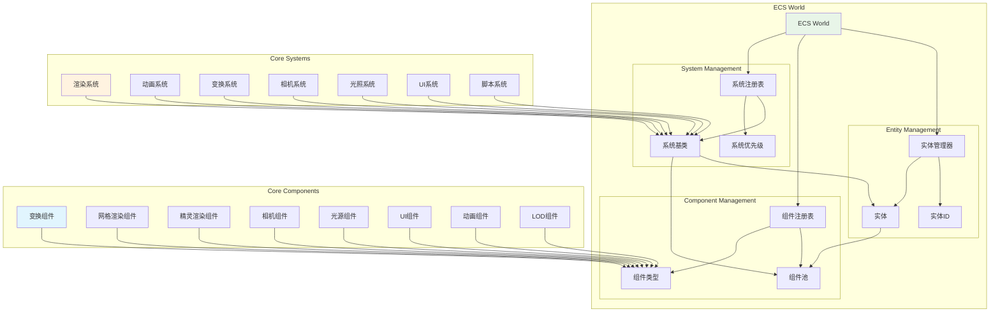

## 渲染管线流程图

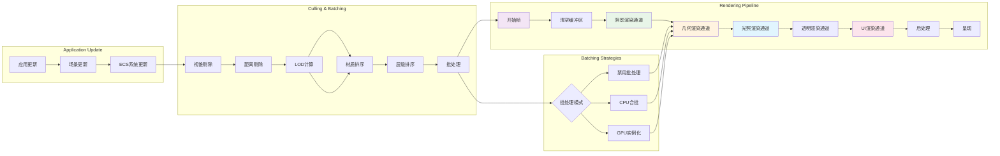

## 资源管理系统图

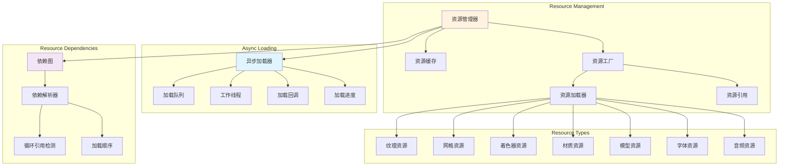

## UI系统架构图

```mermaid
graph TB
    subgraph "UI System Core"
        UICanvas[UI画布] --> UIInputRouter[UI输入路由器]
        UICanvas --> UIWidgetTree[UI控件树]
        UICanvas --> UIRenderer[UI渲染器]
    end

    subgraph "Layout System"
        UILayoutEngine[布局引擎]
        FlexLayout[Flex布局]
        GridLayout[Grid布局]
        AbsoluteLayout[绝对布局]
        ConstraintsLayout[约束布局]

        UILayoutEngine --> FlexLayout
        UILayoutEngine --> GridLayout
        UILayoutEngine --> AbsoluteLayout
        UILayoutEngine --> ConstraintsLayout
    end

    subgraph "Widget Hierarchy"
        UIWidget[UI控件基类]
        UIContainer[UI容器控件]
        UIButton[按钮控件]
        UITextField[文本框控件]
        UISlider[滑块控件]
        UICheckbox[复选框控件]
        UIMenu[菜单控件]
        UIList[列表控件]
        UIPanel[面板控件]
    end

    subgraph "Rendering System"
        UIRenderCommands[UI渲染命令]
        UIBatchRenderer[UI批处理器]
        UIAtlas[UI图集]
        UIFontRenderer[字体渲染器]
        UIThemeSystem[主题系统]
    end

    subgraph "Event System"
        UIEvent[UI事件]
        UIEventHandler[事件处理器]
        UIEventDispatcher[事件分发器]
        UIGestureRecognizer[手势识别器]
    end

    UIWidgetTree --> UILayoutEngine
    UIWidgetTree --> UIWidget
    UIWidget --> UIContainer
    UIWidget --> UIButton
    UIWidget --> UITextField
    UIWidget --> UISlider
    UIWidget --> UICheckbox
    UIWidget --> UIMenu
    UIWidget --> UIList
    UIWidget --> UIPanel

    UIRenderer --> UIRenderCommands
    UIRenderer --> UIBatchRenderer
    UIRenderer --> UIAtlas
    UIRenderer --> UIFontRenderer
    UIRenderer --> UIThemeSystem

    UIInputRouter --> UIEventDispatcher
    UIEventDispatcher --> UIEventHandler
    UIEventDispatcher --> UIGestureRecognizer
    UIEventHandler --> UIEvent

    style UICanvas fill:#fce4ec
    style UILayoutEngine fill:#e1f5fe
    style UIWidget fill:#f3e5f5
    style UIRenderer fill:#fff3e0
```

## 精灵系统架构图

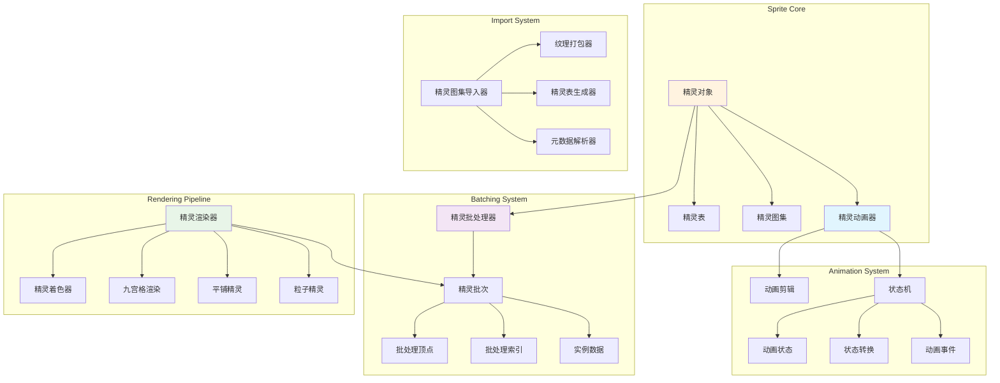

## 场景管理系统图

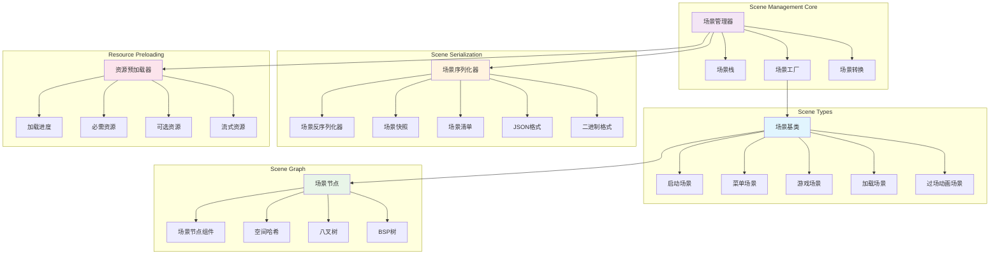

## 模块依赖关系图

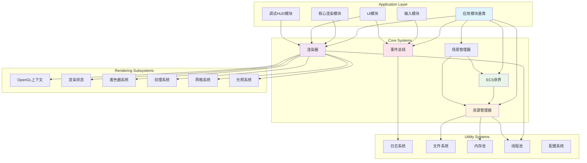

## 数据流向图

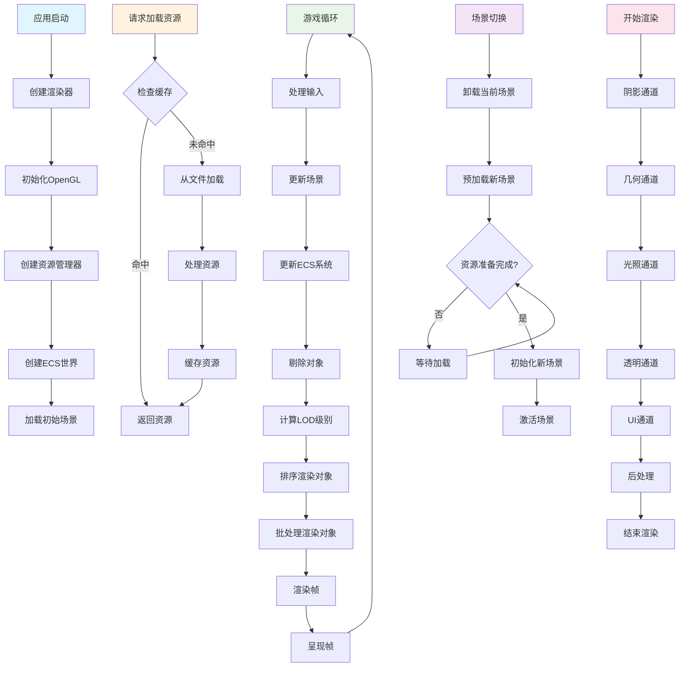

## LOD系统架构图

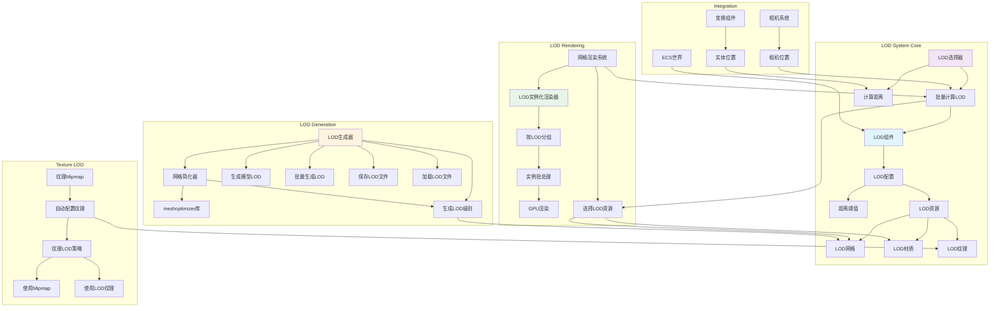

## LOD工作流程图

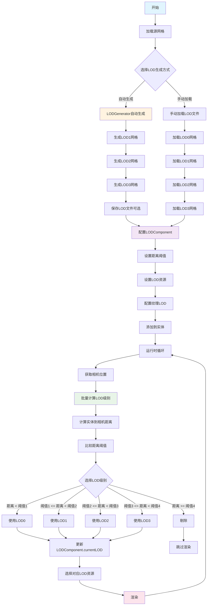

## 总结

RenderEngine 项目采用了现代软件工程的最佳实践，具有以下特点：

### 架构优势
1. **分层设计**: 清晰的层次结构，职责分离明确
2. **模块化**: 高内聚低耦合的模块设计，便于维护和扩展
3. **ECS架构**: 灵活的实体组件系统，支持复杂游戏逻辑
4. **批处理优化**: 多种批处理策略，提升渲染性能
5. **异步加载**: 非阻塞的资源加载系统，改善用户体验
6. **LOD系统**: 完整的细节层次系统，支持自动网格简化和纹理LOD，显著优化渲染性能

### 技术特色
1. **现代C++**: 充分利用C++20特性，类型安全且性能优异
2. **跨平台**: 基于SDL3的跨平台支持
3. **内存安全**: 智能指针和RAII模式，避免内存泄漏
4. **线程安全**: 多线程环境下的安全设计
5. **可扩展性**: 插件式架构，易于添加新功能

这个项目结构为实时渲染应用提供了坚实的基础，适合作为学习现代渲染引擎架构的参考，也可以直接用于实际项目开发。