# 渲染器编辑器设计方案

**创建时间**: 2026-01-11  
**最后更新**: 2026-01-11  
**状态**: 设计方案

---

## 1. 概述

### 1.1 背景与目标

基于现有的 RenderEngine 渲染引擎，设计并实现一个功能完整的可视化编辑器，用于快速制作游戏、视频内容、交互式软件等应用。该编辑器将充分利用引擎的 ECS 架构、场景管理、UI 系统、资源管理等核心功能，提供直观的可视化编辑体验。

### 1.2 设计目标

1. **可视化编辑**: 提供所见即所得的编辑环境，支持 2D/3D 场景编辑
2. **快速原型**: 支持快速创建和迭代游戏、视频、交互应用原型
3. **资源管理**: 集成引擎的资源管理系统，提供资源导入、预览、编辑功能
4. **实时预览**: 支持编辑模式的实时渲染预览，所见即所得
5. **模块化扩展**: 基于引擎的模块化架构，支持插件式功能扩展
6. **跨平台支持**: 基于 SDL3 和 OpenGL，支持 Windows 平台（可扩展至其他平台）

### 1.3 应用场景

- **游戏开发**: 快速创建 2D/3D 游戏原型，场景布局，关卡设计
- **视频制作**: 创建动画序列，场景编排，镜头控制
- **交互软件**: 构建可视化界面，交互式应用，数据可视化
- **教学演示**: 创建可视化教学内容，交互式演示

---

## 2. 系统架构设计

### 2.1 整体架构图

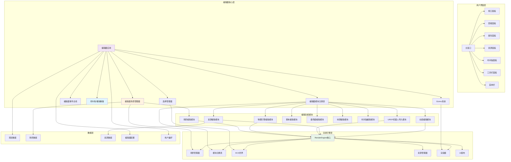

### 2.2 编辑器核心架构

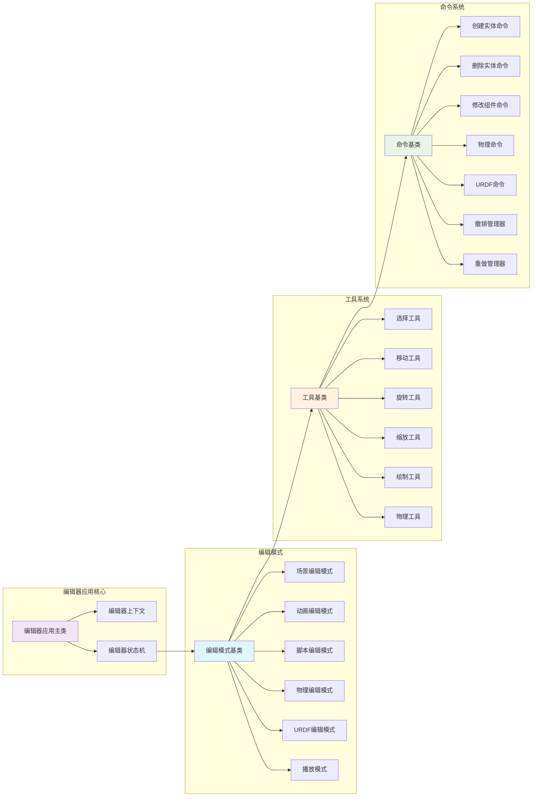

### 2.3 物理引擎编辑架构

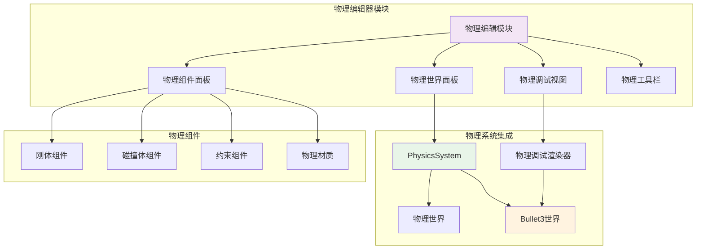

### 2.4 URDF导入架构

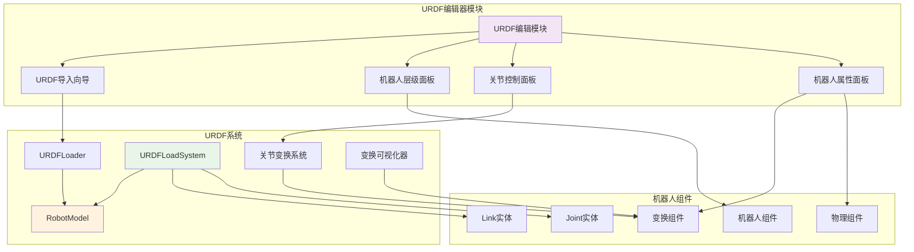

---

## 3. 核心功能模块

### 3.1 场景编辑模块

**功能描述**: 提供场景的可视化编辑功能，包括实体创建、位置调整、层级管理等。

**核心功能**:
- 实体创建和删除
- 实体选择和移动
- 层级树管理
- 场景视图（2D/3D 切换）
- 场景快照和恢复
- 场景导入/导出

**技术实现**:
- 基于 ECS 系统的实体管理
- 集成 SceneManager 的场景切换
- 使用 Gizmo 系统进行可视化操作
- 利用 SceneSerializer 进行场景序列化

### 3.2 资源编辑模块

**功能描述**: 提供资源的导入、预览、编辑和管理功能。

**核心功能**:
- 资源导入（纹理、模型、音频等）
- 资源预览和属性编辑
- 资源库管理
- 资源依赖关系查看
- 资源优化和转换

**技术实现**:
- 集成 ResourceManager 的资源管理
- 利用异步资源加载器
- 资源预览器（纹理、模型预览）
- 资源元数据管理

### 3.3 动画编辑模块

**功能描述**: 提供动画的创建和编辑功能，支持关键帧动画、状态机等。

**核心功能**:
- 关键帧编辑
- 动画曲线编辑
- 动画状态机编辑
- 动画预览
- 动画导入/导出

**技术实现**:
- 基于 SpriteAnimator 的动画系统
- 动画状态机可视化编辑
- 时间轴集成
- 动画事件编辑

### 3.4 材质编辑模块

**功能描述**: 提供材质创建和编辑功能，支持材质属性调整和实时预览。

**核心功能**:
- 材质创建和编辑
- 材质属性面板
- 着色器参数调整
- 材质预览
- 材质库管理

**技术实现**:
- 集成 Material 系统
- 利用 ShaderCache 管理着色器
- 实时材质预览
- 材质预设管理

### 3.5 着色器编辑模块

**功能描述**: 提供着色器的编辑和预览功能。

**核心功能**:
- 着色器代码编辑
- 语法高亮
- 着色器编译和错误检查
- 着色器预览
- 着色器模板管理

**技术实现**:
- 集成 Shader 系统
- 着色器热重载
- 着色器编译错误提示
- 着色器预览窗口

### 3.6 脚本编辑模块

**功能描述**: 提供脚本的创建和编辑功能（未来扩展）。

**核心功能**:
- 脚本创建和编辑
- 脚本语法高亮
- 脚本调试
- 脚本绑定到实体

### 3.7 时间轴编辑模块

**功能描述**: 提供时间轴编辑功能，用于动画序列、视频编辑等。

**核心功能**:
- 时间轴视图
- 关键帧管理
- 时间轴缩放和平移
- 播放控制
- 动画序列编辑

**技术实现**:
- 基于时间轴的数据模型
- 与动画系统集成
- 时间轴渲染和交互

### 3.8 物理引擎编辑模块

**功能描述**: 提供物理引擎的可视化编辑功能，包括刚体、碰撞体、约束等的创建和编辑。

**核心功能**:
- 物理世界配置（重力、时间步长等）
- 刚体组件编辑（类型、质量、速度等）
- 碰撞体编辑（形状、尺寸、触发器等）
- 约束编辑（点对点、铰链、滑动等）
- 物理材质管理
- 物理调试可视化（碰撞体线框、AABB、接触点）
- 物理模拟控制（播放、暂停、步进）
- 射线检测和查询工具

**技术实现**:
- 集成 Bullet3 物理引擎
- 基于 PhysicsSystem 的物理模拟
- 物理组件（RigidBodyComponent、ColliderComponent、ConstraintComponent）
- 物理调试渲染器（PhysicsDebugRenderer）
- 物理材质系统（PhysicsMaterial、PhysicsMaterialManager）
- 物理-渲染同步机制

**编辑器集成**:
- 物理属性面板（Inspector 扩展）
- 物理世界设置面板
- 物理调试视图切换
- 物理模拟时间控制
- 物理查询工具（射线检测、球形检测）

### 3.9 URDF机器人导入模块

**功能描述**: 提供 URDF（Unified Robot Description Format）机器人模型的导入、可视化和编辑功能。

**核心功能**:
- URDF 文件导入
- 机器人模型解析（Link、Joint、Visual、Collision）
- 机器人层级树可视化
- 关节参数编辑（类型、限制、轴等）
- 机器人姿态控制（关节角度设置）
- 机器人物理属性编辑（质量、惯性等）
- 机器人可视化预览
- 机器人导出（场景序列化）

**技术实现**:
- 集成 URDFLoader 解析器
- 基于 RobotModel 的数据模型
- URDFLoadSystem 系统集成
- 机器人组件（RobotComponent）
- 关节变换系统（JointTFSystem）
- 机器人可视化器（TFVisualizer）

**编辑器集成**:
- URDF 导入向导
- 机器人层级面板（显示 Link 和 Joint 树）
- 关节控制面板（实时调整关节角度）
- 机器人属性面板（编辑 Link 和 Joint 属性）
- 机器人预览窗口
- 机器人物理属性编辑

**工作流程**:
1. 导入 URDF 文件
2. 解析机器人模型（Link、Joint、Visual、Collision）
3. 创建 ECS 实体（每个 Link 一个实体）
4. 加载网格资源（Visual 几何）
5. 创建物理组件（Collision 几何、RigidBody）
6. 构建层级关系（Joint 父子关系）
7. 在编辑器中显示和编辑

---

## 4. 数据流设计

### 4.1 编辑器数据流图

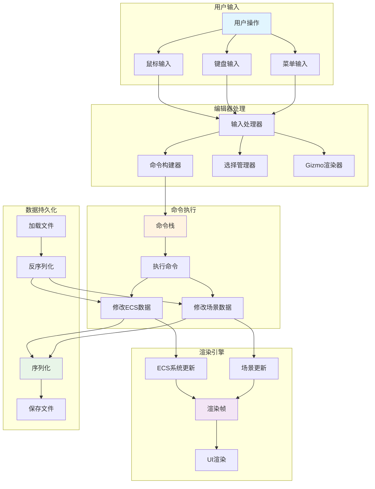

### 4.2 场景编辑数据流

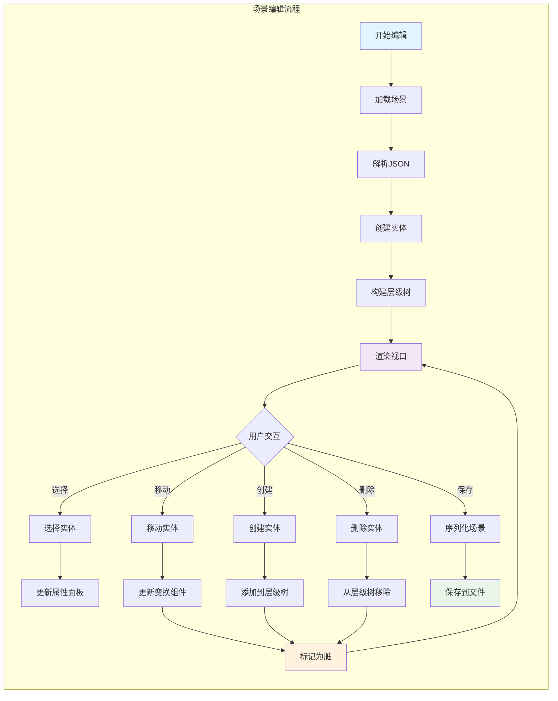

### 4.3 资源管理数据流

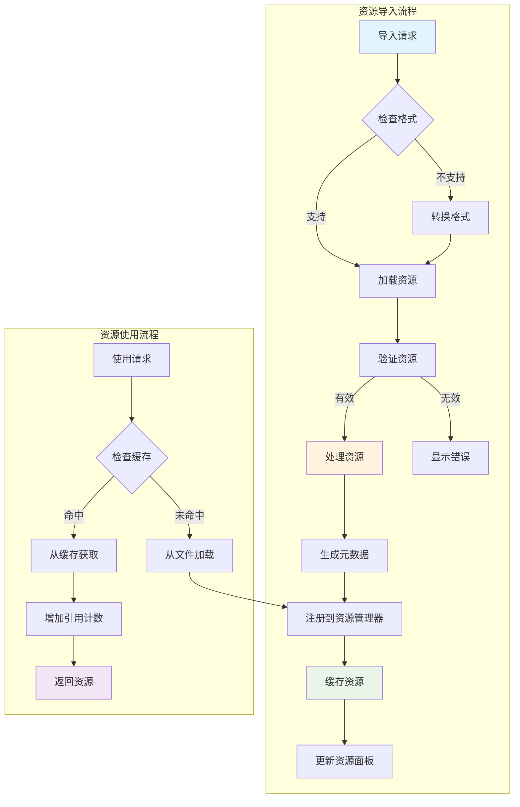

### 4.4 物理引擎数据流

```mermaid
flowchart TD
    subgraph "物理编辑流程"
        EditPhysics[编辑物理属性] --> UpdateComponent[更新物理组件]
        UpdateComponent --> SyncToPhysics[同步到物理世界]
        SyncToPhysics --> RunSimulation[运行物理模拟]
        RunSimulation --> SyncToTransform[同步到Transform]
        SyncToTransform --> RenderUpdate[更新渲染]
        RenderUpdate --> DisplayResult[显示结果]
    end

    subgraph "物理查询流程"
        QueryRequest[查询请求] --> Raycast[射线检测]
        QueryRequest --> SphereCast[球形检测]
        QueryRequest --> CollisionQuery[碰撞查询]
        
        Raycast --> ProcessResults[处理结果]
        SphereCast --> ProcessResults
        CollisionQuery --> ProcessResults
        
        ProcessResults --> ReturnResults[返回结果]
    end

    subgraph "物理调试流程"
        EnableDebug[启用调试] --> CollectDebugData[收集调试数据]
        CollectDebugData --> RenderDebug[渲染调试信息]
        RenderDebug --> DisplayDebug[显示调试视图]
    end

    style EditPhysics fill:#e1f5fe
    style RunSimulation fill:#fff3e0
    style ProcessResults fill:#e8f5e8
    style DisplayDebug fill:#f3e5f5
```

### 4.5 URDF导入数据流

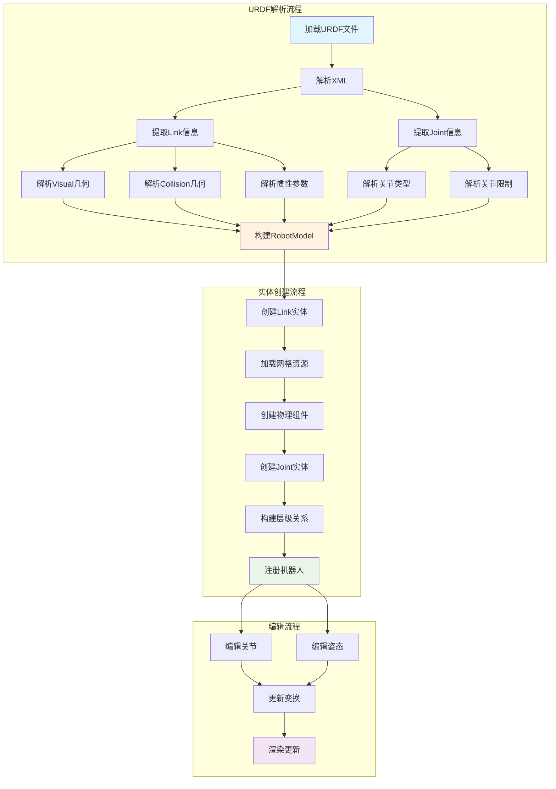

---

## 5. 用户界面设计

### 5.1 主窗口布局

```
┌─────────────────────────────────────────────────────────────────┐
│ 文件  编辑  视图  工具  窗口  帮助                                │
├──────────┬───────────────────────────────────────────┬──────────┤
│          │                                           │          │
│  层级    │                                           │  属性    │
│  面板    │           主视口 (Viewport)               │  面板    │
│          │                                           │          │
│  - Scene │          [3D场景渲染视图]                 │ Transform│
│    - Obj1│                                           │ Position │
│    - Obj2│                                           │ Rotation │
│    - Obj3│                                           │ Scale    │
│          │                                           │          │
│          │                                           │ Mesh     │
│          │                                           │ Material │
│          │                                           │          │
├──────────┴───────────────────────────────────────────┴──────────┤
│  资源面板                                                         │
│  [资源库树形视图]                                                 │
│  - Textures                                                      │
│  - Models                                                        │
│  - Materials                                                     │
│  - Shaders                                                       │
└─────────────────────────────────────────────────────────────────┘
```

### 5.2 面板功能说明

**主视口 (Viewport)**
- 3D 场景实时渲染预览
- 支持鼠标操作（旋转、平移、缩放视角）
- Gizmo 可视化操作手柄
- 网格和坐标轴显示
- 多种视图模式（透视、正交、顶视图、侧视图等）

**层级面板 (Hierarchy)**
- 场景实体树形结构
- 支持拖拽排序
- 右键菜单操作（创建、删除、复制等）
- 搜索和过滤功能

**属性面板 (Inspector)**
- 选中实体的组件属性编辑
- 实时预览属性变化
- 组件添加和删除
- 资源引用选择

**资源面板 (Assets)**
- 项目资源库浏览
- 资源预览缩略图
- 资源导入和导出
- 资源搜索和分类

**时间轴面板 (Timeline)**
- 动画关键帧编辑
- 时间轴缩放和导航
- 播放控制（播放、暂停、停止）
- 多个轨道支持

---

## 6. 技术实现方案

### 6.1 编辑器应用架构

**编辑器应用主类**:
- 继承或封装引擎的 ApplicationHost
- 管理编辑器特定的模块注册
- 处理编辑器生命周期（初始化、更新、关闭）
- 管理编辑器状态和模式切换

**编辑器上下文**:
- 存储编辑器全局状态
- 提供编辑器服务访问接口
- 管理编辑器配置和偏好设置

### 6.2 命令系统实现

**命令模式**:
- 所有编辑操作封装为命令对象
- 命令支持执行、撤销、重做
- 命令栈管理命令历史
- 支持命令合并和批量操作

**命令类型**:
- 创建/删除实体命令
- 修改组件属性命令
- 变换操作命令（移动、旋转、缩放）
- 场景操作命令（保存、加载）

### 6.3 Gizmo 系统

**Gizmo 功能**:
- 位置 Gizmo（箭头手柄）
- 旋转 Gizmo（圆形手柄）
- 缩放 Gizmo（方块手柄）
- 统一 Gizmo（三合一）

**技术实现**:
- 基于引擎的渲染系统
- 使用线条和几何体渲染 Gizmo
- 鼠标拾取检测
- 坐标空间转换（世界空间/本地空间）

### 6.4 选择系统

**选择管理**:
- 单选和多选支持
- 选择高亮显示
- 选择框（框选）支持
- 选择过滤（按类型、层级等）

**技术实现**:
- 鼠标拾取（射线检测）
- 使用 ECS 组件标记选中状态
- 选择集管理
- 选择事件通知

### 6.5 UI 集成

**UI 系统集成**:
- 使用引擎的 UICanvas 和 UIWidget 系统
- 自定义编辑器 UI 组件
- 布局系统（面板停靠、调整大小）
- UI 主题支持（明暗主题切换）

**面板实现**:
- 每个面板作为独立的 UIWidget
- 面板管理器处理面板布局
- 面板状态持久化
- 面板快捷键支持

---

## 7. 工作流程

### 7.1 项目创建流程

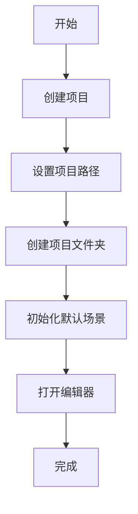

### 7.2 场景编辑流程

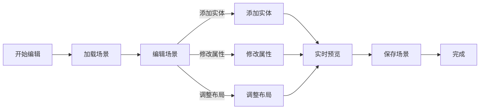

### 7.3 资源导入流程

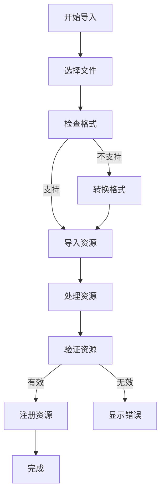

### 7.4 动画编辑流程

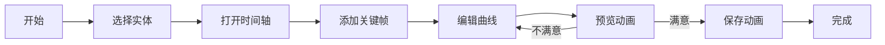

### 7.5 物理编辑流程

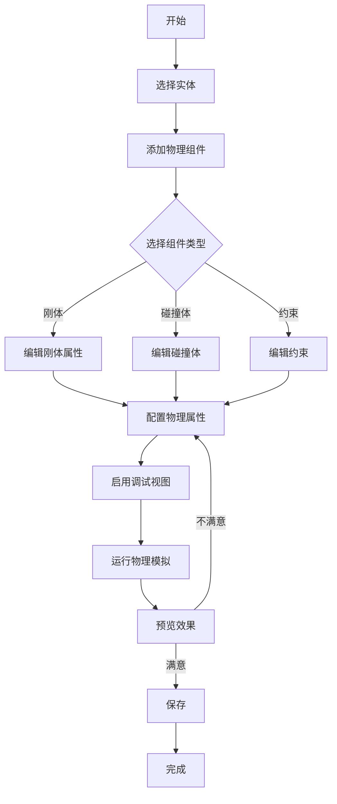

### 7.6 URDF机器人导入流程

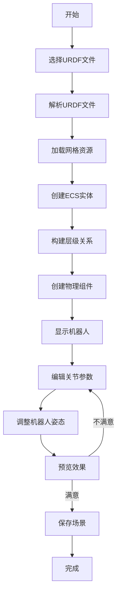

---

## 8. 数据格式和存储

### 8.1 项目结构

```
项目文件夹/
├── Project.json          # 项目配置文件
├── Scenes/               # 场景文件
│   ├── Scene1.json
│   └── Scene2.json
├── Assets/               # 资源文件
│   ├── Textures/
│   ├── Models/
│   ├── Materials/
│   └── Shaders/
├── Scripts/              # 脚本文件（未来）
└── Build/                # 构建输出
```

### 8.2 项目配置格式

基于 JSON 格式的项目配置，包含：
- 项目元数据（名称、版本、描述）
- 项目设置（默认场景、渲染设置等）
- 资源路径配置
- 编辑器偏好设置

### 8.3 场景数据格式

利用引擎现有的 SceneSerializer 系统：
- 基于 JSON 的场景序列化
- 实体和组件数据
- 资源引用
- 场景元数据

### 8.4 编辑器配置格式

编辑器特定配置：
- 窗口布局状态
- 面板可见性
- 快捷键映射
- 用户偏好设置

---

## 9. 扩展性设计

### 9.1 插件系统

**插件架构**:
- 基于引擎的 ModuleRegistry 系统
- 编辑器模块注册机制
- 插件生命周期管理
- 插件依赖关系处理

**插件接口**:
- 编辑器模块接口
- 工具插件接口
- 资源导入器插件接口
- 导出器插件接口

### 9.2 自定义工具

**工具系统扩展**:
- 工具基类定义
- 工具注册机制
- 工具 UI 集成
- 工具快捷键绑定

### 9.3 自定义面板

**面板系统扩展**:
- 面板基类定义
- 面板注册机制
- 面板布局系统
- 面板数据绑定

---

## 10. 性能优化

### 10.1 渲染优化

**编辑器模式优化**:
- 视口渲染优化（LOD、剔除）
- Gizmo 渲染优化
- UI 渲染优化
- 多视口性能优化

### 10.2 数据管理优化

**大数据场景优化**:
- 场景数据懒加载
- 资源缓存策略
- 增量保存机制
- 数据压缩

### 10.3 响应性优化

**用户交互优化**:
- 命令执行优化
- 选择系统优化
- 实时预览优化
- 异步操作支持

---

## 11. 开发计划

### 11.1 阶段划分

**Phase 1: 核心框架**（基础功能）
- 编辑器应用框架
- 基本 UI 布局
- 场景加载和显示
- 基础选择系统

**Phase 2: 场景编辑**（核心编辑功能）
- 实体创建和删除
- 变换操作（移动、旋转、缩放）
- Gizmo 系统
- 命令系统和撤销/重做

**Phase 3: 资源管理**（资源编辑功能）
- 资源导入系统
- 资源预览
- 资源属性编辑
- 资源库管理

**Phase 4: 高级功能**（扩展功能）
- 动画编辑
- 材质编辑
- 着色器编辑
- 时间轴编辑
- 物理引擎编辑
- URDF机器人导入

**Phase 5: 优化和完善**（打磨和优化）
- 性能优化
- UI/UX 优化
- 文档完善
- 测试和 Bug 修复

### 11.2 技术依赖

**引擎功能依赖**:
- ✅ ECS 系统
- ✅ 场景管理系统
- ✅ 资源管理系统
- ✅ UI 系统
- ✅ 渲染系统
- ✅ 序列化系统
- ✅ 物理引擎系统（Bullet3）
- ✅ URDF 导入系统

**待开发功能**:
- 编辑器特定模块
- Gizmo 渲染系统
- 命令系统
- 选择系统
- 编辑器 UI 组件
- 物理编辑器 UI
- URDF 编辑器 UI

---

## 12. 总结

本设计方案基于现有的 RenderEngine 渲染引擎，设计了一个功能完整的可视化编辑器系统。该编辑器充分利用了引擎的 ECS 架构、场景管理、资源管理、UI 系统等核心功能，提供了直观的可视化编辑体验。

### 12.1 核心优势

1. **基于成熟引擎**: 充分利用现有引擎功能，降低开发成本
2. **模块化设计**: 基于引擎的模块化架构，易于扩展和维护
3. **统一数据格式**: 使用引擎的序列化系统，数据格式统一
4. **实时预览**: 编辑和预览使用同一渲染系统，所见即所得
5. **可扩展性**: 支持插件系统，易于功能扩展

### 12.2 应用场景

该编辑器适用于：
- 游戏开发和原型制作
- 视频内容和动画制作
- 交互式应用开发
- 可视化内容创建
- 机器人仿真和可视化
- 物理模拟和实验

### 12.3 未来展望

随着编辑器功能的不断完善，可以进一步扩展：
- 脚本系统集成（Lua/Python）
- 可视化编程（节点编辑器）
- 协作编辑功能
- 云端资源库
- 导出到各种格式（游戏引擎、视频格式等）
- 物理模拟录制和回放
- 机器人运动规划可视化
- 物理参数优化工具
- 机器人控制接口集成

---

**文档版本**: 1.0  
**维护者**: Linductor  
**最后更新**: 2026-01-11
