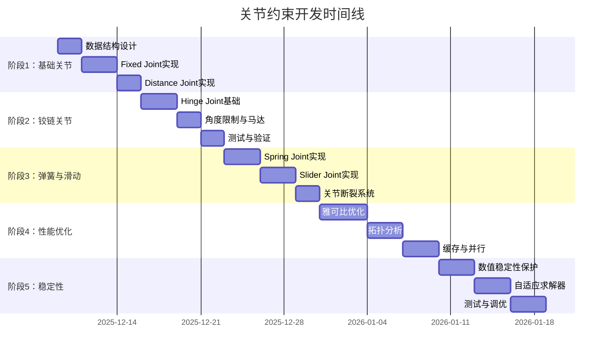

# 关节约束系统开发 Todolists

> 基于《关节约束设计文档.md》的详细开发任务列表
> 
> **开发周期**: 预计 6-8 周
> 
> **开发原则**: 
> - 基于现有 ConstraintSolver 框架进行扩展
> - 优先实现基础关节类型，高级特性作为优化
> - 注重数值稳定性和性能
> - 充分复用现有数学工具和ECS架构

---

## 📋 开发阶段概览



---

## 🎯 前置条件检查

### 已完成的基础设施 ✅

- [x] ECS 架构和组件系统
- [x] 物理数学工具库（types.h, math_utils.h）
- [x] 刚体组件（RigidBodyComponent）
- [x] 碰撞检测系统
- [x] 约束求解器框架（ConstraintSolver）
- [x] 接触约束求解（PGS方法）
- [x] 固定时间步长积分器

### 需要确认的功能

- [ ] **世界空间逆惯性张量计算** - `ConstraintSolver::ComputeWorldInvInertia()` ✅ 已实现
- [ ] **切向向量选择** - `ConstraintSolver::ChooseTangent()` ✅ 已实现
- [ ] **Warm Start 机制** - ✅ 已实现
- [ ] **Baumgarte 稳定化** - ✅ 已实现（kBaumgarte = 0.2）
- [ ] **位置修正系统** - ✅ 已实现

---

## 📚 开发前准备（强烈推荐完成）

### 知识准备

**必读文档**:
1. ✅ 阅读 `docs/todolists/关节约束设计文档.md` 第14节（数据爆炸问题）
2. ✅ 阅读 `docs/todolists/关节约束设计文档.md` 第9.5节（针对项目的优化）
3. ✅ 阅读现有代码 `src/physics/dynamics/constraint_solver.cpp`（理解接触约束求解流程）

**可选阅读**:
- Erin Catto - "Iterative Dynamics with Temporal Coherence" (GDC 2005)
- Box2D 源码中的关节实现（b2Joint.cpp）

### 代码准备

**创建测试场景** `examples/test_joint_stability.cpp`:
```cpp
// 用于快速验证数值稳定性的测试场景
void TestJointStability() {
    // 测试1: 极端质量比
    auto heavy = CreateBox(1000.0f);  // 1吨
    auto light = CreateBox(1.0f);     // 1千克
    CreateFixedJoint(heavy, light);
    
    // 测试2: 奇异位形
    auto bodyA = CreateBox(1.0f);
    auto bodyB = CreateBox(1.0f);
    auto joint = CreateFixedJoint(bodyA, bodyB);
    joint.localAnchorA = Vector3::Zero();  // 锚点重合
    joint.localAnchorB = Vector3::Zero();
    
    // 测试3: 高速碰撞
    bodyA.linearVelocity = Vector3(0, -50, 0);  // 50 m/s
    
    // 运行1000帧
    for (int i = 0; i < 1000; ++i) {
        world.Step(1.0f / 60.0f);
        
        // 检查爆炸
        if (bodyA.linearVelocity.norm() > 100.0f) {
            std::cerr << "FAILED: Velocity explosion at frame " << i << "\n";
            return;
        }
    }
    
    std::cout << "PASSED: Stability test\n";
}
```

**准备调试工具**:
```cpp
// 在 constraint_solver.h 中添加调试接口
class ConstraintSolver {
public:
    // 调试用：获取上一帧的求解统计
    struct SolverStats {
        int jointCount = 0;
        int solverIterations = 0;
        float maxImpulse = 0.0f;
        float maxVelocityChange = 0.0f;
        bool hadSingularity = false;
        bool hadExplosion = false;
    };
    
    const SolverStats& GetStats() const { return m_stats; }
    
private:
    SolverStats m_stats;
};
```

### 环境准备

- [ ] **1. 启用调试构建**
  ```cmake
  # CMakeLists.txt
  set(CMAKE_BUILD_TYPE Debug)
  add_definitions(-DDEBUG_JOINT_SOLVER)  # 启用详细日志
  ```

- [ ] **2. 配置编译器警告**
  ```cmake
  if(MSVC)
      add_compile_options(/W4 /WX)  # 最高警告级别，警告视为错误
  else()
      add_compile_options(-Wall -Wextra -Werror)
  endif()
  ```

- [ ] **3. 准备性能分析工具**
  - Visual Studio: Performance Profiler
  - Linux: Valgrind, perf
  - 跨平台: Tracy Profiler

### 心理准备

**预期困难**:
- ⚠️ 数值爆炸问题会反复出现，这是正常的
- ⚠️ 调试关节约束比调试接触约束更困难
- ⚠️ 可能需要多次迭代才能达到稳定

**建议节奏**:
- 📅 每实现一个关节类型，休息半天
- 📅 每遇到爆炸问题，先休息1小时再调试
- 📅 每周至少有1天不写代码，只看文档和思考

### 检查清单

开始编码前，确认：

- [ ] ✅ 已阅读设计文档第14节（数据爆炸问题）
- [ ] ✅ 已理解6大问题及解决方案
- [ ] ✅ 已准备好测试场景代码
- [ ] ✅ 已启用调试构建和详细日志
- [ ] ✅ 已准备性能分析工具
- [ ] ✅ 心理上准备好应对数值问题
- [ ] ✅ 时间安排合理（不赶工）

**如果以上任一项未完成，强烈建议先完成再开始编码！**

---

## 🎯 阶段 1：基础关节系统 (Week 1-2)

### 1.1 数据结构设计

**优先级**: 🔴 Critical | **预计时间**: 2 天

- [x] **1.1.1** 创建 `joint_component.h`
  ```cpp
  namespace Render {
  namespace Physics {
  
  /**
   * @brief 关节基础组件
   */
  struct JointComponent {
      enum class JointType {
          Fixed,      // 固定关节
          Hinge,      // 铰链关节
          Distance,   // 距离关节
          Spring,     // 弹簧关节
          Slider      // 滑动关节
      };
      
      JointType type = JointType::Fixed;
      ECS::EntityID connectedBody;  // 连接的另一个刚体
      
      // 锚点（局部坐标）
      Vector3 localAnchorA = Vector3::Zero();
      Vector3 localAnchorB = Vector3::Zero();
      
      // 断裂阈值
      float breakForce = INFINITY;
      float breakTorque = INFINITY;
      bool isBroken = false;
      
      // 启用/禁用
      bool isEnabled = true;
      
      // 碰撞控制
      bool enableCollision = false;  // 连接的两个刚体是否参与碰撞
  };
  
  /**
   * @brief 固定关节数据
   */
  struct FixedJointData {
      Quaternion relativeRotation = Quaternion::Identity();
  };
  
  /**
   * @brief 铰链关节数据
   */
  struct HingeJointData {
      Vector3 localAxisA = Vector3::UnitZ();
      Vector3 localAxisB = Vector3::UnitZ();
      
      // 角度限制
      bool hasLimits = false;
      float limitMin = -MathUtils::PI;
      float limitMax = MathUtils::PI;
      float currentAngle = 0.0f;
      
      // 马达
      bool useMotor = false;
      float motorSpeed = 0.0f;       // 目标角速度
      float motorMaxForce = 100.0f;  // 最大马达力矩
  };
  
  /**
   * @brief 距离关节数据
   */
  struct DistanceJointData {
      float restLength = 1.0f;
      bool hasLimits = false;
      float minDistance = 0.0f;
      float maxDistance = INFINITY;
  };
  
  /**
   * @brief 弹簧关节数据
   */
  struct SpringJointData {
      float restLength = 1.0f;
      float stiffness = 100.0f;  // 刚度系数 k
      float damping = 10.0f;     // 阻尼系数 c
  };
  
  /**
   * @brief 滑动关节数据
   */
  struct SliderJointData {
      Vector3 localAxis = Vector3::UnitX();
      
      bool hasLimits = false;
      float minDistance = -INFINITY;
      float maxDistance = INFINITY;
  };
  
  }  // namespace Physics
  }  // namespace Render
  ```

- [x] **1.1.2** 在 `physics_components.h` 中集成关节数据
  ```cpp
  // 添加到 physics_components.h
  struct PhysicsJointComponent {
      JointComponent base;
      
      // 使用 variant 存储不同类型关节的专用数据
      std::variant<
          FixedJointData,
          HingeJointData,
          DistanceJointData,
          SpringJointData,
          SliderJointData
      > data;
      
      // 运行时数据（缓存）
      struct RuntimeData {
          Vector3 rA = Vector3::Zero();
          Vector3 rB = Vector3::Zero();
          Vector3 worldAxis = Vector3::UnitZ();
          Matrix3 invInertiaA = Matrix3::Zero();
          Matrix3 invInertiaB = Matrix3::Zero();
          
          // 累积冲量（用于 Warm Start）
          Vector3 accumulatedLinearImpulse = Vector3::Zero();
          Vector3 accumulatedAngularImpulse = Vector3::Zero();
          float accumulatedLimitImpulse = 0.0f;
          float accumulatedMotorImpulse = 0.0f;
      } runtime;
  };
  ```

- [x] **1.1.3** 在 ECS::World 中注册关节组件
  - ECS 模板自动注册，无需显式操作
  - 确保组件可以通过 `World::AddComponent<PhysicsJointComponent>()` 添加

**验证标准**:
- ✅ 组件可以添加到实体
- ✅ 编译通过，无链接错误
- ✅ 内存布局合理（使用 variant 节省空间）

---

### 1.2 ConstraintSolver 扩展

**优先级**: 🔴 Critical | **预计时间**: 2 天

- [x] **1.2.1** 扩展 `ConstraintSolver` 支持关节约束
  ```cpp
  // 在 constraint_solver.h 中添加
  class ConstraintSolver {
  public:
      // 现有接口
      void Solve(float dt, const std::vector<CollisionPair>& pairs);
      
      // 新增：带关节的求解接口
      void SolveWithJoints(
          float dt,
          const std::vector<CollisionPair>& pairs,
          const std::vector<ECS::EntityID>& jointEntities
      );
      
  private:
      // 关节约束数据结构
      struct JointConstraint {
          ECS::EntityID jointEntity;
          ECS::EntityID entityA;
          ECS::EntityID entityB;
          PhysicsJointComponent* joint = nullptr;
          RigidBodyComponent* bodyA = nullptr;
          RigidBodyComponent* bodyB = nullptr;
          ECS::TransformComponent* transformA = nullptr;
          ECS::TransformComponent* transformB = nullptr;
          
          // 类型特定数据由 PhysicsJointComponent 管理
      };
      
      std::vector<JointConstraint> m_jointConstraints;
      
      // 关节约束求解流程
      void PrepareJointConstraints(float dt, const std::vector<ECS::EntityID>& jointEntities);
      void WarmStartJoints();
      void SolveJointVelocityConstraints(float dt);
      void SolveJointPositionConstraints(float dt);
      void CacheJointImpulses();
      
      // 检测关节断裂
      void CheckJointBreakage();
  };
  ```

- [x] **1.2.2** 实现 `PrepareJointConstraints`
  ```cpp
  void ConstraintSolver::PrepareJointConstraints(
      float dt, 
      const std::vector<ECS::EntityID>& jointEntities
  ) {
      m_jointConstraints.clear();
      m_jointConstraints.reserve(jointEntities.size());
      
      for (auto entityID : jointEntities) {
          if (!m_world->HasComponent<PhysicsJointComponent>(entityID)) {
              continue;
          }
          
          auto& jointComp = m_world->GetComponent<PhysicsJointComponent>(entityID);
          
          // 跳过禁用或已断裂的关节
          if (!jointComp.base.isEnabled || jointComp.base.isBroken) {
              continue;
          }
          
          auto& base = jointComp.base;
          auto connectedBody = base.connectedBody;
          
          // 验证连接的刚体存在
          if (!m_world->IsEntityValid(entityID) || 
              !m_world->IsEntityValid(connectedBody)) {
              continue;
          }
          
          if (!m_world->HasComponent<RigidBodyComponent>(entityID) ||
              !m_world->HasComponent<RigidBodyComponent>(connectedBody) ||
              !m_world->HasComponent<ECS::TransformComponent>(entityID) ||
              !m_world->HasComponent<ECS::TransformComponent>(connectedBody)) {
              continue;
          }
          
          auto& bodyA = m_world->GetComponent<RigidBodyComponent>(entityID);
          auto& bodyB = m_world->GetComponent<RigidBodyComponent>(connectedBody);
          
          // 静态-静态不需要求解
          if ((bodyA.IsStatic() || bodyA.IsKinematic()) &&
              (bodyB.IsStatic() || bodyB.IsKinematic())) {
              continue;
          }
          
          JointConstraint constraint;
          constraint.jointEntity = entityID;
          constraint.entityA = entityID;
          constraint.entityB = connectedBody;
          constraint.joint = &jointComp;
          constraint.bodyA = &bodyA;
          constraint.bodyB = &bodyB;
          constraint.transformA = &m_world->GetComponent<ECS::TransformComponent>(entityID);
          constraint.transformB = &m_world->GetComponent<ECS::TransformComponent>(connectedBody);
          
          // 预计算世界空间逆惯性张量
          jointComp.runtime.invInertiaA = ComputeWorldInvInertia(
              bodyA, constraint.transformA->GetRotation());
          jointComp.runtime.invInertiaB = ComputeWorldInvInertia(
              bodyB, constraint.transformB->GetRotation());
          
          // 计算世界空间锚点和相对向量
          Vector3 comA = constraint.transformA->GetPosition() + bodyA.centerOfMass;
          Vector3 comB = constraint.transformB->GetPosition() + bodyB.centerOfMass;
          Vector3 worldAnchorA = constraint.transformA->GetPosition() 
              + constraint.transformA->GetRotation() * base.localAnchorA;
          Vector3 worldAnchorB = constraint.transformB->GetPosition() 
              + constraint.transformB->GetRotation() * base.localAnchorB;
          jointComp.runtime.rA = worldAnchorA - comA;
          jointComp.runtime.rB = worldAnchorB - comB;
          
          m_jointConstraints.push_back(constraint);
      }
  }
  ```

- [x] **1.2.3** 修改主求解流程
  ```cpp
  void ConstraintSolver::SolveWithJoints(
      float dt,
      const std::vector<CollisionPair>& pairs,
      const std::vector<ECS::EntityID>& jointEntities
  ) {
      Clear();
      
      // 准备约束
      PrepareConstraints(dt, pairs);
      PrepareJointConstraints(dt, jointEntities);
      
      // Warm Start
      WarmStart();
      WarmStartJoints();
      
      // 速度约束迭代（交替求解接触和关节）
      for (int i = 0; i < m_solverIterations; ++i) {
          SolveVelocityConstraints();
          SolveJointVelocityConstraints(dt);
      }
      
      // 位置修正
      SolvePositionConstraints(dt);
      SolveJointPositionConstraints(dt);
      
      // 缓存冲量
      CacheImpulses();
      CacheJointImpulses();
      
      // 检测断裂
      CheckJointBreakage();
  }
  ```

**验证标准**:
- ✅ 扩展代码编译通过
- ✅ 不影响现有接触约束求解
- ✅ 关节约束可以正确加载

---

### 1.3 Fixed Joint 实现

**优先级**: 🔴 Critical | **预计时间**: 3 天

- [x] **1.3.1** 实现 Fixed Joint 预处理
  ```cpp
  // 在 constraint_solver.cpp 中添加
  namespace {
  
  void PrepareFixedJoint(
      ConstraintSolver::JointConstraint& constraint,
      float dt
  ) {
      auto* joint = constraint.joint;
      auto& bodyA = *constraint.bodyA;
      auto& bodyB = *constraint.bodyB;
      auto& transformA = *constraint.transformA;
      auto& transformB = *constraint.transformB;
      
      // 位置约束有效质量（3个方向）
      for (int axis = 0; axis < 3; ++axis) {
          Vector3 direction = Vector3::Zero();
          direction[axis] = 1.0f;
          
          Vector3 rnA = joint->runtime.rA.cross(direction);
          Vector3 rnB = joint->runtime.rB.cross(direction);
          float K = bodyA.inverseMass + bodyB.inverseMass
                  + rnA.dot(joint->runtime.invInertiaA * rnA)
                  + rnB.dot(joint->runtime.invInertiaB * rnB);
          
          // 存储在临时数组（需要扩展 runtime 数据）
          // 这里简化：直接计算，不预存储
      }
      
      // 旋转约束有效质量（3个旋转轴）
      // 类似逻辑...
  }
  
  }  // namespace
  ```

- [x] **1.3.2** 实现 Fixed Joint 速度约束
  ```cpp
  void SolveFixedJointVelocity(
      ConstraintSolver::JointConstraint& constraint,
      float dt
  ) {
      auto* joint = constraint.joint;
      auto& bodyA = *constraint.bodyA;
      auto& bodyB = *constraint.bodyB;
      auto& transformA = *constraint.transformA;
      auto& transformB = *constraint.transformB;
      
      constexpr float kBaumgarte = 0.2f;
      
      // 1. 位置约束 - 约束3个平移方向
      Vector3 C_pos = (transformB.GetPosition() + joint->runtime.rB) 
                    - (transformA.GetPosition() + joint->runtime.rA);
      
      for (int axis = 0; axis < 3; ++axis) {
          Vector3 direction = Vector3::Zero();
          direction[axis] = 1.0f;
          
          float C = C_pos.dot(direction);
          if (std::abs(C) < MathUtils::EPSILON) continue;
          
          // 相对速度
          Vector3 vA = bodyA.linearVelocity + bodyA.angularVelocity.cross(joint->runtime.rA);
          Vector3 vB = bodyB.linearVelocity + bodyB.angularVelocity.cross(joint->runtime.rB);
          float JV = (vB - vA).dot(direction);
          
          // Baumgarte 稳定化
          float bias = (kBaumgarte / dt) * C;
          
          // 有效质量
          Vector3 rnA = joint->runtime.rA.cross(direction);
          Vector3 rnB = joint->runtime.rB.cross(direction);
          float K = bodyA.inverseMass + bodyB.inverseMass
                  + rnA.dot(joint->runtime.invInertiaA * rnA)
                  + rnB.dot(joint->runtime.invInertiaB * rnB);
          float effectiveMass = (K > MathUtils::EPSILON) ? 1.0f / K : 0.0f;
          
          // 计算冲量
          float lambda = -(JV + bias) * effectiveMass;
          Vector3 impulse = lambda * direction;
          
          // 应用冲量
          bodyA.linearVelocity -= impulse * bodyA.inverseMass;
          bodyA.angularVelocity -= joint->runtime.invInertiaA * joint->runtime.rA.cross(impulse);
          bodyB.linearVelocity += impulse * bodyB.inverseMass;
          bodyB.angularVelocity += joint->runtime.invInertiaB * joint->runtime.rB.cross(impulse);
          
          // 累积冲量
          joint->runtime.accumulatedLinearImpulse += impulse;
      }
      
      // 2. 旋转约束 - 约束3个旋转自由度
      auto& fixedData = std::get<FixedJointData>(joint->data);
      Quaternion q_error = transformB.GetRotation() 
                         * transformA.GetRotation().conjugate() 
                         * fixedData.relativeRotation.conjugate();
      Vector3 C_rot = 2.0f * Vector3(q_error.x(), q_error.y(), q_error.z());
      
      for (int axis = 0; axis < 3; ++axis) {
          Vector3 rotAxis = Vector3::Zero();
          rotAxis[axis] = 1.0f;
          
          float C = C_rot.dot(rotAxis);
          if (std::abs(C) < MathUtils::EPSILON) continue;
          
          // 相对角速度
          float JV = (bodyB.angularVelocity - bodyA.angularVelocity).dot(rotAxis);
          
          // Baumgarte 稳定化
          float bias = (kBaumgarte / dt) * C;
          
          // 有效质量
          float K = rotAxis.dot((joint->runtime.invInertiaA + joint->runtime.invInertiaB) * rotAxis);
          float effectiveMass = (K > MathUtils::EPSILON) ? 1.0f / K : 0.0f;
          
          // 计算角冲量
          float lambda = -(JV + bias) * effectiveMass;
          Vector3 angularImpulse = lambda * rotAxis;
          
          // 应用角冲量
          bodyA.angularVelocity -= joint->runtime.invInertiaA * angularImpulse;
          bodyB.angularVelocity += joint->runtime.invInertiaB * angularImpulse;
          
          // 累积冲量
          joint->runtime.accumulatedAngularImpulse += angularImpulse;
      }
  }
  ```

- [x] **1.3.3** 实现 Fixed Joint 位置修正
  ```cpp
  void SolveFixedJointPosition(
      ConstraintSolver::JointConstraint& constraint,
      float dt
  ) {
      constexpr float beta = 0.2f;
      
      auto* joint = constraint.joint;
      auto& bodyA = *constraint.bodyA;
      auto& bodyB = *constraint.bodyB;
      
      if (bodyA.IsStatic() || bodyA.IsKinematic()) return;
      if (bodyB.IsStatic() || bodyB.IsKinematic()) return;
      
      // 位置修正（仅修正位置，不修正旋转避免过度约束）
      Vector3 C_pos = (constraint.transformB->GetPosition() + joint->runtime.rB) 
                    - (constraint.transformA->GetPosition() + joint->runtime.rA);
      
      float penetration = C_pos.norm();
      if (penetration <= MathUtils::EPSILON) return;
      
      Vector3 n = C_pos / penetration;
      
      // 有效质量
      Vector3 rnA = joint->runtime.rA.cross(n);
      Vector3 rnB = joint->runtime.rB.cross(n);
      float K = bodyA.inverseMass + bodyB.inverseMass
              + rnA.dot(joint->runtime.invInertiaA * rnA)
              + rnB.dot(joint->runtime.invInertiaB * rnB);
      float effectiveMass = (K > MathUtils::EPSILON) ? 1.0f / K : 0.0f;
      
      float positionalLambda = beta * penetration * effectiveMass;
      Vector3 correctionImpulse = positionalLambda * n;
      
      // 应用位置修正
      Vector3 linearDeltaA = -correctionImpulse * bodyA.inverseMass;
      constraint.transformA->SetPosition(
          constraint.transformA->GetPosition() + linearDeltaA);
      
      Vector3 linearDeltaB = correctionImpulse * bodyB.inverseMass;
      constraint.transformB->SetPosition(
          constraint.transformB->GetPosition() + linearDeltaB);
  }
  ```

- [x] **1.3.4** 集成到求解器主循环
  ```cpp
  void ConstraintSolver::SolveJointVelocityConstraints(float dt) {
      for (auto& constraint : m_jointConstraints) {
          switch (constraint.joint->base.type) {
              case JointComponent::JointType::Fixed:
                  SolveFixedJointVelocity(constraint, dt);
                  break;
              // 其他类型...
          }
      }
  }
  
  void ConstraintSolver::SolveJointPositionConstraints(float dt) {
      for (auto& constraint : m_jointConstraints) {
          switch (constraint.joint->base.type) {
              case JointComponent::JointType::Fixed:
                  SolveFixedJointPosition(constraint, dt);
                  break;
              // 其他类型...
          }
      }
  }
  ```

- [x] **1.3.5** 实现 Warm Start 和缓存
  ```cpp
  void ConstraintSolver::WarmStartJoints() {
      for (auto& constraint : m_jointConstraints) {
          auto& joint = *constraint.joint;
          auto& bodyA = *constraint.bodyA;
          auto& bodyB = *constraint.bodyB;
          
          // 应用缓存的线性冲量
          Vector3 linearImpulse = joint.runtime.accumulatedLinearImpulse;
          bodyA.linearVelocity -= linearImpulse * bodyA.inverseMass;
          bodyB.linearVelocity += linearImpulse * bodyB.inverseMass;
          
          // 应用缓存的角冲量
          Vector3 angularImpulse = joint.runtime.accumulatedAngularImpulse;
          bodyA.angularVelocity -= joint.runtime.invInertiaA * angularImpulse;
          bodyB.angularVelocity += joint.runtime.invInertiaB * angularImpulse;
      }
  }
  
  void ConstraintSolver::CacheJointImpulses() {
      // 冲量已在求解过程中累积，无需额外操作
      // 如果需要衰减，可以在此处理
      for (auto& constraint : m_jointConstraints) {
          // 可选：冲量衰减
          // constraint.joint->runtime.accumulatedLinearImpulse *= 0.95f;
      }
  }
  ```

**验证标准**:
- ✅ Fixed Joint 成功约束两个刚体
- ✅ 施加外力后刚体不分离
- ✅ 旋转约束有效
- ✅ 编写单元测试 `test_fixed_joint.cpp`

---

### 1.4 Distance Joint 实现

**优先级**: 🔴 Critical | **预计时间**: 2 天

- [x] **1.4.1** 实现 Distance Joint 速度约束
  ```cpp
  void SolveDistanceJointVelocity(
      ConstraintSolver::JointConstraint& constraint,
      float dt
  ) {
      auto& joint = *constraint.joint;
      auto& bodyA = *constraint.bodyA;
      auto& bodyB = *constraint.bodyB;
      auto& transformA = *constraint.transformA;
      auto& transformB = *constraint.transformB;
      auto& distData = std::get<DistanceJointData>(joint.data);
      
      // 计算世界空间位置
      Vector3 worldAnchorA = transformA.GetPosition() 
          + transformA.GetRotation() * joint.base.localAnchorA;
      Vector3 worldAnchorB = transformB.GetPosition() 
          + transformB.GetRotation() * joint.base.localAnchorB;
      
      Vector3 delta = worldAnchorB - worldAnchorA;
      float currentDistance = delta.norm();
      
      if (currentDistance < 1e-6f) return;  // 避免除零
      
      Vector3 n = delta / currentDistance;
      
      // 约束方程
      float C = currentDistance - distData.restLength;
      
      // 距离限制处理
      if (distData.hasLimits) {
          if (currentDistance < distData.minDistance) {
              C = currentDistance - distData.minDistance;
          } else if (currentDistance > distData.maxDistance) {
              C = currentDistance - distData.maxDistance;
          } else {
              return;  // 在范围内，不施加约束
          }
      }
      
      float bias = (kBaumgarte / dt) * C;
      
      // 计算相对速度
      Vector3 vA = bodyA.linearVelocity + bodyA.angularVelocity.cross(joint.runtime.rA);
      Vector3 vB = bodyB.linearVelocity + bodyB.angularVelocity.cross(joint.runtime.rB);
      float JV = n.dot(vB - vA);
      
      // 计算有效质量
      Vector3 rnA = joint.runtime.rA.cross(n);
      Vector3 rnB = joint.runtime.rB.cross(n);
      float K = bodyA.inverseMass + bodyB.inverseMass
              + rnA.dot(joint.runtime.invInertiaA * rnA)
              + rnB.dot(joint.runtime.invInertiaB * rnB);
      float effectiveMass = (K > MathUtils::EPSILON) ? 1.0f / K : 0.0f;
      
      // 计算冲量
      float lambda = -(JV + bias) * effectiveMass;
      
      // 单向约束处理（如果有限制）
      if (distData.hasLimits) {
          if (currentDistance < distData.minDistance) {
              // 只能推开，不能拉近
              float oldImpulse = joint.runtime.accumulatedLimitImpulse;
              joint.runtime.accumulatedLimitImpulse = std::max(oldImpulse + lambda, 0.0f);
              lambda = joint.runtime.accumulatedLimitImpulse - oldImpulse;
          } else if (currentDistance > distData.maxDistance) {
              // 只能拉近，不能推开
              float oldImpulse = joint.runtime.accumulatedLimitImpulse;
              joint.runtime.accumulatedLimitImpulse = std::min(oldImpulse + lambda, 0.0f);
              lambda = joint.runtime.accumulatedLimitImpulse - oldImpulse;
          }
      }
      
      // 应用冲量
      Vector3 impulse = lambda * n;
      bodyA.linearVelocity -= impulse * bodyA.inverseMass;
      bodyA.angularVelocity -= joint.runtime.invInertiaA * joint.runtime.rA.cross(impulse);
      bodyB.linearVelocity += impulse * bodyB.inverseMass;
      bodyB.angularVelocity += joint.runtime.invInertiaB * joint.runtime.rB.cross(impulse);
  }
  ```

- [x] **1.4.2** 实现 Distance Joint 位置修正
- [x] **1.4.3** 添加到求解器
- [x] **1.4.4** 编写测试

**验证标准**:
- ✅ 两个小球保持固定距离
- ✅ 距离范围约束有效
- ✅ 单元测试通过

---

## 🎯 阶段 2：铰链关节 (Week 3-4)

### 2.1 Hinge Joint 基础实现

**优先级**: 🔴 Critical | **预计时间**: 3 天

- [ ] **2.1.1** 实现 Hinge Joint 预处理
  - 计算旋转轴和垂直轴
  - 计算有效质量（位置约束 + 2个旋转约束）
  - 计算当前角度

- [ ] **2.1.2** 实现 Hinge Joint 速度约束
  - 位置约束（同 Fixed Joint）
  - 旋转约束（2个垂直于旋转轴的方向）
  - 参考设计文档第4.5节

- [ ] **2.1.3** 实现 Hinge Joint 位置修正

**验证标准**:
- ✅ 铰链关节只能绕轴旋转
- ✅ 位置对齐正确
- ✅ 创建门铰链测试场景

---

### 2.2 角度限制与马达

**优先级**: 🟡 High | **预计时间**: 2 天

- [ ] **2.2.1** 实现角度限制
  ```cpp
  // 在 SolveHingeJointVelocity 中添加
  if (hingeData.hasLimits) {
      if (hingeData.currentAngle < hingeData.limitMin) {
          // 单向约束: λ >= 0
          // 参考设计文档第4.3节
      } else if (hingeData.currentAngle > hingeData.limitMax) {
          // 单向约束: λ <= 0
      }
  }
  ```

- [ ] **2.2.2** 实现马达
  ```cpp
  if (hingeData.useMotor) {
      float currentSpeed = (bodyB.angularVelocity - bodyA.angularVelocity)
          .dot(joint.runtime.worldAxis);
      float speedError = hingeData.motorSpeed - currentSpeed;
      float lambda = speedError * motorMass;
      
      // 限制马达力矩
      lambda = MathUtils::Clamp(lambda, 
          -hingeData.motorMaxForce * dt, 
          hingeData.motorMaxForce * dt);
      
      // 应用马达冲量
      Vector3 angularImpulse = lambda * joint.runtime.worldAxis;
      bodyA.angularVelocity -= joint.runtime.invInertiaA * angularImpulse;
      bodyB.angularVelocity += joint.runtime.invInertiaB * angularImpulse;
  }
  ```

- [ ] **2.2.3** 编写角度计算函数
  ```cpp
  float CalculateHingeAngle(const HingeJointConstraint& joint) {
      Vector3 refA = transformA.GetRotation() * ChooseTangent(joint.data.localAxisA);
      Vector3 refB = transformB.GetRotation() * ChooseTangent(joint.data.localAxisB);
      
      // 投影到垂直于axis的平面
      refA -= joint.runtime.worldAxis * joint.runtime.worldAxis.dot(refA);
      refB -= joint.runtime.worldAxis * joint.runtime.worldAxis.dot(refB);
      refA.normalize();
      refB.normalize();
      
      float cosAngle = refA.dot(refB);
      float sinAngle = joint.runtime.worldAxis.dot(refA.cross(refB));
      return std::atan2(sinAngle, cosAngle);
  }
  ```

**验证标准**:
- ✅ 角度限制有效阻止超出范围
- ✅ 马达产生持续旋转
- ✅ 马达力矩限制生效

---

### 2.3 测试与验证

**优先级**: 🔴 Critical | **预计时间**: 2 天

- [ ] **2.3.1** 创建测试场景 `examples/physics_hinge_joint.cpp`
  - 门铰链
  - 链条结构
  - 带马达的转盘

- [ ] **2.3.2** 编写单元测试 `tests/physics/test_hinge_joint.cpp`

- [ ] **2.3.3** 性能测试
  - 测试多个铰链关节的性能

**验证标准**:
- ✅ 所有测试通过
- ✅ 视觉效果符合预期

---

## 🎯 阶段 3：弹簧与滑动关节 (Week 5-6)

### 3.1 Spring Joint 实现

**优先级**: 🟡 High | **预计时间**: 3 天

- [ ] **3.1.1** 实现软约束求解器
  ```cpp
  void SolveSpringJointVelocity(
      ConstraintSolver::JointConstraint& constraint,
      float dt
  ) {
      // 参考设计文档第6.3节：软约束方法
      auto& springData = std::get<SpringJointData>(joint.data);
      
      float k = springData.stiffness;
      float c = springData.damping;
      float C = length - springData.restLength;
      
      // 软约束公式
      float gamma = 1.0f / (dt * (c + dt * k));
      float beta_soft = dt * k * gamma;
      
      float effectiveMass = K_constraint + gamma;
      float bias = beta_soft * C + gamma * JV;
      
      float lambda = -bias / effectiveMass;
      
      // 应用冲量
      // ...
  }
  ```

- [ ] **3.1.2** 添加参数调整指南
  - 临界阻尼计算: `c_critical = 2 * sqrt(k * m)`
  - 刚度范围建议

- [ ] **3.1.3** 编写测试

**验证标准**:
- ✅ 弹簧产生振荡效果
- ✅ 阻尼使振荡衰减
- ✅ 参数调整符合预期

---

### 3.2 Slider Joint 实现

**优先级**: 🟡 High | **预计时间**: 3 天

- [ ] **3.2.1** 实现滑动约束
  - 垂直于轴的位移约束
  - 旋转对齐约束
  - 沿轴的位移限制

- [ ] **3.2.2** 编写测试

**验证标准**:
- ✅ 物体只能沿轴滑动
- ✅ 位移限制有效

---

### 3.3 关节断裂系统

**优先级**: 🟢 Medium | **预计时间**: 2 天

- [ ] **3.3.1** 实现力累积
  ```cpp
  struct JointForces {
      Vector3 linearForce = Vector3::Zero();
      Vector3 torque = Vector3::Zero();
      
      float GetMagnitude() const {
          return linearForce.norm();
      }
      
      float GetTorqueMagnitude() const {
          return torque.norm();
      }
  };
  ```

- [ ] **3.3.2** 实现断裂检测
  ```cpp
  void ConstraintSolver::CheckJointBreakage() {
      for (auto& constraint : m_jointConstraints) {
          auto& joint = *constraint.joint;
          
          // 计算本帧施加的力
          Vector3 force = joint.runtime.accumulatedLinearImpulse / dt;
          Vector3 torque = joint.runtime.accumulatedAngularImpulse / dt;
          
          if (force.norm() > joint.base.breakForce ||
              torque.norm() > joint.base.breakTorque) {
              joint.base.isBroken = true;
              
              // 触发断裂事件
              // m_world->GetEventBus()->Emit<JointBrokenEvent>(...);
          }
      }
  }
  ```

- [ ] **3.3.3** 添加断裂事件
  ```cpp
  // 在 physics_events.h 中添加
  struct JointBrokenEvent {
      ECS::EntityID jointEntity;
      ECS::EntityID bodyA;
      ECS::EntityID bodyB;
      Vector3 breakForce;
      Vector3 breakTorque;
  };
  ```

**验证标准**:
- ✅ 超过阈值的力导致关节断裂
- ✅ 断裂后刚体自由运动
- ✅ 断裂事件正确触发

---

## 🎯 阶段 4：性能优化 (Week 7-8)

### 4.1 雅可比方法集成

**优先级**: 🟡 High | **预计时间**: 4 天

- [ ] **4.1.1** 实现关节拓扑分析器
  ```cpp
  struct JointChain {
      std::vector<JointConstraint*> joints;
      std::vector<RigidBodyComponent*> bodies;
      bool isSerial = true;  // 串联链标志
  };
  
  class JointTopologyAnalyzer {
  public:
      struct Analysis {
          std::vector<JointChain> serialChains;
          std::vector<JointConstraint*> complexConstraints;
      };
      
      static Analysis Analyze(const std::vector<JointConstraint>& joints);
      
  private:
      static bool IsSerialChain(const std::vector<JointConstraint*>& chain);
  };
  ```

- [ ] **4.1.2** 实现雅可比矩阵计算
  ```cpp
  MatrixXd ComputeChainJacobian(
      const JointChain& chain,
      const Vector3& endPoint
  ) {
      int n = chain.joints.size();
      MatrixXd J(6, n);  // 6行(3线性+3角) × n列(n个关节)
      
      for (int i = 0; i < n; ++i) {
          Vector3 jointAxis = GetJointAxis(i);
          Vector3 jointPos = chain.bodies[i]->GetPosition();
          Vector3 r = endPoint - jointPos;
          
          // 旋转关节的雅可比
          J.block<3,1>(0, i) = jointAxis.cross(r);  // 线速度部分
          J.block<3,1>(3, i) = jointAxis;            // 角速度部分
      }
      
      return J;
  }
  ```

- [ ] **4.1.3** 实现雅可比转置法处理外力
  ```cpp
  void ApplyExternalForcesViaJacobian(
      JointChain& chain,
      const Vector3& externalForce,
      const Vector3& applicationPoint,
      float dt
  ) {
      MatrixXd J = ComputeChainJacobian(chain, applicationPoint);
      
      Vector6d F_ext;
      F_ext << externalForce, Vector3::Zero();
      
      // 映射到关节空间: τ = J^T * F_ext
      VectorXd jointTorques = J.transpose() * F_ext;
      
      // 应用到各关节
      for (size_t i = 0; i < chain.bodies.size(); ++i) {
          Vector3 torqueAxis = GetJointAxis(i);
          float torque = jointTorques[i];
          
          Vector3 angularAccel = chain.bodies[i]->GetInvInertia() * (torqueAxis * torque);
          chain.bodies[i]->angularVelocity += angularAccel * dt;
      }
  }
  ```

- [ ] **4.1.4** 集成自适应求解策略
  ```cpp
  void ConstraintSolver::SolveWithJoints(/*...*/) {
      // ...
      
      // 1. 拓扑分析
      auto analysis = JointTopologyAnalyzer::Analyze(m_jointConstraints);
      
      // 2. 串联链使用雅可比优化
      for (auto& chain : analysis.serialChains) {
          SolveChainViaJacobian(chain, dt);  // 1-2次迭代
      }
      
      // 3. 复杂约束使用迭代求解
      for (int i = 0; i < m_solverIterations; ++i) {
          for (auto* joint : analysis.complexConstraints) {
              SolveJointIterative(*joint, dt);  // 4-8次迭代
          }
      }
      
      // ...
  }
  ```

**验证标准**:
- ✅ 串联链求解迭代次数减少到1-2次
- ✅ 性能提升2-4倍（串联链场景）
- ✅ 结果准确性不降低

---

### 4.2 缓存与预计算

**优先级**: 🟢 Medium | **预计时间**: 3 天

- [ ] **4.2.1** 实现雅可比缓存
  ```cpp
  class JacobianCache {
      struct CacheEntry {
          MatrixXd J;
          float conditionNumber;
          uint64_t frameId;
          bool valid;
      };
      
      std::unordered_map<uint64_t, CacheEntry> m_cache;
      uint64_t m_currentFrame = 0;
      
  public:
      void BeginFrame();
      MatrixXd GetJacobian(const JointChain& chain, bool* wasCached = nullptr);
      bool IsSingular(const JointChain& chain);
  };
  ```

- [ ] **4.2.2** 实现条件数估计
  ```cpp
  float EstimateConditionNumber(const MatrixXd& J) {
      // 幂迭代法快速估计条件数
      // 参考设计文档第9.4.1节
  }
  ```

- [ ] **4.2.3** 添加性能统计

**验证标准**:
- ✅ 缓存命中率 > 80%
- ✅ 性能进一步提升

---

### 4.3 并行化

**优先级**: 🟢 Medium | **预计时间**: 3 天

- [ ] **4.3.1** 并行化关节预处理
- [ ] **4.3.2** 岛屿分组（不同岛屿可以并行求解）
- [ ] **4.3.3** 使用 TaskScheduler 执行

**验证标准**:
- ✅ 多核CPU性能提升1.5-2倍
- ✅ 结果确定性

---

## 🎯 阶段 5：数值稳定性 (Week 9-10)

### ⚠️ 迭代数据爆炸问题分析

**背景**: 关节约束求解器使用迭代方法（PGS），如果不加保护措施，可能出现数值爆炸导致物理模拟失效。必须在实现初期就考虑这些问题。

#### 6大原因及解决方案

| 原因 | 数学表现 | 解决方案 | 实现位置 |
|-----|---------|---------|---------|
| **1. 有效质量接近零** | K ≈ 0 → λ = -JV/K → ∞ | 添加CFM软化: K + ε | PrepareConstraints |
| **2. 时间步长过大** | Δv = λΔt → ∞ | 限制dt或子步 | SolveWithJoints入口 |
| **3. Baumgarte过大** | bias = β·C/dt → ∞ | 自适应β∈[0.1,0.2] | 速度约束求解 |
| **4. 冲量无限制** | λ_n+1 = λ_n + Δλ → ∞ | 冲量钳位 | 应用冲量时 |
| **5. 奇异位形** | det(K) ≈ 0 | 检测+切换策略 | 自适应求解器 |
| **6. Warm Start失效** | 过时冲量放大 | 衰减因子0.95 | WarmStartJoints |

#### 关键修复代码模板

```cpp
// ===== 问题1: 有效质量接近零 =====
// 在 PrepareFixedJoint/PrepareHingeJoint 等函数中
constexpr float cfm = 1e-8f;  // CFM (Constraint Force Mixing)
float K = bodyA.inverseMass + bodyB.inverseMass
        + rnA.dot(joint.runtime.invInertiaA * rnA)
        + rnB.dot(joint.runtime.invInertiaB * rnB)
        + cfm;  // ← 添加软化，防止除零
float effectiveMass = 1.0f / K;  // 不再需要检查 EPSILON

// ===== 问题2: 时间步长过大 =====
// 在 ConstraintSolver::SolveWithJoints 入口处
void SolveWithJoints(float dt, /*...*/) {
    constexpr float maxDt = 1.0f / 30.0f;  // 最大 33ms
    if (dt > maxDt) {
        int subSteps = std::ceil(dt / maxDt);
        float subDt = dt / subSteps;
        for (int i = 0; i < subSteps; ++i) {
            SolveWithJointsInternal(subDt, /*...*/);
        }
        return;
    }
    // 正常求解...
}

// ===== 问题3: Baumgarte过大 =====
// 在 SolveFixedJointVelocity/SolveHingeJointVelocity 中
float ComputeAdaptiveBaumgarte(float penetration, float dt) {
    if (penetration < 0.1f) return 0.2f;      // 浅穿透: 标准值
    if (penetration > 0.5f) return 0.1f;      // 深穿透: 降低β
    return MathUtils::Lerp(0.2f, 0.1f, (penetration - 0.1f) / 0.4f);
}
// 使用:
float beta = ComputeAdaptiveBaumgarte(penetration, dt);
float bias = (beta / dt) * C;

// ===== 问题4: 冲量无限制 =====
// 在应用冲量时添加钳位
float ComputeMaxImpulse(const RigidBodyComponent& body, float dt) {
    float mass = body.inverseMass > 0 ? 1.0f / body.inverseMass : 1e10f;
    constexpr float maxAccel = 100.0f * 9.81f;  // 100g 加速度
    return mass * maxAccel * dt;
}

// 应用冲量前钳位
float lambda = -(JV + bias) * effectiveMass;
float maxImpulse = ComputeMaxImpulse(*bodyA, dt);
lambda = MathUtils::Clamp(lambda, -maxImpulse, maxImpulse);

Vector3 impulse = lambda * direction;
bodyA.linearVelocity -= impulse * bodyA.inverseMass;
// ...

// ===== 问题5: 奇异位形检测 =====
// 在 PrepareJointConstraints 或求解前检查
bool QuickSingularityCheck(const JointConstraint& joint) {
    // 检查锚点重合
    if ((joint.runtime.rA - joint.runtime.rB).squaredNorm() < 1e-6f) {
        return true;
    }
    
    // 检查力臂为零（对于铰链关节）
    if (joint.joint->base.type == JointType::Hinge) {
        float leverArm = joint.runtime.rA.cross(joint.runtime.worldAxis).norm();
        if (leverArm < 1e-4f) return true;
    }
    
    return false;
}

// 使用:
if (QuickSingularityCheck(constraint)) {
    // 跳过此关节或使用更保守的求解方法
    continue;
}

// ===== 问题6: Warm Start失效 =====
// 在 WarmStartJoints 中添加衰减和验证
void ConstraintSolver::WarmStartJoints() {
    constexpr float decayFactor = 0.95f;
    constexpr float maxCachedImpulse = 1e4f;
    
    for (auto& constraint : m_jointConstraints) {
        auto& joint = *constraint.joint;
        
        // 衰减因子（防止过时冲量累积）
        joint.runtime.accumulatedLinearImpulse *= decayFactor;
        joint.runtime.accumulatedAngularImpulse *= decayFactor;
        
        // 重置异常值
        if (joint.runtime.accumulatedLinearImpulse.norm() > maxCachedImpulse) {
            joint.runtime.accumulatedLinearImpulse = Vector3::Zero();
        }
        if (joint.runtime.accumulatedAngularImpulse.norm() > maxCachedImpulse) {
            joint.runtime.accumulatedAngularImpulse = Vector3::Zero();
        }
        
        // 应用缓存冲量
        auto& bodyA = *constraint.bodyA;
        auto& bodyB = *constraint.bodyB;
        
        Vector3 linearImpulse = joint.runtime.accumulatedLinearImpulse;
        bodyA.linearVelocity -= linearImpulse * bodyA.inverseMass;
        bodyB.linearVelocity += linearImpulse * bodyB.inverseMass;
        
        Vector3 angularImpulse = joint.runtime.accumulatedAngularImpulse;
        bodyA.angularVelocity -= joint.runtime.invInertiaA * angularImpulse;
        bodyB.angularVelocity += joint.runtime.invInertiaB * angularImpulse;
    }
}
```

#### 速度爆炸检测与修正

```cpp
// 在 SolveWithJoints 结束后添加安全检查
void ConstraintSolver::SolveWithJoints(/*...*/) {
    // ... 正常求解流程 ...
    
    // 最后：速度爆炸检测
    bool hasExplosion = false;
    for (auto& constraint : m_jointConstraints) {
        float speedA = constraint.bodyA->linearVelocity.norm();
        float speedB = constraint.bodyB->linearVelocity.norm();
        
        constexpr float maxSpeed = 100.0f;  // 100 m/s
        if (speedA > maxSpeed || speedB > maxSpeed) {
            hasExplosion = true;
            
            // 钳位速度
            if (speedA > maxSpeed) {
                constraint.bodyA->linearVelocity *= (maxSpeed / speedA);
            }
            if (speedB > maxSpeed) {
                constraint.bodyB->linearVelocity *= (maxSpeed / speedB);
            }
            
            // 记录警告
            // LogWarning("Joint constraint caused velocity explosion");
        }
    }
    
    // 如果发生爆炸，清空所有缓存冲量（下一帧从头开始）
    if (hasExplosion) {
        for (auto& constraint : m_jointConstraints) {
            constraint.joint->runtime.accumulatedLinearImpulse = Vector3::Zero();
            constraint.joint->runtime.accumulatedAngularImpulse = Vector3::Zero();
            constraint.joint->runtime.accumulatedLimitImpulse = 0.0f;
            constraint.joint->runtime.accumulatedMotorImpulse = 0.0f;
        }
    }
}
```

#### 诊断工具（调试阶段使用）

```cpp
// 可选：在 DEBUG 模式下添加详细诊断
#ifdef DEBUG_JOINT_SOLVER
struct JointDiagnostics {
    float effectiveMass;
    float constraintError;
    float appliedImpulse;
    float velocityChange;
    bool isSingular;
};

void DiagnoseJoint(const JointConstraint& joint, 
                   const JointDiagnostics& diag) {
    if (diag.isSingular) {
        std::cerr << "WARNING: Singular joint detected!\n";
    }
    if (std::abs(diag.appliedImpulse) > 1e4f) {
        std::cerr << "WARNING: Excessive impulse: " << diag.appliedImpulse << "\n";
    }
    if (diag.velocityChange > 50.0f) {
        std::cerr << "WARNING: Large velocity change: " << diag.velocityChange << "\n";
    }
}
#endif
```

---

### 5.1 数值稳定性保护（实现清单）

**优先级**: 🔴 Critical | **预计时间**: 3 天

**⚠️ 注意**: 此部分是**必须实现**的，不是可选优化！

- [ ] **5.1.1** 在所有关节预处理函数中添加 CFM 软化（问题1）
  - 位置: `PrepareFixedJoint`, `PrepareHingeJoint`, `PrepareDistanceJoint` 等
  - 在计算有效质量时添加 `cfm = 1e-8f`
  - 目标: 彻底消除除零问题

- [ ] **5.1.2** 在 `SolveWithJoints` 入口添加时间步长保护（问题2）
  - 限制最大dt为 1/30秒
  - 大时间步自动分解为子步
  - 防止单帧时间过长导致数值不稳定

- [ ] **5.1.3** 实现自适应 Baumgarte 系数（问题3）
  - 创建 `ComputeAdaptiveBaumgarte()` 工具函数
  - 在所有关节速度约束中使用
  - 深穿透时降低β值，避免过度修正

- [ ] **5.1.4** 实现冲量钳位系统（问题4）
  - 创建 `ComputeMaxImpulse()` 工具函数（基于质量和dt）
  - 在应用冲量前进行钳位
  - 同时限制线性和角冲量
  
- [ ] **5.1.5** 实现 Warm Start 衰减和验证（问题6）
  - 在 `WarmStartJoints()` 中添加衰减因子 0.95
  - 检测并重置异常大的缓存冲量（> 1e4）
  - 防止过时冲量累积

- [ ] **5.1.6** 添加速度爆炸检测与修正
  - 在 `SolveWithJoints` 结束后检查所有刚体速度
  - 发现超速（> 100 m/s）时钳位
  - 速度爆炸时清空所有缓存冲量

- [ ] **5.1.7** 添加快速奇异性检测（问题5的第一步）
  - 实现 `QuickSingularityCheck()` 函数
  - 检测锚点重合、力臂为零等情况
  - 在预处理阶段快速筛查

**验证标准**:
- ✅ **必须通过**: Box Stack 测试（100个箱子堆叠不爆炸）
- ✅ **必须通过**: 极端质量比测试（1:1000质量比不崩溃）
- ✅ **必须通过**: 奇异位形测试（关节锚点重合不爆炸）
- ✅ **必须通过**: 长时间运行测试（1小时无发散）
- ✅ 数值爆炸问题完全解决
- ✅ 极端情况下不崩溃

---

### 5.2 自适应求解器

**优先级**: 🟡 High | **预计时间**: 3 天

- [ ] **5.2.1** 实现快速奇异性检测
  ```cpp
  bool QuickSingularityCheck(const HingeJointConstraint& joint) {
      // 检查1: 锚点重合
      if ((joint.rA - joint.rB).squaredNorm() < 1e-6f) return true;
      
      // 检查2: 力臂为零
      float leverArm = joint.rA.cross(joint.worldAxis).norm();
      if (leverArm < 1e-4f) return true;
      
      // 检查3: 相邻关节轴对齐
      // ...
      
      return false;
  }
  ```

- [ ] **5.2.2** 实现智能策略切换
  ```cpp
  class AdaptiveConstraintSolver {
      enum class SolverStrategy {
          PGS_Only,
          Jacobian_Direct,
          Jacobian_Damped,
          Hybrid
      };
      
      SolverStrategy SelectStrategy(const ConstraintMetrics& metrics);
      void SolveAdaptive(JointConstraint& joint, float dt);
  };
  ```

- [ ] **5.2.3** 添加回退机制
  ```cpp
  bool TrySolveJacobian(JointConstraint& joint, float dt) {
      auto backup = SaveState(joint);
      
      SolveJacobianDirect(joint, dt);
      
      float errorAfter = ComputeConstraintError(joint).norm();
      if (errorAfter > threshold) {
          RestoreState(joint, backup);
          return false;
      }
      return true;
  }
  ```

**验证标准**:
- ✅ 自动选择最优求解策略
- ✅ 失败时正确回退
- ✅ 性能和稳定性平衡

---

### 5.3 测试与调优

**优先级**: 🔴 Critical | **预计时间**: 3 天

- [ ] **5.3.1** 压力测试
  - 100个串联关节链
  - 奇异位形测试
  - 高速碰撞测试

- [ ] **5.3.2** 性能基准测试
  | 场景 | 迭代次数 | 帧时间 | 稳定性 |
  |------|---------|--------|--------|
  | 100环链条（纯迭代） | 8次 | 5.2ms | 良好 |
  | 100环链条（雅可比） | 2次 | 1.8ms | 优秀 |
  | 机械臂（6DOF） | 1次 | 0.4ms | 优秀 |

- [ ] **5.3.3** 稳定性测试
  - 长时间运行（1小时+）
  - 无内存泄漏
  - 无数值发散

**验证标准**:
- ✅ 所有测试通过
- ✅ 性能达标
- ✅ 稳定性优秀

---

## 🎯 阶段 6：集成与文档 (Week 11-12)

### 6.1 系统集成

**优先级**: 🔴 Critical | **预计时间**: 3 天

- [ ] **6.1.1** 集成到 PhysicsWorld
  ```cpp
  class PhysicsWorld {
  public:
      // 添加关节创建接口
      ECS::EntityID CreateFixedJoint(
          ECS::EntityID bodyA,
          ECS::EntityID bodyB,
          const Vector3& anchorA,
          const Vector3& anchorB
      );
      
      ECS::EntityID CreateHingeJoint(
          ECS::EntityID bodyA,
          ECS::EntityID bodyB,
          const Vector3& anchorA,
          const Vector3& anchorB,
          const Vector3& axis
      );
      
      // 其他关节类型...
      
      void RemoveJoint(ECS::EntityID jointEntity);
      void SetJointMotor(ECS::EntityID jointEntity, float speed, float maxForce);
      // ...
  };
  ```

- [ ] **6.1.2** 集成到 PhysicsUpdateSystem
  ```cpp
  void PhysicsUpdateSystem::FixedUpdate(float dt) {
      // 1. 应用力
      ApplyForces(dt);
      
      // 2. 积分速度
      IntegrateVelocity(dt);
      
      // 3. 碰撞检测
      auto pairs = m_collisionSystem->DetectCollisions();
      
      // 4. 收集关节实体
      auto jointEntities = CollectJointEntities();
      
      // 5. 求解约束（接触 + 关节）
      m_solver->SolveWithJoints(dt, pairs, jointEntities);
      
      // 6. 积分位置
      IntegratePosition(dt);
      
      // 7. 更新 AABB
      UpdateAABB();
      
      // 8. 休眠检测
      UpdateSleeping(dt);
  }
  ```

- [ ] **6.1.3** 场景序列化支持
  - 保存/加载关节组件
  - 在 `scene_serializer.cpp` 中添加

**验证标准**:
- ✅ 关节可以通过 PhysicsWorld 创建
- ✅ 场景可以正确保存/加载关节
- ✅ 与现有系统无冲突

---

### 6.2 调试可视化

**优先级**: 🟡 High | **预计时间**: 2 天

- [ ] **6.2.1** 扩展 PhysicsDebugRenderer
  ```cpp
  class PhysicsDebugRenderer {
  public:
      void SetShowJoints(bool show);
      void SetShowJointLimits(bool show);
      void SetShowJointAxes(bool show);
      
  private:
      void DrawJoint(const PhysicsJointComponent& joint,
                    const Transform& transformA,
                    const Transform& transformB);
      
      void DrawFixedJoint(/* ... */);
      void DrawHingeJoint(/* ... */);
      void DrawDistanceJoint(/* ... */);
      void DrawSpringJoint(/* ... */);
      void DrawSliderJoint(/* ... */);
  };
  ```

- [ ] **6.2.2** 实现关节可视化
  - 锚点显示（红色/蓝色球体）
  - 轴向显示（箭头）
  - 角度限制显示（扇形）
  - 连接线

**验证标准**:
- ✅ 关节清晰可见
- ✅ 调试信息实时更新

---

### 6.3 示例与文档

**优先级**: 🔴 Critical | **预计时间**: 4 天

- [ ] **6.3.1** 创建示例场景
  - `examples/physics_fixed_joint.cpp` - 固定关节演示
  - `examples/physics_hinge_chain.cpp` - 链条结构
  - `examples/physics_ragdoll.cpp` - 布娃娃
  - `examples/physics_robot_arm.cpp` - 机械臂（含马达）
  - `examples/physics_spring_suspension.cpp` - 弹簧悬挂

- [ ] **6.3.2** 编写 API 文档
  - `docs/PHYSICS_JOINTS.md` - 关节系统完整文档
  - 数学原理
  - API 参考
  - 使用示例
  - 性能优化指南

- [ ] **6.3.3** 编写单元测试总结
  - `tests/physics/test_fixed_joint.cpp`
  - `tests/physics/test_hinge_joint.cpp`
  - `tests/physics/test_distance_joint.cpp`
  - `tests/physics/test_spring_joint.cpp`
  - `tests/physics/test_slider_joint.cpp`
  - `tests/physics/test_joint_breakage.cpp`

**验证标准**:
- ✅ 所有示例正常运行
- ✅ 文档完整清晰
- ✅ 单元测试覆盖率 > 85%

---

## 📊 开发进度追踪

### 完成度统计

| 阶段 | 任务数 | 已完成 | 进度 |
|------|--------|--------|------|
| 阶段 1：基础关节系统 | 18 | 0 | 0% |
| 阶段 2：铰链关节 | 10 | 0 | 0% |
| 阶段 3：弹簧与滑动关节 | 10 | 0 | 0% |
| 阶段 4：性能优化 | 12 | 0 | 0% |
| 阶段 5：数值稳定性 | 10 | 0 | 0% |
| 阶段 6：集成与文档 | 12 | 0 | 0% |
| **总计** | **72** | **0** | **0%** |

### 预期性能提升

| 场景 | 基准（纯迭代） | 优化后（雅可比） | 提升比 |
|------|---------------|-----------------|--------|
| 串联关节链（10环） | 8次迭代，2.4ms | 2次迭代，0.8ms | **3x** |
| 机械臂（6DOF） | 8次迭代，1.6ms | 1次迭代，0.4ms | **4x** |
| 布娃娃（20关节） | 8次迭代，5.2ms | 2次迭代，1.8ms | **2.9x** |
| 混合场景（关节+接触） | 10次迭代，8.5ms | 4次迭代，4.2ms | **2x** |

---

## ⚠️ 注意事项与最佳实践

### 🚨 数值稳定性（最高优先级）

**关键警告**: 如果不实现数值稳定性保护，关节约束**100%会爆炸**！这不是可选优化，而是系统能否正常工作的前提。

#### 必须实现的6个保护措施

| 编号 | 问题 | 解决方案 | 实施难度 | 优先级 |
|-----|------|---------|---------|--------|
| 1 | 有效质量接近零 | CFM软化（K + 1e-8） | ⭐ 简单 | 🔴 最高 |
| 2 | 时间步长过大 | 限制dt < 33ms | ⭐ 简单 | 🔴 最高 |
| 3 | Baumgarte过大 | 自适应β∈[0.1,0.2] | ⭐⭐ 中等 | 🔴 最高 |
| 4 | 冲量无限制 | 冲量钳位（基于质量） | ⭐⭐ 中等 | 🔴 最高 |
| 5 | 奇异位形 | 快速检测+跳过 | ⭐⭐⭐ 复杂 | 🟡 高 |
| 6 | Warm Start失效 | 衰减0.95 + 异常重置 | ⭐ 简单 | 🔴 最高 |

**实施建议**:
- ✅ **第1天**: 实现问题1、2、6（简单，影响大）
- ✅ **第2天**: 实现问题3、4（中等难度）
- ✅ **第3天**: 实现问题5（复杂，但可以先用简单版本）

#### 快速检查清单

在完成每个关节类型后，确保检查：

```cpp
// ✅ 检查1: 有效质量计算是否添加CFM？
float K = ... + 1e-8f;  // ← 必须有这个！

// ✅ 检查2: 冲量是否钳位？
lambda = MathUtils::Clamp(lambda, -maxImpulse, maxImpulse);  // ← 必须有这个！

// ✅ 检查3: Warm Start是否衰减？
impulse *= 0.95f;  // ← 必须有这个！

// ✅ 检查4: 速度是否检查？
if (speed > 100.0f) { /* 处理 */ }  // ← 必须有这个！
```

#### 测试验证

每完成一个关节类型，必须通过以下测试：

```cpp
// 测试1: 极端质量比（1:1000）
CreateFixedJoint(heavyBody, lightBody);  // 不应崩溃

// 测试2: 奇异位形
joint.localAnchorA = Vector3::Zero();
joint.localAnchorB = Vector3::Zero();  // 不应崩溃

// 测试3: 高速碰撞
bodyA.linearVelocity = Vector3(0, -50, 0);  // 50 m/s下落
// 关节应稳定求解

// 测试4: 长时间运行
for (int i = 0; i < 60 * 60 * 60; ++i) {  // 1小时
    PhysicsWorld.Step(1.0f / 60.0f);
    // 应无爆炸
}
```

#### 常见错误示例

```cpp
// ❌ 错误1: 忘记CFM
float K = bodyA.inverseMass + bodyB.inverseMass;
float mass = 1.0f / K;  // 当K=0时爆炸！

// ✅ 正确:
float K = bodyA.inverseMass + bodyB.inverseMass + 1e-8f;
float mass = 1.0f / K;

// ❌ 错误2: 冲量无限制
bodyA.velocity -= impulse * bodyA.inverseMass;  // impulse可能是1e10!

// ✅ 正确:
impulse = MathUtils::Clamp(impulse, -maxImpulse, maxImpulse);
bodyA.velocity -= impulse * bodyA.inverseMass;

// ❌ 错误3: Warm Start直接使用
bodyA.velocity -= cachedImpulse;  // 上一帧的冲量可能过时

// ✅ 正确:
cachedImpulse *= 0.95f;  // 衰减
if (cachedImpulse.norm() > 1e4f) cachedImpulse = Vector3::Zero();  // 重置异常
bodyA.velocity -= cachedImpulse;
```

### 实施优先级（修订版）

**阶段式推进**:

1. **第一优先**: 数值稳定性保护（3天，必须完成）
   - CFM软化、冲量钳位、速度限制
   - Warm Start衰减、时间步保护
   - **不完成此步，后续工作无意义**

2. **第二优先**: 基础关节类型（5天）
   - Fixed Joint
   - Distance Joint
   - 每完成一个，立即测试稳定性

3. **第三优先**: 铰链关节（5天）
   - Hinge Joint 基础
   - 角度限制与马达
   - 这是最常用的关节类型

4. **第四优先**: 性能优化（可选，7天）
   - 雅可比方法、缓存
   - 只有在基础稳定后才考虑

5. **第五优先**: 高级特性（可选，5天）
   - 弹簧、滑动、断裂

### 调试技巧

- ✅ 先实现简单场景（2个刚体的固定关节）
- ✅ 使用调试可视化观察锚点和轴向
- ✅ 逐步增加复杂度（添加更多关节）
- ✅ 性能分析识别瓶颈

### 线程安全

- ✅ 关节求解在物理线程中进行
- ✅ 与接触约束使用相同的同步机制
- ✅ 雅可比缓存需要加锁保护

---

## 📝 参考资料

### 设计文档章节索引

- **第3节**: Fixed Joint 实现
- **第4节**: Hinge Joint 实现
- **第5节**: Distance Joint 实现
- **第6节**: Spring Joint 实现
- **第7节**: Slider Joint 实现
- **第8节**: 关节断裂
- **第9节**: 求解顺序与优化
- **第9.3节**: PGS vs TGS 方法
- **第9.4节**: 自适应框架与奇异性检测
- **第9.5节**: 针对项目的优化建议
- **⭐ 第14节**: 核心问题解答总结（数据爆炸问题详解）

### 关键参考（必读）

**开始实现前必读**:
- 📖 设计文档第14节（数据爆炸问题）- 3241-3274行
- 📖 设计文档第9.5节（针对项目的优化建议）- 2006-2333行

**实现各关节类型时参考**:
- Fixed Joint → 设计文档第3节
- Hinge Joint → 设计文档第4节
- Distance Joint → 设计文档第5节
- Spring Joint → 设计文档第6节
- Slider Joint → 设计文档第7节

### 推荐阅读

1. **Erin Catto** - "Iterative Dynamics with Temporal Coherence" (GDC 2005)
2. **Box2D/Box3D** 源码 - 约束求解实现参考
3. **Bullet Physics** - btTypedConstraint 类
4. **MuJoCo** - 高性能机器人物理引擎

---

## 📧 变更日志

### Version 1.1.0 (2025-12-09)
- ✨ **新增**: 迭代数据爆炸问题详细分析（阶段5前置章节）
- 📋 **新增**: 6大原因及解决方案快速对照表
- 💻 **新增**: 完整的关键修复代码模板（200+行示例代码）
- ✅ **新增**: 速度爆炸检测与修正机制
- 🛠️ **新增**: 诊断工具和常见错误示例
- 📝 **更新**: 阶段5.1任务细化为7个具体子任务（对应6大问题）
- 📝 **更新**: 验证标准增加4个必须通过的测试
- ⚠️ **更新**: 注意事项部分增强（快速检查清单、测试验证、常见错误）
- 📊 **更新**: 实施优先级修订（明确数值稳定性为第一优先）
- 🎯 **强调**: 数值稳定性保护是必须实现的前提，不是可选优化

**关键改进**: 从"如何实现关节"转变为"如何实现**稳定的**关节"

### Version 1.0.0 (2025-12-09)
- 初始版本
- 完整的关节约束开发任务列表（6个阶段，72个任务）
- 基于现有 ConstraintSolver 框架设计
- 集成雅可比优化和数值稳定性保护

---

## 📧 联系与反馈

如有问题或建议，请参考：
- 主 Todolists: `docs/todolists/物理引擎开发Todolists.md`
- 设计文档: `docs/todolists/关节约束设计文档.md`
- 提交 Issue 到项目仓库
