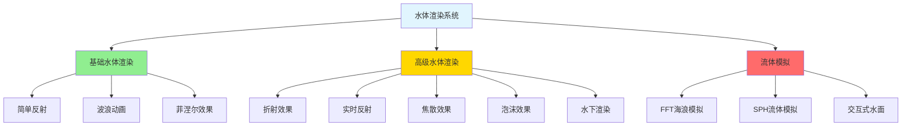
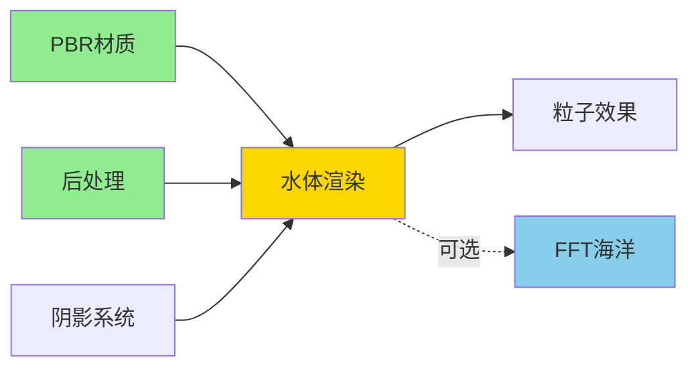

# 水体渲染系统扩展方案

## 1. 水体渲染概述

水体渲染可以分为几个层次：



---

## 2. 基础水体渲染系统

### 2.1 架构设计

```mermaid
graph TB
    subgraph "Water Rendering System"
        WaterComponent[水体组件] --> WaterMaterial[水体材质]
        WaterComponent --> WaterMesh[水面网格]
        WaterComponent --> WaveGenerator[波浪生成器]
        
        WaterMaterial --> ReflectionTexture[反射纹理]
        WaterMaterial --> RefractionTexture[折射纹理]
        WaterMaterial --> NormalMap[法线贴图]
        WaterMaterial --> FoamTexture[泡沫纹理]
        
        WaveGenerator --> GerstnerWaves[Gerstner波浪]
        WaveGenerator --> PerlinNoise[Perlin噪声]
        WaveGenerator --> SineWaves[正弦波组合]
        
        WaterRenderer[水体渲染器] --> ReflectionPass[反射渲染通道]
        WaterRenderer --> RefractionPass[折射渲染通道]
        WaterRenderer --> WaterPass[水面渲染通道]
        
        ReflectionPass --> PlanarReflection[平面反射]
        ReflectionPass --> SSR[屏幕空间反射]
    end
    
    subgraph "Advanced Effects"
        CausticsRenderer[焦散渲染器] --> CausticsTexture[焦散纹理]
        FoamGenerator[泡沫生成器] --> DepthBasedFoam[深度基于泡沫]
        FoamGenerator --> VelocityBasedFoam[速度基于泡沫]
        
        UnderwaterEffect[水下效果] --> UnderwaterFog[水下雾效]
        UnderwaterEffect --> GodRays[水下光线]
        UnderwaterEffect --> ColorGrading[颜色分级]
    end
    
    WaterRenderer --> CausticsRenderer
    WaterRenderer --> FoamGenerator
    WaterRenderer --> UnderwaterEffect
    
    style WaterComponent fill:#e1f5fe
    style WaterRenderer fill:#fff3e0
    style CausticsRenderer fill:#f3e5f5
```



### 2.2 核心组件实现

#### 2.2.1 水体材质

```cpp
class WaterMaterial : public Material {
public:
    struct Parameters {
        // 基础颜色
        glm::vec3 shallowColor = glm::vec3(0.0f, 0.5f, 0.7f);
        glm::vec3 deepColor = glm::vec3(0.0f, 0.1f, 0.3f);
        float depthFalloff = 0.5f;
        
        // 光学参数
        float fresnelPower = 5.0f;
        float reflectionStrength = 0.8f;
        float refractionStrength = 0.5f;
        float refractionDistortion = 0.1f;
        
        // 透明度
        float transparency = 0.9f;
        float absorptionCoefficient = 0.3f;
        
        // 表面参数
        float roughness = 0.1f;
        float metallic = 0.0f;
        float specularIntensity = 1.0f;
        
        // 波浪参数
        float waveSpeed = 1.0f;
        float waveScale = 1.0f;
        float normalStrength = 1.0f;
        
        // 泡沫参数
        bool enableFoam = true;
        glm::vec3 foamColor = glm::vec3(1.0f);
        float foamAmount = 0.5f;
        float foamCutoff = 0.8f;
        
        // 焦散参数
        bool enableCaustics = true;
        float causticsScale = 1.0f;
        float causticsSpeed = 0.5f;
        float causticsStrength = 1.0f;
        
        // 纹理
        std::shared_ptr<Texture2D> normalMap;
        std::shared_ptr<Texture2D> foamTexture;
        std::shared_ptr<Texture2D> causticsTexture;
    };
    
    void setParameters(const Parameters& params);
    const Parameters& getParameters() const { return params_; }
    
    void updateReflectionTexture(std::shared_ptr<Texture2D> texture);
    void updateRefractionTexture(std::shared_ptr<Texture2D> texture);
    
private:
    Parameters params_;
    std::shared_ptr<Texture2D> reflectionTexture_;
    std::shared_ptr<Texture2D> refractionTexture_;
};
```

#### 2.2.2 波浪生成器

```cpp
class WaveGenerator {
public:
    // Gerstner波浪参数
    struct GerstnerWave {
        glm::vec2 direction;     // 波浪方向
        float amplitude;         // 振幅
        float wavelength;        // 波长
        float speed;             // 速度
        float steepness;         // 陡峭度 (0-1)
    };
    
    // 添加Gerstner波浪
    void addGerstnerWave(const GerstnerWave& wave);
    void clearWaves();
    
    // 计算指定位置的水面位置和法线
    struct WaveResult {
        glm::vec3 position;
        glm::vec3 normal;
        glm::vec3 tangent;
        glm::vec3 binormal;
    };
    
    WaveResult evaluateWaves(const glm::vec2& worldPos, float time) const;
    
    // 生成GPU数据用于顶点着色器
    void uploadToGPU(const Shader& shader) const;
    
private:
    std::vector<GerstnerWave> waves_;
    
    // Gerstner波浪计算
    glm::vec3 calculateGerstnerWave(
        const GerstnerWave& wave,
        const glm::vec2& worldPos,
        float time,
        glm::vec3& tangent,
        glm::vec3& binormal
    ) const;
};
```

#### 2.2.3 水体组件

```cpp
class WaterComponent : public Component {
public:
    enum class WaterType {
        Ocean,          // 海洋
        Lake,           // 湖泊
        River,          // 河流
        Pool            // 水池
    };
    
    struct Config {
        WaterType type = WaterType::Lake;
        glm::vec2 size = glm::vec2(100.0f);
        uint32_t tessellation = 64;  // 细分级别
        float height = 0.0f;          // 水面高度
        
        // LOD设置
        bool enableLOD = true;
        float lodBias = 1.0f;
        uint32_t maxLODLevel = 4;
    };
    
    void setConfig(const Config& config);
    void setMaterial(std::shared_ptr<WaterMaterial> material);
    void setWaveGenerator(std::shared_ptr<WaveGenerator> generator);
    
    std::shared_ptr<WaterMaterial> getMaterial() const { return material_; }
    std::shared_ptr<WaveGenerator> getWaveGenerator() const { return waveGenerator_; }
    const Config& getConfig() const { return config_; }
    
private:
    Config config_;
    std::shared_ptr<WaterMaterial> material_;
    std::shared_ptr<WaveGenerator> waveGenerator_;
    std::shared_ptr<Mesh> waterMesh_;
};
```

#### 2.2.4 水体渲染器

```cpp
class WaterRenderer {
public:
    struct RenderSettings {
        bool enableReflections = true;
        bool enableRefractions = true;
        bool enableCaustics = true;
        bool enableFoam = true;
        bool useSSR = false;  // 使用屏幕空间反射而非平面反射
        
        uint32_t reflectionResolution = 512;
        uint32_t refractionResolution = 512;
    };
    
    void initialize();
    void setSettings(const RenderSettings& settings);
    
    // 主渲染流程
    void render(
        const std::vector<WaterComponent*>& waterComponents,
        const Camera& camera,
        const Scene& scene
    );
    
private:
    // 渲染通道
    void renderReflectionPass(const Camera& camera, const Scene& scene);
    void renderRefractionPass(const Camera& camera, const Scene& scene);
    void renderWaterSurface(
        const std::vector<WaterComponent*>& waterComponents,
        const Camera& camera
    );
    
    // 辅助功能
    Camera createReflectionCamera(const Camera& camera, float waterHeight);
    void updateWaterUniforms(const WaterComponent& water, float time);
    
    RenderSettings settings_;
    
    // 渲染目标
    std::shared_ptr<RenderTarget> reflectionTarget_;
    std::shared_ptr<RenderTarget> refractionTarget_;
    
    // 着色器
    std::shared_ptr<Shader> waterShader_;
    std::shared_ptr<Shader> underwaterShader_;
};
```

---

## 3. 水体着色器实现

### 3.1 顶点着色器（波浪动画）

```glsl
#version 450 core

layout(location = 0) in vec3 aPosition;
layout(location = 1) in vec2 aTexCoord;

out VS_OUT {
    vec3 worldPos;
    vec3 normal;
    vec2 texCoord;
    vec4 clipSpace;
    vec3 viewDir;
    float depth;
} vs_out;

uniform mat4 uModel;
uniform mat4 uView;
uniform mat4 uProjection;
uniform float uTime;
uniform vec3 uCameraPos;

// Gerstner波浪参数
struct GerstnerWave {
    vec2 direction;
    float amplitude;
    float wavelength;
    float speed;
    float steepness;
};

#define MAX_WAVES 8
uniform int uWaveCount;
uniform GerstnerWave uWaves[MAX_WAVES];

// Gerstner波浪计算
vec3 calculateGerstnerWave(GerstnerWave wave, vec2 worldPos, float time, inout vec3 tangent, inout vec3 binormal) {
    float k = 2.0 * 3.14159 / wave.wavelength;
    float c = sqrt(9.8 / k);
    vec2 d = normalize(wave.direction);
    float f = k * (dot(d, worldPos) - c * time * wave.speed);
    float a = wave.amplitude;
    float Q = wave.steepness / (k * a * float(uWaveCount));
    
    // 位移
    vec3 displacement;
    displacement.x = Q * a * d.x * cos(f);
    displacement.y = a * sin(f);
    displacement.z = Q * a * d.y * cos(f);
    
    // 切线和副切线（用于计算法线）
    tangent += vec3(
        -Q * a * d.x * d.x * sin(f),
        Q * a * d.x * cos(f),
        -Q * a * d.x * d.y * sin(f)
    );
    
    binormal += vec3(
        -Q * a * d.x * d.y * sin(f),
        Q * a * d.y * cos(f),
        -Q * a * d.y * d.y * sin(f)
    );
    
    return displacement;
}

void main() {
    // 基础世界坐标
    vec4 worldPos = uModel * vec4(aPosition, 1.0);
    
    // 计算所有波浪的叠加效果
    vec3 displacement = vec3(0.0);
    vec3 tangent = vec3(1.0, 0.0, 0.0);
    vec3 binormal = vec3(0.0, 0.0, 1.0);
    
    for (int i = 0; i < uWaveCount; i++) {
        displacement += calculateGerstnerWave(uWaves[i], worldPos.xz, uTime, tangent, binormal);
    }
    
    // 应用位移
    worldPos.xyz += displacement;
    
    // 计算法线（切线 × 副切线）
    vec3 normal = normalize(cross(binormal, tangent));
    
    // 输出
    vs_out.worldPos = worldPos.xyz;
    vs_out.normal = normal;
    vs_out.texCoord = aTexCoord;
    vs_out.clipSpace = uProjection * uView * worldPos;
    vs_out.viewDir = normalize(uCameraPos - worldPos.xyz);
    vs_out.depth = (uView * worldPos).z;
    
    gl_Position = vs_out.clipSpace;
}
```

### 3.2 片段着色器（水面效果）

```glsl
#version 450 core

in VS_OUT {
    vec3 worldPos;
    vec3 normal;
    vec2 texCoord;
    vec4 clipSpace;
    vec3 viewDir;
    float depth;
} fs_in;

out vec4 FragColor;

// 水体参数
uniform vec3 uShallowColor;
uniform vec3 uDeepColor;
uniform float uDepthFalloff;
uniform float uFresnelPower;
uniform float uReflectionStrength;
uniform float uRefractionStrength;
uniform float uRefractionDistortion;
uniform float uTransparency;

// 纹理
uniform sampler2D uReflectionTexture;
uniform sampler2D uRefractionTexture;
uniform sampler2D uDepthTexture;
uniform sampler2D uNormalMap;
uniform sampler2D uFoamTexture;
uniform sampler2D uCausticsTexture;

// 其他
uniform float uTime;
uniform vec3 uCameraPos;
uniform vec3 uLightDir;
uniform vec3 uLightColor;

// 计算菲涅尔效应
float fresnelSchlick(float cosTheta, float F0) {
    return F0 + (1.0 - F0) * pow(1.0 - cosTheta, uFresnelPower);
}

// 采样法线贴图
vec3 sampleNormalMap(vec2 uv, float time) {
    // 双层法线贴图滚动
    vec2 uv1 = uv * 2.0 + vec2(time * 0.05, time * 0.03);
    vec2 uv2 = uv * 1.5 + vec2(-time * 0.03, time * 0.04);
    
    vec3 normal1 = texture(uNormalMap, uv1).rgb * 2.0 - 1.0;
    vec3 normal2 = texture(uNormalMap, uv2).rgb * 2.0 - 1.0;
    
    return normalize(normal1 + normal2);
}

// 计算水深颜色
vec3 calculateDepthColor(float depth) {
    float depthFactor = exp(-depth * uDepthFalloff);
    return mix(uDeepColor, uShallowColor, depthFactor);
}

// 计算泡沫
float calculateFoam(vec2 uv, float depth, float time) {
    // 基于深度的泡沫
    float foamDepth = smoothstep(0.0, 0.3, depth);
    
    // 动画泡沫纹理
    vec2 foamUV1 = uv * 5.0 + vec2(time * 0.1, time * 0.05);
    vec2 foamUV2 = uv * 3.0 + vec2(-time * 0.08, time * 0.06);
    
    float foam1 = texture(uFoamTexture, foamUV1).r;
    float foam2 = texture(uFoamTexture, foamUV2).r;
    
    float foam = foam1 * foam2;
    foam = pow(foam, 2.0) * foamDepth;
    
    return foam;
}

// 计算焦散
float calculateCaustics(vec3 worldPos, float time) {
    vec2 causticsUV = worldPos.xz * 0.2 + vec2(time * 0.02, time * 0.03);
    
    float caustics1 = texture(uCausticsTexture, causticsUV).r;
    float caustics2 = texture(uCausticsTexture, causticsUV * 0.7 + 0.5).r;
    
    return min(caustics1, caustics2);
}

void main() {
    // 归一化设备坐标
    vec2 ndc = (fs_in.clipSpace.xy / fs_in.clipSpace.w) * 0.5 + 0.5;
    
    // 采样法线
    vec3 normalMap = sampleNormalMap(fs_in.texCoord, uTime);
    vec3 normal = normalize(fs_in.normal + normalMap);
    
    // 计算菲涅尔
    float fresnel = fresnelSchlick(max(dot(normal, fs_in.viewDir), 0.0), 0.02);
    
    // 采样反射和折射
    vec2 distortion = normalMap.xy * uRefractionDistortion;
    vec2 reflectUV = vec2(ndc.x, 1.0 - ndc.y) + distortion;
    vec2 refractUV = ndc + distortion;
    
    vec3 reflection = texture(uReflectionTexture, reflectUV).rgb;
    vec3 refraction = texture(uRefractionTexture, refractUV).rgb;
    
    // 计算水深
    float sceneDepth = texture(uDepthTexture, ndc).r;
    float waterDepth = abs(fs_in.depth);
    float depth = sceneDepth - waterDepth;
    
    // 水深颜色
    vec3 depthColor = calculateDepthColor(depth);
    refraction = mix(refraction, depthColor, clamp(depth * 0.5, 0.0, 1.0));
    
    // 混合反射和折射
    vec3 waterColor = mix(refraction, reflection, fresnel * uReflectionStrength);
    
    // 添加焦散
    float caustics = calculateCaustics(fs_in.worldPos, uTime);
    waterColor += vec3(caustics) * uLightColor * 0.5;
    
    // 添加镜面高光
    vec3 halfDir = normalize(uLightDir + fs_in.viewDir);
    float spec = pow(max(dot(normal, halfDir), 0.0), 256.0);
    waterColor += spec * uLightColor;
    
    // 添加泡沫
    float foam = calculateFoam(fs_in.texCoord, depth, uTime);
    waterColor = mix(waterColor, vec3(1.0), foam);
    
    // 输出
    FragColor = vec4(waterColor, uTransparency);
}
```

---

## 4. 高级水体效果

### 4.1 焦散效果渲染

```cpp
class CausticsRenderer {
public:
    struct Settings {
        uint32_t resolution = 512;
        float scale = 1.0f;
        float speed = 0.5f;
        float strength = 1.0f;
        uint32_t iterations = 3;  // 叠加层数
    };
    
    void initialize(const Settings& settings);
    void generateCausticsTexture(float time);
    std::shared_ptr<Texture2D> getCausticsTexture() const;
    
private:
    void renderCausticsLayer(uint32_t layer, float time);
    void combineLayers();
    
    Settings settings_;
    std::shared_ptr<RenderTarget> causticsTarget_;
    std::shared_ptr<Shader> causticsShader_;
    std::vector<std::shared_ptr<Texture2D>> layerTextures_;
};
```

**焦散着色器**：
```glsl
// 焦散片段着色器
#version 450 core

in vec2 TexCoord;
out vec4 FragColor;

uniform float uTime;
uniform float uScale;
uniform float uSpeed;

// Voronoi噪声生成焦散图案
vec2 voronoi(vec2 uv) {
    vec2 n = floor(uv);
    vec2 f = fract(uv);
    
    float minDist = 1.0;
    vec2 minPoint;
    
    for (int y = -1; y <= 1; y++) {
        for (int x = -1; x <= 1; x++) {
            vec2 neighbor = vec2(float(x), float(y));
            vec2 point = 0.5 + 0.5 * sin(uTime * uSpeed + 6.2831 * (n + neighbor));
            float dist = length(neighbor + point - f);
            
            if (dist < minDist) {
                minDist = dist;
                minPoint = point;
            }
        }
    }
    
    return vec2(minDist, minPoint.x);
}

void main() {
    vec2 uv = TexCoord * uScale;
    
    // 多层Voronoi生成焦散
    float caustics = 0.0;
    float amplitude = 1.0;
    float frequency = 1.0;
    
    for (int i = 0; i < 3; i++) {
        vec2 v = voronoi(uv * frequency);
        caustics += (1.0 - v.x) * amplitude;
        
        frequency *= 2.0;
        amplitude *= 0.5;
    }
    
    caustics = pow(caustics, 3.0);
    
    FragColor = vec4(vec3(caustics), 1.0);
}
```

### 4.2 泡沫生成器

```cpp
class FoamGenerator {
public:
    struct Settings {
        // 深度基于泡沫
        float depthThreshold = 0.5f;
        float depthFalloff = 2.0f;
        
        // 速度基于泡沫
        bool enableVelocityFoam = false;
        float velocityThreshold = 0.5f;
        
        // 泡沫纹理
        float foamScale = 5.0f;
        float foamSpeed = 1.0f;
    };
    
    void setSettings(const Settings& settings);
    
    // 计算泡沫遮罩
    float calculateFoamMask(
        const glm::vec3& worldPos,
        float waterDepth,
        const glm::vec3& velocity,
        float time
    ) const;
    
private:
    Settings settings_;
};
```

### 4.3 水下渲染效果

```cpp
class UnderwaterEffect : public PostProcessEffect {
public:
    struct Settings {
        // 水下雾
        glm::vec3 fogColor = glm::vec3(0.0f, 0.3f, 0.4f);
        float fogDensity = 0.05f;
        float fogStart = 5.0f;
        
        // 颜色调整
        glm::vec3 colorTint = glm::vec3(0.7f, 0.9f, 1.0f);
        float saturation = 0.8f;
        float brightness = 0.9f;
        
        // 扭曲效果
        float distortionStrength = 0.02f;
        float distortionSpeed = 1.0f;
        
        // God Rays
        bool enableGodRays = true;
        float godRayIntensity = 0.5f;
    };
    
    void setSettings(const Settings& settings);
    void render(const RenderTarget& input, const RenderTarget& output) override;
    
    // 检测相机是否在水下
    bool isCameraUnderwater(const Camera& camera, float waterHeight) const;
    
private:
    void applyUnderwaterFog(const RenderTarget& target);
    void applyColorGrading(const RenderTarget& target);
    void applyDistortion(const RenderTarget& target, float time);
    void renderGodRays(const RenderTarget& target, const glm::vec3& sunDir);
    
    Settings settings_;
    std::shared_ptr<Shader> underwaterShader_;
};
```

**水下效果着色器**：
```glsl
#version 450 core

in vec2 TexCoord;
out vec4 FragColor;

uniform sampler2D uSceneTexture;
uniform sampler2D uDepthTexture;
uniform sampler2D uNormalTexture;

uniform vec3 uFogColor;
uniform float uFogDensity;
uniform vec3 uColorTint;
uniform float uTime;
uniform float uDistortionStrength;

// Perlin噪声用于扭曲
float noise(vec2 uv) {
    return fract(sin(dot(uv, vec2(12.9898, 78.233))) * 43758.5453);
}

void main() {
    // 水下扭曲
    vec2 distortion = vec2(
        noise(TexCoord * 10.0 + uTime * 0.1),
        noise(TexCoord * 10.0 + uTime * 0.15)
    ) * 2.0 - 1.0;
    distortion *= uDistortionStrength;
    
    vec2 uv = TexCoord + distortion;
    
    // 采样场景
    vec3 sceneColor = texture(uSceneTexture, uv).rgb;
    float depth = texture(uDepthTexture, TexCoord).r;
    
    // 水下雾
    float fogFactor = 1.0 - exp(-depth * uFogDensity);
    sceneColor = mix(sceneColor, uFogColor, fogFactor);
    
    // 颜色调整
    sceneColor *= uColorTint;
    
    FragColor = vec4(sceneColor, 1.0);
}
```

---

## 5. FFT海洋模拟（高级）

### 5.1 FFT海浪系统

```cpp
class FFTOceanSimulation {
public:
    struct Parameters {
        uint32_t resolution = 512;      // 必须是2的幂
        float patchSize = 1000.0f;      // 海面尺寸（米）
        float windSpeed = 30.0f;        // 风速
        glm::vec2 windDirection = glm::vec2(1.0f, 0.0f);
        float amplitude = 1.0f;         // 波浪幅度
        float gravity = 9.81f;
        float damping = 0.001f;
    };
    
    void initialize(const Parameters& params);
    void update(float time);
    
    // 获取高度图和法线图
    std::shared_ptr<Texture2D> getDisplacementMap() const;
    std::shared_ptr<Texture2D> getNormalMap() const;
    
private:
    void generateSpectrum();
    void updateSpectrum(float time);
    void performFFT();
    void generateMaps();
    
    Parameters params_;
    
    // FFT数据
    std::vector<std::complex<float>> h0_;      // 初始频谱
    std::vector<std::complex<float>> ht_;      // 时间相关频谱
    std::vector<glm::vec3> displacement_;      // 位移场
    std::vector<glm::vec3> normals_;           // 法线场
    
    // GPU纹理
    std::shared_ptr<Texture2D> displacementMap_;
    std::shared_ptr<Texture2D> normalMap_;
    
    // 计算着色器
    std::shared_ptr<ComputeShader> fftShader_;
    std::shared_ptr<ComputeShader> normalShader_;
};
```

### 5.2 Phillips频谱实现

```cpp
// Phillips频谱函数
float PhillipsSpectrum(
    const glm::vec2& k,
    float windSpeed,
    const glm::vec2& windDir,
    float gravity,
    float amplitude
) {
    float k_length = glm::length(k);
    if (k_length < 0.00001f) return 0.0f;
    
    float k_length2= k_length * k_length;
    float k_length4 = k_length2 * k_length2;
    
    float k_dot_w = glm::dot(glm::normalize(k), windDir);
    float k_dot_w2 = k_dot_w * k_dot_w;
    
    float L = (windSpeed * windSpeed) / gravity;
    float L2 = L * L;
    
    float damping = 0.001f;
    float l2 = L2 * damping * damping;
    
    return amplitude * 
           std::exp(-1.0f / (k_length2 * L2)) / k_length4 *
           k_dot_w2 *
           std::exp(-k_length2 * l2);
}
```

---

## 6. 交互式水体

### 6.1 水面交互系统

```cpp
class InteractiveWaterSystem {
public:
    struct Ripple {
        glm::vec2 position;
        float radius;
        float amplitude;
        float frequency;
        float lifetime;
        float age;
    };
    
    // 添加涟漪
    void addRipple(const glm::vec2& position, float strength);
    
    // 添加持续性扰动（如船只）
    void addDisturbance(const glm::vec2& position, const glm::vec2& velocity, float size);
    
    // 更新所有涟漪
    void update(float deltaTime);
    
    // 生成交互纹理（用于着色器）
    std::shared_ptr<Texture2D> generateInteractionTexture(const glm::vec2& worldMin, const glm::vec2& worldMax);
    
private:
    std::vector<Ripple> activeRipples_;
    float maxRippleLifetime_ = 5.0f;
    uint32_t maxRippleCount_ = 64;
};
```

### 6.2 物理交互

```cpp
class WaterPhysicsInteraction {
public:
    // 计算浮力
    struct BuoyancyResult {
        glm::vec3 force;
        glm::vec3 torque;
        float submergedVolume;
    };
    
    BuoyancyResult calculateBuoyancy(
        const AABB& objectBounds,
        float objectMass,
        const WaterComponent& water,
        float time
    ) const;
    
    // 计算阻力
    glm::vec3 calculateDrag(
        const glm::vec3& velocity,
        float crossSectionalArea,
        float dragCoefficient
    ) const;
    
private:
    float waterDensity_ = 1000.0f;  // kg/m³
};
```

---

## 7. 实现步骤与时间线

### 阶段1: 基础水体渲染 (2-3周)
**Week 1-2: 核心系统**
- ✅ 实现 `WaterComponent` 和 `WaterMaterial`
- ✅ Gerstner波浪生成器
- ✅ 基础水体着色器（反射、折射、菲涅尔）
- ✅ 平面反射渲染

**Week 3: 基础效果**
- ✅ 法线贴图动画
- ✅ 深度基于颜色
- ✅ 基础泡沫效果

**预期效果**: 可用的湖泊/池塘水体，具有基本的反射和波浪动画

### 阶段2: 高级视觉效果 (2-3周)
**Week 1: 焦散和泡沫**
- ✅ 焦散纹理生成
- ✅ 动态泡沫系统
- ✅ 改进的法线贴图混合

**Week 2: 水下效果**
- ✅ 水下后处理
- ✅ 水下雾和颜色分级
- ✅ 水下God Rays

**Week 3: 优化和整合**
- ✅ 性能优化
- ✅ LOD系统集成
- ✅ 与现有渲染管线整合

**预期效果**: 具有焦散、泡沫的高质量水体，支持水下渲染

### 阶段3: 物理模拟和交互 (3-4周) *(可选高级功能)*
**Week 1-2: FFT海洋模拟**
- Phillips频谱实现
- FFT计算（CPU或GPU）
- 高度图和法线图生成

**Week 3: 交互系统**
- 涟漪系统
- 物体交互
- 浮力计算

**Week 4: 抛光和优化**
- 性能优化
- 调试工具
- 参数调优

**预期效果**: 逼真的海洋模拟，支持大规模水域和物理交互

---

## 8. 性能优化建议

### 8.1 渲染优化

```cpp
class WaterOptimization {
public:
    // LOD系统
    struct LODConfig {
        float distances[4] = {50.0f, 100.0f, 200.0f, 500.0f};
        uint32_t tessellations[4] = {128, 64, 32, 16};
    };
    
    // 根据距离选择LOD级别
    uint32_t selectLOD(float distanceToCamera, const LODConfig& config);
    
    // 视锥剔除
    bool frustumCullWaterTile(const AABB& tileBounds, const Frustum& frustum);
    
    // 降低分辨率渲染
    struct AdaptiveQuality {
        bool enableAdaptive = true;
        float targetFrameTime = 16.67f;  // 60 FPS
        uint32_t minResolution = 256;
        uint32_t maxResolution = 1024;
        uint32_t currentResolution = 512;
    };
};
```

### 8.2 内存优化

- **纹理复用**: 反射和折射纹理使用较低分辨率
- **图集打包**: 法线贴图、泡沫贴图等打包到图集
- **流式加载**: FFT数据按需计算和加载

### 8.3 GPU优化

- **计算着色器**: FFT计算、波浪更新使用计算着色器
- **实例化渲染**: 多个水体使用实例化
- **Early-Z**: 水体渲染前先渲染深度

```cpp
class WaterGPUOptimization {
public:
    // 使用计算着色器更新波浪
    void updateWavesOnGPU(float time) {
        waveUpdateShader_->bind();
        waveUpdateShader_->setFloat("uTime", time);
        waveUpdateShader_->dispatch(
            (meshResolution_ + 15) / 16,
            (meshResolution_ + 15) / 16,
            1
        );
        glMemoryBarrier(GL_SHADER_STORAGE_BARRIER_BIT);
    }
    
    // 批量渲染多个水体
    void batchRenderWater(const std::vector<WaterComponent*>& waters) {
        // 按材质分组
        std::map<WaterMaterial*, std::vector<WaterComponent*>> batches;
        for (auto* water : waters) {
            batches[water->getMaterial().get()].push_back(water);
        }
        
        // 实例化渲染
        for (auto& [material, instances] : batches) {
            if (instances.size() > 1) {
                renderInstancedWater(material, instances);
            } else {
                renderSingleWater(instances[0]);
            }
        }
    }
    
private:
    std::shared_ptr<ComputeShader> waveUpdateShader_;
    uint32_t meshResolution_;
};
```

---

## 9. 调试和可视化工具

### 9.1 水体调试器

```cpp
class WaterDebugger {
public:
    enum class DebugMode {
        None,
        Wireframe,          // 网格线框
        Normals,            // 法线可视化
        Depth,              // 深度可视化
        Reflection,         // 仅反射
        Refraction,         // 仅折射
        Foam,               // 泡沫遮罩
        Caustics,           // 焦散
        Waves,              // 波浪高度
        Fresnel             // 菲涅尔因子
    };
    
    void setDebugMode(DebugMode mode);
    void renderDebugUI();  // ImGui界面
    void visualizeWaves(const WaveGenerator& generator);
    
    // 实时参数调整
    struct LiveParameters {
        float waveSpeed = 1.0f;
        float waveScale = 1.0f;
        float reflectionStrength = 0.8f;
        float foamAmount = 0.5f;
        glm::vec3 shallowColor = glm::vec3(0.0f, 0.5f, 0.7f);
        glm::vec3 deepColor = glm::vec3(0.0f, 0.1f, 0.3f);
    };
    
    void updateLiveParameters(WaterComponent& water, const LiveParameters& params);
    
private:
    DebugMode currentMode_ = DebugMode::None;
    LiveParameters liveParams_;
};
```

### 9.2 ImGui调试界面示例

```cpp
void WaterDebugger::renderDebugUI() {
    ImGui::Begin("Water Debugger");
    
    // 调试模式选择
    const char* debugModes[] = {
        "None", "Wireframe", "Normals", "Depth", 
        "Reflection", "Refraction", "Foam", "Caustics",
        "Waves", "Fresnel"
    };
    int currentMode = static_cast<int>(currentMode_);
    if (ImGui::Combo("Debug Mode", &currentMode, debugModes, IM_ARRAYSIZE(debugModes))) {
        currentMode_ = static_cast<DebugMode>(currentMode);
    }
    
    ImGui::Separator();
    
    // 实时参数调整
    ImGui::Text("Wave Parameters");
    ImGui::SliderFloat("Wave Speed", &liveParams_.waveSpeed, 0.0f, 5.0f);
    ImGui::SliderFloat("Wave Scale", &liveParams_.waveScale, 0.1f, 10.0f);
    
    ImGui::Separator();
    
    ImGui::Text("Appearance");
    ImGui::SliderFloat("Reflection Strength", &liveParams_.reflectionStrength, 0.0f, 1.0f);
    ImGui::SliderFloat("Foam Amount", &liveParams_.foamAmount, 0.0f, 1.0f);
    ImGui::ColorEdit3("Shallow Color", &liveParams_.shallowColor.x);
    ImGui::ColorEdit3("Deep Color", &liveParams_.deepColor.x);
    
    ImGui::Separator();
    
    // 性能统计
    ImGui::Text("Performance");
    ImGui::Text("Reflection Pass: %.2f ms", reflectionPassTime_);
    ImGui::Text("Refraction Pass: %.2f ms", refractionPassTime_);
    ImGui::Text("Water Pass: %.2f ms", waterPassTime_);
    ImGui::Text("Total: %.2f ms", totalTime_);
    
    ImGui::End();
}
```

---

## 10. 使用示例

### 10.1 创建简单湖泊

```cpp
// 场景设置示例
void createLakeScene(Scene& scene) {
    // 创建水体实体
    auto waterEntity = scene.createEntity("Lake");
    
    // 配置水体组件
    WaterComponent::Config waterConfig;
    waterConfig.type = WaterComponent::WaterType::Lake;
    waterConfig.size = glm::vec2(200.0f, 200.0f);
    waterConfig.tessellation = 128;
    waterConfig.height = 0.0f;
    
    auto waterComponent = waterEntity.addComponent<WaterComponent>();
    waterComponent->setConfig(waterConfig);
    
    // 创建水体材质
    auto material = std::make_shared<WaterMaterial>();
    WaterMaterial::Parameters params;
    params.shallowColor = glm::vec3(0.3f, 0.7f, 0.8f);
    params.deepColor = glm::vec3(0.0f, 0.2f, 0.4f);
    params.reflectionStrength = 0.7f;
    params.transparency = 0.85f;
    params.enableFoam = true;
    params.enableCaustics = true;
    material->setParameters(params);
    
    // 加载纹理
    material->loadNormalMap("textures/water_normal.png");
    material->loadFoamTexture("textures/foam.png");
    material->loadCausticsTexture("textures/caustics.png");
    
    waterComponent->setMaterial(material);
    
    // 配置波浪
    auto waveGen = std::make_shared<WaveGenerator>();
    
    // 添加多个Gerstner波浪
    WaveGenerator::GerstnerWave wave1;
    wave1.direction = glm::vec2(1.0f, 0.0f);
    wave1.amplitude = 0.3f;
    wave1.wavelength = 10.0f;
    wave1.speed = 1.0f;
    wave1.steepness = 0.5f;
    waveGen->addGerstnerWave(wave1);
    
    WaveGenerator::GerstnerWave wave2;
    wave2.direction = glm::vec2(0.7f, 0.7f);
    wave2.amplitude = 0.2f;
    wave2.wavelength = 7.0f;
    wave2.speed = 1.2f;
    wave2.steepness = 0.4f;
    waveGen->addGerstnerWave(wave2);
    
    WaveGenerator::GerstnerWave wave3;
    wave3.direction = glm::vec2(-0.5f, 0.8f);
    wave3.amplitude = 0.15f;
    wave3.wavelength = 5.0f;
    wave3.speed = 1.5f;
    wave3.steepness = 0.3f;
    waveGen->addGerstnerWave(wave3);
    
    waterComponent->setWaveGenerator(waveGen);
    
    // 添加变换组件
    auto transform = waterEntity.addComponent<TransformComponent>();
    transform->setPosition(glm::vec3(0.0f, 0.0f, 0.0f));
}
```

### 10.2 创建海洋场景（使用FFT）

```cpp
void createOceanScene(Scene& scene) {
    auto oceanEntity = scene.createEntity("Ocean");
    
    // FFT海洋配置
    FFTOceanSimulation::Parameters fftParams;
    fftParams.resolution = 512;
    fftParams.patchSize = 2000.0f;
    fftParams.windSpeed = 25.0f;
    fftParams.windDirection = glm::vec2(1.0f, 0.3f);
    fftParams.amplitude = 2.0f;
    
    auto fftOcean = std::make_shared<FFTOceanSimulation>();
    fftOcean->initialize(fftParams);
    
    // 创建水体组件
    WaterComponent::Config config;
    config.type = WaterComponent::WaterType::Ocean;
    config.size = glm::vec2(5000.0f, 5000.0f);
    config.tessellation = 256;
    config.enableLOD = true;
    
    auto waterComponent = oceanEntity.addComponent<WaterComponent>();
    waterComponent->setConfig(config);
    
    // 海洋材质
    auto material = std::make_shared<WaterMaterial>();
    WaterMaterial::Parameters params;
    params.shallowColor = glm::vec3(0.1f, 0.4f, 0.5f);
    params.deepColor = glm::vec3(0.0f, 0.05f, 0.2f);
    params.depthFalloff = 0.02f;  // 海洋更深
    params.reflectionStrength = 0.9f;
    params.enableFoam = true;
    params.foamAmount = 0.7f;
    material->setParameters(params);
    
    waterComponent->setMaterial(material);
    
    // 使用FFT生成的纹理
    material->setNormalMap(fftOcean->getNormalMap());
    material->setDisplacementMap(fftOcean->getDisplacementMap());
    
    // 存储FFT模拟器引用以便每帧更新
    oceanEntity.addComponent<FFTOceanComponent>(fftOcean);
}
```

### 10.3 添加交互式涟漪

```cpp
void setupInteractiveWater(Scene& scene, WaterComponent* water) {
    auto interactive = std::make_shared<InteractiveWaterSystem>();
    
    // 监听输入事件
    InputManager::getInstance().onMouseClick([water, interactive](const glm::vec2& screenPos) {
        // 将屏幕坐标转换为世界坐标
        Ray ray = camera.screenToWorldRay(screenPos);
        float waterHeight = water->getConfig().height;
        
        // 计算射线与水面交点
        float t = (waterHeight - ray.origin.y) / ray.direction.y;
        if (t > 0) {
            glm::vec3 hitPoint = ray.origin + ray.direction * t;
            glm::vec2 waterPos = glm::vec2(hitPoint.x, hitPoint.z);
            
            // 添加涟漪
            interactive->addRipple(waterPos, 1.0f);
        }
    });
    
    // 每帧更新
    scene.onUpdate([water, interactive](float deltaTime) {
        interactive->update(deltaTime);
        
        // 生成交互纹理并传递给材质
        auto interactionTex = interactive->generateInteractionTexture(
            glm::vec2(-100, -100),
            glm::vec2(100, 100)
        );
        water->getMaterial()->setInteractionTexture(interactionTex);
    });
}
```

### 10.4 水下切换

```cpp
class WaterSceneManager {
public:
    void update(float deltaTime) {
        // 检查相机是否在水下
        bool wasUnderwater = isUnderwater_;
        isUnderwater_ = checkCameraUnderwater();
        
        // 切换状态
        if (isUnderwater_ != wasUnderwater) {
            transitionToUnderwater(isUnderwater_);
        }
        
        // 更新水下效果
        if (isUnderwater_) {
            underwaterEffect_->update(deltaTime);
        }
    }
    
private:
    bool checkCameraUnderwater() {
        float cameraY = camera_->getPosition().y;
        for (auto* water : activeWaters_) {
            float waterHeight = water->getConfig().height;
            // 考虑波浪影响
            glm::vec2 cameraXZ = glm::vec2(camera_->getPosition().x, camera_->getPosition().z);
            auto waveResult = water->getWaveGenerator()->evaluateWaves(cameraXZ, time_);
            waterHeight += waveResult.position.y;
            
            if (cameraY < waterHeight) {
                return true;
            }
        }
        return false;
    }
    
    void transitionToUnderwater(bool underwater) {
        if (underwater) {
            // 启用水下后处理
            postProcessStack_->addEffect(underwaterEffect_);
            
            // 调整声音
            audioManager_->setUnderwaterFilter(true);
            
            // 粒子效果（气泡）
            spawnBubbles();
        } else {
            // 禁用水下效果
            postProcessStack_->removeEffect("Underwater");
            audioManager_->setUnderwaterFilter(false);
        }
    }
    
    bool isUnderwater_ = false;
    Camera* camera_;
    std::vector<WaterComponent*> activeWaters_;
    std::shared_ptr<UnderwaterEffect> underwaterEffect_;
    std::shared_ptr<PostProcessingStack> postProcessStack_;
};
```

---

## 11. 与其他高级渲染功能的集成

### 11.1 与PBR系统集成

水体需要与PBR材质系统兼容：

```cpp
class WaterPBRIntegration {
public:
    // 水体作为PBR材质的特殊情况
    void renderWaterWithPBR(
        const WaterComponent& water,
        const std::vector<Light*>& lights,
        const IBLEnvironment& ibl
    ) {
        auto shader = waterPBRShader_;
        shader->bind();
        
        // 基础PBR参数
        shader->setFloat("uMetallic", 0.0f);     // 水不是金属
        shader->setFloat("uRoughness", 0.05f);   // 水面光滑
        
        // IBL环境
        shader->setTextureCube("uIrradianceMap", ibl.getIrradianceMap());
        shader->setTextureCube("uPrefilteredMap", ibl.getPrefilteredMap());
        shader->setTexture2D("uBRDFLookup", ibl.getBRDFLookup());
        
        // 水体特有参数
        bindWaterParameters(shader, water);
        
        // 渲染
        water.getMesh()->draw();
    }
};
```

### 11.2 与延迟渲染集成

在延迟渲染管线中，水体需要特殊处理：

```cpp
class WaterDeferredIntegration {
public:
    void renderInDeferredPipeline(
        const std::vector<WaterComponent*>& waters,
        const GBuffer& gbuffer,
        const Camera& camera
    ) {
        // 方案1: 水体使用前向渲染（推荐）
        // 在延迟渲染的光照通道之后渲染水体
        
        // 方案2: 水体写入G-Buffer（限制较多）
        // 需要特殊的G-Buffer布局来存储水体参数
        
        // 推荐方案1的实现
        glEnable(GL_BLEND);
        glBlendFunc(GL_SRC_ALPHA, GL_ONE_MINUS_SRC_ALPHA);
        
        for (auto* water : waters) {
            // 水体可以访问G-Buffer深度进行深度测试
            waterShader_->setTexture2D("uSceneDepth", gbuffer.getDepthAttachment());
            
            // 渲染水面
            renderWaterSurface(water, camera);
        }
        
        glDisable(GL_BLEND);
    }
};
```

### 11.3 与阴影系统集成

```cpp
// 水体接收和投射阴影
class WaterShadowIntegration {
public:
    // 水体接收阴影
    void renderWithShadows(
        const WaterComponent& water,
        const CascadedShadowMap& csm
    ) {
        waterShader_->bind();
        
        // 绑定级联阴影贴图
        waterShader_->setTexture2DArray("uShadowMaps", csm.getShadowMapArray());
        waterShader_->setMatrixArray("uLightMatrices", csm.getLightMatrices());
        waterShader_->setFloatArray("uCascadeDistances", csm.getCascadeDistances());
        
        // 渲染时考虑阴影
        water.getMesh()->draw();
    }
    
    // 水体投射阴影（可选，通常水是透明的）
    void renderWaterToShadowMap(
        const WaterComponent& water,
        const DirectionalLight& light
    ) {
        // 如果需要水面投射阴影（如浅水区）
        shadowShader_->bind();
        shadowShader_->setFloat("uAlphaThreshold", 0.5f);
        water.getMesh()->draw();
    }
};
```

### 11.4 与粒子系统集成

```cpp
// 水体相关粒子效果
class WaterParticleEffects {
public:
    // 水花效果
    void spawnSplash(const glm::vec3& position, float intensity) {
        ParticleEmitter::Config config;
        config.maxParticles = 100;
        config.lifetime = 1.0f;
        config.emissionRate = 100.0f / config.lifetime;
        config.initialVelocity = glm::vec3(0.0f, 5.0f * intensity, 0.0f);
        config.velocityVariance = 2.0f;
        
        auto emitter = std::make_shared<ParticleEmitter>(config);
        emitter->setPosition(position);
        emitter->setTexture(splashTexture_);
        emitter->emit();
    }
    
    // 气泡效果（水下）
    void spawnBubbles(const glm::vec3& position) {
        ParticleEmitter::Config config;
        config.maxParticles = 50;
        config.lifetime = 3.0f;
        config.emissionRate = 10.0f;
        config.initialVelocity = glm::vec3(0.0f, 1.0f, 0.0f);
        
        // 气泡受到浮力影响
        config.forces.push_back(std::make_shared<BuoyancyForce>(0.5f));
        
        auto emitter = std::make_shared<ParticleEmitter>(config);
        emitter->setPosition(position);
        emitter->setTexture(bubbleTexture_);
    }
    
    // 雨滴涟漪
    void spawnRainRipples(const WaterComponent& water, float rainIntensity) {
        float spawnRate = rainIntensity * 100.0f;  // 每秒生成涟漪数
        
        // 随机位置生成涟漪
        for (int i = 0; i < spawnRate * deltaTime_; i++) {
            glm::vec2 randomPos = getRandomPositionOnWater(water);
            interactive->addRipple(randomPos, 0.3f);
        }
    }
};
```

---

## 12. 性能基准和优化目标

### 12.1 性能目标

| 场景类型 | 分辨率 | 目标帧率 | 水体尺寸 | 细分级别 |
|---------|--------|---------|----------|---------|
| 小型池塘 | 1080p | 60 FPS | 50x50m | 64x64 |
| 中型湖泊 | 1080p | 60 FPS | 200x200m | 128x128 |
| 大型海洋 | 1080p | 30-60 FPS | 5000x5000m | 256x256 + LOD |
| 多个水体 | 1080p | 60 FPS | 多个100x100m | 64x64 each |

### 12.2 性能分析

```cpp
class WaterPerformanceProfiler {
public:
    struct FrameStats {
        float reflectionPassMs;
        float refractionPassMs;
        float waveUpdateMs;
        float waterRenderMs;
        float totalMs;
        
        uint32_t vertices;
        uint32_t triangles;
        uint32_t drawCalls;
    };
    
    void beginFrame();
    void endPass(const std::string& passName);
    void endFrame();
    
    FrameStats getAverageStats(uint32_t frameCount = 60) const;
    void exportToCSV(const std::string& filename) const;
    
private:
    std::vector<FrameStats> frameHistory_;
    std::chrono::high_resolution_clock::time_point passStartTime_;
};
```

### 12.3 优化检查清单

**渲染优化**:
- [ ] 使用低分辨率反射/折射纹理 (512x512)
- [ ] 实现水体LOD系统
- [ ] 视锥剔除水体平铺
- [ ] 合批多个水体实例
- [ ] 使用计算着色器更新波浪

**内存优化**:
- [ ] 纹理压缩 (BC5用于法线贴图)
- [ ] 共享材质和纹理
- [ ] 流式加载FFT数据
- [ ] 释放不可见水体资源

**着色器优化**:
- [ ] 简化水下着色器
- [ ] 减少纹理采样次数
- [ ] 使用shader变体而非分支
- [ ] 预计算静态数据

---

## 13. 总结与建议

### 13.1 推荐实施路线

**立即开始（必需）**:
1. **基础水体渲染** (2-3周)
   - Gerstner波浪
   - 反射/折射
   - 基础材质

**短期目标（推荐）**:
2. **高级视觉效果** (2-3周)
   - 焦散
   - 泡沫
   - 水下效果

**中期目标（可选）**:
3. **FFT海洋模拟** (3-4周)
   - 逼真的大规模海洋
   - 物理正确的波浪

**长期目标（高级）**:
4. **交互和物理** (2-3周)
   - 涟漪系统
   - 浮力模拟

### 13.2 与其他功能的优先级



**建议顺序**:
1. 先完成 PBR + 后处理 + 阴影
2. 再实现基础水体渲染
3. 最后添加高级水体效果

### 13.3 快速原型建议

如果想快速看到效果，可以先实现：

```cpp
// 最简化的水体原型 (1-2天可完成)
class SimpleWaterPrototype {
public:
    void render() {
        // 1. 平面网格 + 简单波浪动画（正弦波）
        // 2. 天空盒反射（立方体贴图）
        // 3. 菲涅尔混合
        // 4. 滚动法线贴图
        
        // 即可得到基本可用的水面效果
    }
};
```

然后逐步添加：
- 折射效果
- 焦散
- 泡沫
- Gerstner波浪
- 更复杂的光照

### 13.4 预期效果展示

**完成阶段1后**:
- ✅ 清澈的湖泊水面
- ✅ 动态波浪动画
- ✅ 反射和折射效果
- ✅ 基础的深度颜色渐变

**完成阶段2后**:
- ✅ 焦散光斑
- ✅ 动态泡沫
- ✅ 水下雾效和颜色调整
- ✅ 接近游戏水准的视觉质量

**完成阶段3后** (可选):
- ✅ 电影级海洋
- ✅ 物理正确的波浪
- ✅ 大规模水域支持

---

## 14. 参考资源

### 学习资源
- **GPU Gems** - Chapter 1: Effective Water Simulation from Physical Models
- **GPU Gems 2** - Chapter 18: Simulating Ocean Water
- **Real-Time Rendering 4th Edition** - Water Rendering章节
- **Tessendorf's Paper**: "Simulating Ocean Water" (FFT海洋经典论文)

### 代码参考
- Unreal Engine 4 Water系统
- Unity Water System 2.0
- Crest Ocean System (Unity插件，开源)
