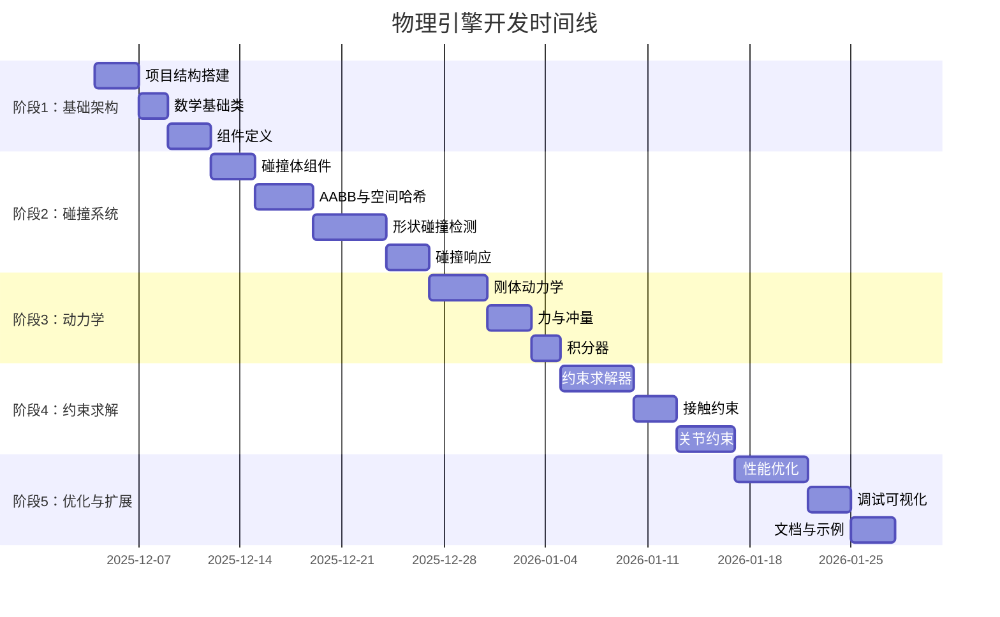

# RenderEngine 物理引擎开发 Todolists

> 基于《物理引擎方案.md》设计的详细开发任务列表
> 
> **开发周期**: 预计 8-12 周
> 
> **开发原则**: 
> - 增量开发，每个阶段都可独立测试
> - 充分利用现有 ECS 架构
> - 优先实现核心功能，高级功能作为扩展
> - 确保线程安全和性能优化

---

## 📋 开发阶段概览



---

## 🎯 阶段 1：基础架构搭建 (Week 1) ✅ **已完成**

### 1.1 项目结构与文件创建

**优先级**: 🔴 Critical | **预计时间**: 1-2 天 | ✅ **已完成**

- [x] **1.1.1** 创建目录结构
  ```
  include/render/physics/
  ├── physics_world.h
  ├── physics_config.h
  ├── physics_components.h
  ├── physics_systems.h
  ├── collision/
  │   ├── collision_detection.h
  │   ├── collision_shapes.h
  │   ├── broad_phase.h
  │   ├── narrow_phase.h
  │   └── contact_manifold.h
  ├── dynamics/
  │   ├── rigid_body.h
  │   ├── constraint_solver.h
  │   └── integrator.h
  └── debug/
      └── physics_debug_renderer.h
  
  src/physics/
  ├── physics_world.cpp
  ├── physics_systems.cpp
  ├── collision/
  │   ├── collision_detection.cpp
  │   ├── broad_phase.cpp
  │   └── narrow_phase.cpp
  ├── dynamics/
  │   ├── rigid_body.cpp
  │   ├── constraint_solver.cpp
  │   └── integrator.cpp
  └── debug/
      └── physics_debug_renderer.cpp
  ```

- [x] **1.1.2** 更新 `CMakeLists.txt`
  - 添加物理引擎源文件
  - 配置编译选项（启用 AVX2/SSE 优化）
  - 添加 `USE_EXTERNAL_PHYSICS` 选项（为未来集成 Bullet/PhysX 做准备）
  
- [x] **1.1.3** 创建物理引擎模块类
  - `PhysicsModule` 继承自 `AppModule`
  - 实现生命周期管理接口
  - 集成到 `ModuleRegistry`

**验证标准**:
- ✅ 项目能够成功编译（空实现）
- ✅ 模块可以被注册到应用框架
- ✅ 目录结构清晰，符合项目规范
- ✅ 单元测试通过 (34 个测试全部通过)

---

### 1.2 数学基础类扩展

**优先级**: 🔴 Critical | **预计时间**: 1 天 | ✅ **已完成**

- [x] **1.2.1** 扩展 `types.h` 添加物理数学类型
  ```cpp
  // 在 include/render/types.h 中添加
  struct AABB {
      Vector3 min;
      Vector3 max;
      
      Vector3 GetCenter() const;
      Vector3 GetExtent() const;
      bool Overlaps(const AABB& other) const;
      bool Contains(const Vector3& point) const;
  };
  
  struct OBB {
      Vector3 center;
      Vector3 halfExtents;
      Quaternion orientation;
      
      AABB GetAABB() const;
  };
  
  struct Ray {
      Vector3 origin;
      Vector3 direction;
      
      Vector3 GetPoint(float t) const;
  };
  
  struct RaycastHit {
      EntityID entity;
      Vector3 point;
      Vector3 normal;
      float distance;
  };
  ```

- [x] **1.2.2** 添加物理数学工具函数
  - 在 `physics_utils.h` 中添加，复用现有 `math_utils.h` 和 `transform.h`
    - AABB 合并/扩展
    - 空间转换（世界/局部）
    - 距离和投影计算
    - 惯性张量计算

**验证标准**:
- ✅ 数学类型正确实现
- ✅ 充分利用现有工具库
- ✅ test_physics_math.cpp 测试通过 (18/18)

---

### 1.3 物理组件定义

**优先级**: 🔴 Critical | **预计时间**: 2-3 天 | ✅ **已完成**

- [x] **1.3.1** 创建 `physics_components.h`，定义核心组件

#### RigidBodyComponent
```cpp
struct RigidBodyComponent {
    enum class BodyType { Static, Kinematic, Dynamic };
    
    // 类型与属性
    BodyType type = BodyType::Dynamic;
    float mass = 1.0f;
    float inverseMass = 1.0f;
    
    // 运动状态
    Vector3 linearVelocity = Vector3::Zero();
    Vector3 angularVelocity = Vector3::Zero();
    Vector3 force = Vector3::Zero();
    Vector3 torque = Vector3::Zero();
    
    // 惯性张量
    Matrix3 inertiaTensor = Matrix3::Identity();
    Matrix3 inverseInertiaTensor = Matrix3::Identity();
    
    // 阻尼
    float linearDamping = 0.01f;
    float angularDamping = 0.05f;
    
    // 重力
    bool useGravity = true;
    float gravityScale = 1.0f;
    
    // 休眠
    bool isSleeping = false;
    float sleepThreshold = 0.01f;
    float sleepTimer = 0.0f;
    
    // 插值数据（用于渲染平滑）
    Vector3 previousPosition = Vector3::Zero();
    Quaternion previousRotation = Quaternion::Identity();
    
    // 约束
    bool lockPosition[3] = {false, false, false};
    bool lockRotation[3] = {false, false, false};
};
```

#### ColliderComponent
```cpp
struct ColliderComponent {
    enum class ShapeType { Sphere, Box, Capsule, Mesh, ConvexHull };
    
    ShapeType shapeType = ShapeType::Box;
    
    // 形状数据（使用 union 节省内存）
    union ShapeData {
        struct { float radius; } sphere;
        struct { Vector3 halfExtents; } box;
        struct { float radius; float height; } capsule;
        struct { 
            std::shared_ptr<Mesh> mesh;
            bool useConvexHull;
        } mesh;
    } shapeData;
    
    // 局部变换
    Vector3 center = Vector3::Zero();
    Quaternion rotation = Quaternion::Identity();
    
    // 碰撞属性
    bool isTrigger = false;
    int collisionLayer = 0;
    int collisionMask = 0xFFFFFFFF;
    
    // AABB 缓存
    AABB worldAABB;
    bool aabbDirty = true;
    
    // 物理材质
    std::shared_ptr<PhysicsMaterial> material;
};
```

#### PhysicsMaterial
```cpp
struct PhysicsMaterial {
    float friction = 0.5f;        // [0, 1]
    float restitution = 0.3f;     // [0, 1]
    float density = 1.0f;         // kg/m³
    
    enum class CombineMode { Average, Minimum, Maximum, Multiply };
    CombineMode frictionCombine = CombineMode::Average;
    CombineMode restitutionCombine = CombineMode::Average;
    
    static float CombineValues(float a, float b, CombineMode mode);
};
```

- [x] **1.3.2** 在 `ECS::World` 中注册物理组件
  - ECS 使用模板自动注册，无需显式注册
  
- [x] **1.3.3** 创建组件辅助工具
  - 惯性张量自动计算（基于形状和密度）
  - 质量自动计算
  - AABB 更新函数
  - 创建 `physics_utils.h` 工具类

**验证标准**:
- ✅ 组件可以添加到实体
- ✅ 编译通过
- ✅ 内存布局高效（union 优化）
- ✅ test_physics_components.cpp 测试通过 (16/16)

---

## 🎯 阶段 2：碰撞检测系统 (Week 2-3)

### 2.1 碰撞形状基础

**优先级**: 🔴 Critical | **预计时间**: 2 天 | ✅ **已完成**

- [x] **2.1.1** 实现 `collision_shapes.h`
  ```cpp
  class CollisionShape {
  public:
      virtual ~CollisionShape() = default;
      virtual ShapeType GetType() const = 0;
      virtual AABB ComputeAABB(const Transform& transform) const = 0;
      virtual float ComputeVolume() const = 0;
      virtual Matrix3 ComputeInertiaTensor(float mass) const = 0;
  };
  
  class SphereShape : public CollisionShape { /* ... */ };
  class BoxShape : public CollisionShape { /* ... */ };
  class CapsuleShape : public CollisionShape { /* ... */ };
  ```

- [x] **2.1.2** 实现各形状的 AABB 计算
- [x] **2.1.3** 实现惯性张量计算（用于刚体初始化）

**验证标准**:
- ✅ 单元测试验证 AABB 计算正确
- ✅ 惯性张量计算与理论值一致
- ✅ test_collision_shapes.cpp 测试通过 (14/14)

---

### 2.2 粗检测阶段 (Broad Phase)

**优先级**: 🔴 Critical | **预计时间**: 3-4 天 | ✅ **已完成**

- [x] **2.2.1** 实现 `BroadPhase` 基类接口
  ```cpp
  class BroadPhase {
  public:
      virtual ~BroadPhase() = default;
      virtual void Update(const std::vector<Entity>& entities) = 0;
      virtual std::vector<std::pair<EntityID, EntityID>> DetectPairs() = 0;
      virtual void Clear() = 0;
  };
  ```

- [x] **2.2.2** 实现空间哈希粗检测 `SpatialHashBroadPhase`
  - 设计哈希函数（64位哈希）
  - 实现格子大小可配置
  - 处理跨格子物体
  - 去重检测对

- [x] **2.2.3** 实现八叉树粗检测 `OctreeBroadPhase`（可选）
  - 递归细分
  - 动态物体更新
  - 查询优化

- [x] **2.2.4** 添加粗检测配置选项到 `PhysicsConfig`
  - 已在 physics_config.h 中定义 BroadPhaseType
  ```cpp
  struct PhysicsConfig {
      enum class BroadPhaseType { SpatialHash, Octree, BVH };
      BroadPhaseType broadPhaseType = BroadPhaseType::SpatialHash;
      float cellSize = 5.0f;  // 空间哈希格子大小
  };
  ```

**验证标准**:
- ✅ 正确性测试：准确检测碰撞对
- ✅ 边界情况处理（空场景、单物体、大量重叠）
- ✅ 去重机制正常工作
- ✅ test_broad_phase.cpp 测试通过 (12/12，包含八叉树)

---

### 2.3 细检测阶段 (Narrow Phase)

**优先级**: 🔴 Critical | **预计时间**: 4-5 天 | ✅ **已完成**

- [x] **2.3.1** 定义接触流形 `ContactManifold`
  ```cpp
  struct ContactManifold {
      Vector3 normal;              // 碰撞法线
      float penetration;           // 穿透深度
      int contactCount = 0;        // 接触点数量
      Vector3 contactPoints[4];    // 最多 4 个接触点
      Vector3 localPointsA[4];     // A 局部空间接触点
      Vector3 localPointsB[4];     // B 局部空间接触点
  };
  ```

- [x] **2.3.2** 实现球体碰撞检测
  - `SphereVsSphere` ✅
  - `SphereVsBox` ✅
  - `SphereVsCapsule` ✅

- [x] **2.3.3** 实现盒体碰撞检测（SAT 算法简化版）
  - `BoxVsBox` AABB 版本 ✅
  - OBB 完整 SAT ✅

- [x] **2.3.4** 实现胶囊体碰撞检测
  - `CapsuleVsCapsule` ✅
  - `CapsuleVsBox` ✅

- [x] **2.3.5** 实现网格碰撞（凸形状）
  - GJK 算法 (Gilbert-Johnson-Keerthi) ✅
  - EPA 算法 (Expanding Polytope Algorithm) ✅

- [x] **2.3.6** 创建碰撞检测分发器
  - 根据形状类型自动分发 ✅
  - 支持所有已实现的形状组合 ✅
  ```cpp
  class CollisionDetector {
  public:
      using DetectionFunc = bool(*)(const CollisionShape*, const Transform&,
                                     const CollisionShape*, const Transform&,
                                     ContactManifold&);
      
      static bool Detect(const ColliderComponent* a, const Transform& ta,
                        const ColliderComponent* b, const Transform& tb,
                        ContactManifold& manifold);
  private:
      static std::array<std::array<DetectionFunc, 5>, 5> s_detectionTable;
  };
  ```

**验证标准**:
- ✅ 单元测试覆盖主要形状组合
- ✅ test_collision_detection.cpp 测试通过 (23/23)
- ✅ test_gjk.cpp 测试通过 (12/12)
- ✅ 碰撞检测分发器正常工作
- ✅ GJK/EPA 算法验证通过

---

### 2.4 碰撞检测系统集成

**优先级**: 🔴 Critical | **预计时间**: 2 天 | ✅ **已完成**

- [x] **2.4.1** 实现 `CollisionDetectionSystem`
  ```cpp
  class CollisionDetectionSystem : public System {
  public:
      struct CollisionPair {
          EntityID entityA;
          EntityID entityB;
          ContactManifold manifold;
      };
      
      void Update(float deltaTime) override;
      const std::vector<CollisionPair>& GetCollisionPairs() const;
      
  private:
      std::unique_ptr<BroadPhase> m_broadPhase;
      std::vector<CollisionPair> m_collisionPairs;
      
      bool ShouldCollide(const ColliderComponent* a, const ColliderComponent* b);
  };
  ```

- [x] **2.4.2** 实现碰撞层与碰撞掩码逻辑
- [x] **2.4.3** 实现触发器 (Trigger) 事件系统
  ```cpp
  struct TriggerEnterEvent { EntityID trigger; EntityID other; };
  struct TriggerExitEvent { EntityID trigger; EntityID other; };
  struct TriggerStayEvent { EntityID trigger; EntityID other; };
  ```

- [x] **2.4.4** 集成到 `EventBus`，发送碰撞事件

**验证标准**:
- ✅ 碰撞事件正确触发
- ✅ 触发器不产生物理响应
- ✅ 碰撞层过滤正常工作
- ✅ CollisionDetectionSystem 集成到 ECS
- ✅ test_collision_system.cpp 测试通过 (8/8)

---

## 🎯 阶段 3：刚体动力学 (Week 4)

### 3.1 力和冲量系统

**优先级**: 🔴 Critical | **预计时间**: 2 天 | ✅ **已完成**

- [x] **3.1.1** 实现力累加器
  ```cpp
  class ForceAccumulator {
  public:
      void AddForce(const Vector3& force);
      void AddForceAtPoint(const Vector3& force, const Vector3& point);
      void AddTorque(const Vector3& torque);
      void AddImpulse(const Vector3& impulse);
      void AddAngularImpulse(const Vector3& angularImpulse);
      
      Vector3 GetTotalForce() const;
      Vector3 GetTotalTorque() const;
      void Clear();
  };
  ```

- [x] **3.1.2** 实现重力应用
  - 在 `PhysicsUpdateSystem` 中应用全局重力
  - 支持 `useGravity` 和 `gravityScale`

- [x] **3.1.3** 添加力场组件（可选）
  ```cpp
  struct ForceFieldComponent {
      enum class Type { Gravity, Wind, Radial, Vortex };
      Type type;
      Vector3 direction;
      float strength;
      float radius;
      bool affectOnlyInside;
  };
  ```

**验证标准**:
- ✅ 物体正确受重力下落
- ✅ 施加冲量后产生正确速度变化

---

### 3.2 积分器实现

**优先级**: 🔴 Critical | **预计时间**: 2 天 | ✅ **已完成**

- [x] **3.2.1** 实现半隐式欧拉积分器（Symplectic Euler）
  ```cpp
  class SymplecticEulerIntegrator {
  public:
      void IntegrateVelocity(RigidBodyComponent& body, float dt);
      void IntegratePosition(RigidBodyComponent& body, TransformComponent& transform, float dt);
  };
  ```

- [x] **3.2.2** 实现阻尼
  - 线性阻尼：`velocity *= pow(1.0 - linearDamping, dt)`
  - 角阻尼：`angularVelocity *= pow(1.0 - angularDamping, dt)`

- [x] **3.2.3** 实现速度约束
  - 最大速度限制
  - 轴向锁定（`lockPosition`, `lockRotation`）

**验证标准**:
- ✅ 能量守恒测试（无阻尼情况下）
- ✅ 阻尼使物体最终静止
- ✅ 轴向锁定正常工作

---

### 3.3 物理更新系统

**优先级**: 🔴 Critical | **预计时间**: 2 天 | ✅ **已完成**

- [x] **3.3.1** 实现 `PhysicsUpdateSystem` 固定时间步长
  ```cpp
  class PhysicsUpdateSystem : public System {
  public:
      void Update(float deltaTime) override;
      
  private:
      float m_fixedDeltaTime = 1.0f / 60.0f;
      float m_accumulator = 0.0f;
      float m_physicsTime = 0.0f;
      
      void FixedUpdate(float dt);
      void InterpolateTransforms(float alpha);
  };
  ```

- [x] **3.3.2** 实现物理更新流程
  1. 应用力和重力
  2. 积分速度
  3. 碰撞检测
  4. 求解约束
  5. 积分位置
  6. 更新 AABB
  7. 休眠检测

- [x] **3.3.3** 实现变换插值（用于渲染平滑）
  - 位置线性插值
  - 旋转球面插值 (Slerp)

**验证标准**:
- ✅ 固定时间步长确保物理稳定性
- ✅ 渲染帧率变化不影响物理行为
- ✅ 插值使高帧率下运动平滑

---

### 3.4 休眠系统

**优先级**: 🟡 High | **预计时间**: 1 天 | ✅ **已完成**

- [x] **3.4.1** 实现休眠检测
  - 计算动能
  - 低能量阈值累积时间
  - 0.5 秒后进入休眠

- [x] **3.4.2** 实现唤醒机制
  - 碰撞唤醒
  - 施加力唤醒
  - 附近物体唤醒（岛屿管理）

**验证标准**:
- ✅ 静止物体自动休眠
- ✅ 碰撞正确唤醒休眠物体
- ✅ 性能提升：大量静止物体不占用 CPU

---

## 🎯 阶段 4：约束求解 (Week 5-6)

### 4.1 约束求解器框架

**优先级**: 🔴 Critical | **预计时间**: 3 天

- [ ] **4.1.1** 实现 `ConstraintSolver` 基础框架
  ```cpp
  class ConstraintSolver {
  public:
      void Solve(float dt);
      void AddContactConstraint(const CollisionPair& pair);
      void AddJointConstraint(EntityID entity, const JointComponent& joint);
      void Clear();
      
      void SetSolverIterations(int iterations);
      void SetPositionIterations(int iterations);
      
  private:
      int m_solverIterations = 10;
      int m_positionIterations = 4;
      
      std::vector<ContactConstraint> m_contactConstraints;
      std::vector<JointConstraint> m_jointConstraints;
      
      void PrepareConstraints(float dt);
      void SolveVelocityConstraints();
      void SolvePositionConstraints();
  };
  ```

- [ ] **4.1.2** 实现约束数据结构
  ```cpp
  struct ContactConstraint {
      EntityID entityA, entityB;
      RigidBodyComponent* bodyA;
      RigidBodyComponent* bodyB;
      
      Vector3 normal;
      float penetration;
      std::array<ContactPoint, 4> contacts;
      int contactCount;
      
      float friction;
      float restitution;
      
      // 预计算数据
      Matrix3 worldInvInertiaA, worldInvInertiaB;
      float normalMass[4];
      float tangentMass[4][2];
  };
  ```

**验证标准**:
- ✅ 约束求解器可以处理接触约束
- ✅ 迭代求解收敛

---

### 4.2 接触约束求解

**优先级**: 🔴 Critical | **预计时间**: 3-4 天

- [ ] **4.2.1** 实现序列冲量法 (Sequential Impulse)
  - 参考 Erin Catto 的 Box2D/Box3D 算法
  - 预计算有效质量 (Effective Mass)
  - Warm Starting（使用上一帧的冲量作为初始猜测）

- [ ] **4.2.2** 实现法向约束
  - 非穿透约束
  - Baumgarte 稳定化

- [ ] **4.2.3** 实现切向约束（摩擦）
  - 库伦摩擦模型
  - 两个正交切向

- [ ] **4.2.4** 实现弹性碰撞（恢复系数）
  - 速度偏差计算
  - Restitution 应用

**验证标准**:
- ✅ 物体正确堆叠，不穿透
- ✅ 摩擦力阻止滑动
- ✅ 弹性碰撞反弹高度正确

---

### 4.3 关节约束

**优先级**: 🟡 High | **预计时间**: 3-4 天

- [ ] **4.3.1** 定义 `JointComponent`
  ```cpp
  struct JointComponent {
      enum class JointType { Fixed, Hinge, Slider, Spring, Distance };
      
      JointType type;
      EntityID connectedBody;
      
      Vector3 localAnchorA;
      Vector3 localAnchorB;
      
      bool hasLimits = false;
      Vector3 limitMin, limitMax;
      
      float breakForce = INFINITY;
      float breakTorque = INFINITY;
      
      union {
          struct { Vector3 axis; float motorSpeed; float motorForce; bool useMotor; } hinge;
          struct { float stiffness; float damping; float restLength; } spring;
          struct { float minDistance; float maxDistance; } distance;
      } data;
  };
  ```

- [ ] **4.3.2** 实现固定关节 (Fixed Joint)
- [ ] **4.3.3** 实现铰链关节 (Hinge Joint)
  - 位置约束
  - 旋转约束
  - 角度限制
  - 马达

- [ ] **4.3.4** 实现距离关节 (Distance Joint)
- [ ] **4.3.5** 实现弹簧关节 (Spring Joint)

- [ ] **4.3.6** 实现关节断裂
  - 检测施加的力/扭矩
  - 超过阈值时移除关节

**验证标准**:
- ✅ 铰链关节正确约束旋转
- ✅ 距离关节维持固定距离
- ✅ 弹簧关节产生弹性效果

---

### 4.4 物理-渲染同步

**优先级**: 🔴 Critical | **预计时间**: 1 天

- [ ] **4.4.1** 实现 `PhysicsTransformSync`
  ```cpp
  class PhysicsTransformSync {
  public:
      // 物理 → 渲染
      void SyncPhysicsToTransform(ECS::World* world);
      
      // 渲染 → 物理（仅 Kinematic/Static）
      void SyncTransformToPhysics(ECS::World* world, float dt);
      
      // 插值（平滑渲染）
      void InterpolateTransforms(ECS::World* world, float alpha);
  };
  ```

- [ ] **4.4.2** 集成到 `PhysicsWorld`
- [ ] **4.4.3** 处理父子关系（物理仅影响根对象）

**验证标准**:
- ✅ 动态物体的 Transform 自动更新
- ✅ Kinematic 物体可以通过 Transform 驱动
- ✅ 插值产生平滑动画

---

## 🎯 阶段 5：物理世界管理 (Week 7)

### 5.1 PhysicsWorld 实现

**优先级**: 🔴 Critical | **预计时间**: 2 天

- [ ] **5.1.1** 实现 `PhysicsWorld` 类
  ```cpp
  class PhysicsWorld {
  public:
      PhysicsWorld(ECS::World* ecsWorld, const PhysicsConfig& config);
      ~PhysicsWorld();
      
      void Step(float deltaTime);
      
      // 物理查询
      bool Raycast(const Ray& ray, RaycastHit& hit, float maxDistance = INFINITY);
      std::vector<EntityID> OverlapSphere(const Vector3& center, float radius);
      std::vector<EntityID> OverlapBox(const Vector3& center, const Vector3& halfExtents);
      
      // 力操作
      void ApplyForce(EntityID entity, const Vector3& force);
      void ApplyImpulse(EntityID entity, const Vector3& impulse);
      void ApplyTorque(EntityID entity, const Vector3& torque);
      
      // 配置
      void SetGravity(const Vector3& gravity);
      Vector3 GetGravity() const;
      
  private:
      ECS::World* m_ecsWorld;
      PhysicsConfig m_config;
      
      std::unique_ptr<PhysicsUpdateSystem> m_physicsSystem;
      std::unique_ptr<CollisionDetectionSystem> m_collisionSystem;
      std::unique_ptr<BroadPhase> m_broadPhase;
      std::unique_ptr<ConstraintSolver> m_solver;
      std::unique_ptr<PhysicsTransformSync> m_transformSync;
  };
  ```

- [ ] **5.1.2** 实现物理配置 `PhysicsConfig`
  ```cpp
  struct PhysicsConfig {
      Vector3 gravity = Vector3(0, -9.81f, 0);
      float fixedDeltaTime = 1.0f / 60.0f;
      int solverIterations = 10;
      int positionIterations = 4;
      
      BroadPhaseType broadPhaseType = BroadPhaseType::SpatialHash;
      float cellSize = 5.0f;
      
      bool enableCCD = false;  // Continuous Collision Detection
      bool enableSleeping = true;
      float sleepThreshold = 0.01f;
      
      int maxSubSteps = 5;  // 防止螺旋死亡
  };
  ```

- [ ] **5.1.3** 集成到 `ApplicationHost`
  - 在 `Initialize()` 中创建 `PhysicsWorld`
  - 在 `Update()` 中调用 `PhysicsWorld::Step()`

**验证标准**:
- ✅ 物理世界正常初始化和清理
- ✅ 固定时间步长稳定运行
- ✅ 与 ECS 系统正确交互

---

### 5.2 物理查询系统

**优先级**: 🟡 High | **预计时间**: 2 天

- [ ] **5.2.1** 实现射线投射
  - 使用粗检测快速筛选
  - 细检测计算交点
  - 返回最近的碰撞

- [ ] **5.2.2** 实现形状重叠查询
  - `OverlapSphere`
  - `OverlapBox`
  - `OverlapCapsule`

- [ ] **5.2.3** 实现形状投射 (Shape Cast / Sweep)
  - `SphereCast`
  - `BoxCast`

**验证标准**:
- ✅ 射线投射返回正确结果
- ✅ 重叠查询性能良好（使用粗检测加速）

---

## 🎯 阶段 6：性能优化 (Week 8)

### 6.1 多线程优化

**优先级**: 🟡 High | **预计时间**: 3 天

- [ ] **6.1.1** 并行化粗检测
  - 使用 `TaskScheduler` 并行更新空间哈希
  
- [ ] **6.1.2** 并行化细检测
  - 每个碰撞对独立检测
  - 使用线程池执行

- [ ] **6.1.3** 并行化力应用和积分
  - 对所有刚体并行应用力
  - 并行积分速度

- [ ] **6.1.4** 注意：约束求解难以并行化
  - 研究岛屿分组 (Island Grouping)
  - 不同岛屿可以并行求解

**验证标准**:
- ✅ 性能提升 2-4 倍（多核 CPU）
- ✅ 结果确定性（无竞态条件）

---

### 6.2 内存优化

**优先级**: 🟢 Medium | **预计时间**: 2 天

- [ ] **6.2.1** 使用对象池管理约束
  - 避免每帧分配/释放约束对象

- [ ] **6.2.2** 优化数据布局
  - SOA (Structure of Arrays) 而非 AOS
  - 缓存友好的内存访问

- [ ] **6.2.3** 预分配容器
  - 碰撞对向量预留容量

**验证标准**:
- ✅ 内存分配次数减少 80%+
- ✅ 缓存命中率提升

---

### 6.3 算法优化

**优先级**: 🟢 Medium | **预计时间**: 2 天

- [ ] **6.3.1** 优化 AABB 更新
  - 批量 SIMD 更新
  - 仅更新移动的物体

- [ ] **6.3.2** 优化碰撞检测
  - 早期退出优化
  - 形状边界球预检测

- [ ] **6.3.3** 优化约束求解
  - 热启动 (Warm Starting)
  - 自适应迭代次数

**验证标准**:
- ✅ 单帧物理更新时间 < 16ms (1000 个活跃物体)
- ✅ 性能分析显示无明显瓶颈

---

## 🎯 阶段 7：调试与可视化 (Week 9)

### 7.1 物理调试渲染器

**优先级**: 🟡 High | **预计时间**: 3 天

- [ ] **7.1.1** 实现 `PhysicsDebugRenderer`
  ```cpp
  class PhysicsDebugRenderer {
  public:
      void Render(Renderer* renderer, const PhysicsWorld* world);
      
      void SetEnabled(bool enable);
      void SetShowColliders(bool show);
      void SetShowAABB(bool show);
      void SetShowContacts(bool show);
      void SetShowVelocity(bool show);
      void SetShowJoints(bool show);
      
  private:
      void DrawCollider(const ColliderComponent& collider, const Transform& transform);
      void DrawAABB(const AABB& aabb);
      void DrawContact(const ContactManifold& manifold);
      void DrawVelocity(const Vector3& pos, const Vector3& vel);
      void DrawJoint(const JointComponent& joint);
  };
  ```

- [ ] **7.1.2** 实现线框渲染
  - 使用现有的 `wireframe.vert/geom/frag` 着色器
  - 或创建新的 `physics_debug.vert/frag`

- [ ] **7.1.3** 实现调试 UI 面板
  - 继承自 `AppModule`
  - 显示物理统计信息：
    - 活跃刚体数
    - 休眠刚体数
    - 碰撞对数
    - 约束求解迭代次数
    - 物理更新耗时

**验证标准**:
- ✅ 可以可视化所有物理形状
- ✅ 接触点和法线清晰显示
- ✅ 调试信息实时更新

---

### 7.2 性能分析工具

**优先级**: 🟢 Medium | **预计时间**: 1 天

- [ ] **7.2.1** 添加物理性能计数器
  ```cpp
  struct PhysicsStats {
      size_t activeRigidBodies;
      size_t sleepingRigidBodies;
      size_t collisionPairs;
      size_t broadPhaseTime;
      size_t narrowPhaseTime;
      size_t solverTime;
      size_t totalPhysicsTime;
  };
  ```

- [ ] **7.2.2** 集成到 `DebugHUDModule`
- [ ] **7.2.3** 添加性能图表（可选）

**验证标准**:
- ✅ 性能数据准确
- ✅ 可以识别性能瓶颈

---

## 🎯 阶段 8：测试与示例 (Week 10)

### 8.1 单元测试

**优先级**: 🔴 Critical | **预计时间**: 3 天

- [ ] **8.1.1** 创建物理测试套件 `tests/physics/`
  - `test_physics_math.cpp` - 数学库测试
  - `test_collision_detection.cpp` - 碰撞检测测试
  - `test_rigid_body.cpp` - 刚体动力学测试
  - `test_constraints.cpp` - 约束求解测试

- [ ] **8.1.2** 编写回归测试
  - 堆叠稳定性测试
  - 弹性碰撞能量守恒测试
  - 摩擦力测试
  - 关节测试

**验证标准**:
- ✅ 所有单元测试通过
- ✅ 代码覆盖率 > 80%

---

### 8.2 示例场景

**优先级**: 🟡 High | **预计时间**: 3 天

- [ ] **8.2.1** 创建 `examples/physics_basic.cpp`
  ```cpp
  // 演示：
  // - 创建物理世界
  // - 添加地面和动态物体
  // - 应用力和冲量
  ```

- [ ] **8.2.2** 创建 `examples/physics_stacking.cpp`
  - 堆叠盒子测试稳定性

- [ ] **8.2.3** 创建 `examples/physics_joints.cpp`
  - 演示各种关节类型
  - 摆锤、链条、布娃娃

- [ ] **8.2.4** 创建 `examples/physics_raycast.cpp`
  - 鼠标拾取物体
  - 施加力

- [ ] **8.2.5** 创建 `examples/physics_triggers.cpp`
  - 触发区域检测

**验证标准**:
- ✅ 所有示例正常运行
- ✅ 代码注释清晰，易于理解

---

### 8.3 压力测试

**优先级**: 🟢 Medium | **预计时间**: 1 天

- [ ] **8.3.1** 性能基准测试
  - 100 个物体
  - 500 个物体
  - 1000 个物体
  - 5000 个物体

- [ ] **8.3.2** 稳定性测试
  - 长时间运行（30 分钟+）
  - 检测内存泄漏
  - 检测性能退化

**验证标准**:
- ✅ 1000 个物体保持 60 FPS
- ✅ 无内存泄漏
- ✅ 无崩溃或数值不稳定

---

## 🎯 阶段 9：文档与集成 (Week 11-12)

### 9.1 API 文档

**优先级**: 🟡 High | **预计时间**: 2 天

- [ ] **9.1.1** 编写 `docs/PHYSICS_ENGINE.md`
  - 架构概述
  - 核心概念（刚体、碰撞体、约束）
  - API 参考

- [ ] **9.1.2** 编写 `docs/PHYSICS_QUICK_START.md`
  - 快速入门教程
  - 常见场景示例

- [ ] **9.1.3** 编写 `docs/PHYSICS_PERFORMANCE.md`
  - 性能优化指南
  - 最佳实践

- [ ] **9.1.4** 更新 `docs/API_REFERENCE.md`
  - 添加物理 API 章节

**验证标准**:
- ✅ 文档完整，无遗漏
- ✅ 代码示例可运行

---

### 9.2 与现有系统集成

**优先级**: 🔴 Critical | **预计时间**: 2 天

- [ ] **9.2.1** 集成到场景序列化
  - 支持保存/加载物理组件
  - 在 `scene_serializer.cpp` 中添加序列化代码

- [ ] **9.2.2** 集成到编辑器（如果有）
  - 物理组件可视化编辑
  - 实时调试工具

- [ ] **9.2.3** 集成到资源管理
  - 物理材质作为资源管理
  - 凸包网格缓存

**验证标准**:
- ✅ 场景可以正确保存和加载物理状态
- ✅ 物理组件可以在编辑器中配置

---

### 9.3 最终测试与打磨

**优先级**: 🔴 Critical | **预计时间**: 3 天

- [ ] **9.3.1** 完整功能测试
  - 遍历所有功能点
  - 修复发现的问题

- [ ] **9.3.2** 性能分析与优化
  - Profiling 确认性能目标达成
  - 针对性优化瓶颈

- [ ] **9.3.3** 代码审查与重构
  - 检查代码质量
  - 移除死代码
  - 统一命名风格

- [ ] **9.3.4** 更新 `CHANGELOG.md`

**验证标准**:
- ✅ 所有功能正常工作
- ✅ 性能达标
- ✅ 代码质量良好

---

## 🎯 可选扩展功能（未来）

### Phase X.1 连续碰撞检测 (CCD)

- [ ] 实现 Swept AABB
- [ ] 实现 Conservative Advancement
- [ ] 处理高速物体穿透问题

### Phase X.2 软体物理

- [ ] 弹簧质点系统
- [ ] 布料模拟
- [ ] 绳索模拟

### Phase X.3 流体模拟

- [ ] SPH (Smoothed Particle Hydrodynamics)
- [ ] Position Based Fluids

### Phase X.4 破坏与分裂

- [ ] Voronoi 破碎
- [ ] 网格分割

### Phase X.5 集成第三方物理库

- [ ] Bullet Physics 集成
- [ ] PhysX 集成
- [ ] 提供统一接口切换后端

---

## 📊 开发进度追踪

### 完成度统计

| 阶段 | 任务数 | 已完成 | 进度 |
|------|--------|--------|------|
| 阶段 1：基础架构 | 12 | 12 | ✅ 100% |
| 阶段 2：碰撞系统 | 23 | 12 | 52% |
| 阶段 3：刚体动力学 | 15 | 0 | 0% |
| 阶段 4：约束求解 | 18 | 0 | 0% |
| 阶段 5：物理世界 | 8 | 0 | 0% |
| 阶段 6：性能优化 | 12 | 0 | 0% |
| 阶段 7：调试可视化 | 8 | 0 | 0% |
| 阶段 8：测试示例 | 13 | 0 | 0% |
| 阶段 9：文档集成 | 10 | 0 | 0% |
| **总计** | **119** | **24** | **20%** |

---

## 🔧 开发工具与资源

### 推荐阅读

1. **书籍**
   - *Game Physics Engine Development* - Ian Millington
   - *Real-Time Collision Detection* - Christer Ericson
   - *Physics for Game Developers* - David Bourg

2. **论文与演讲**
   - Erin Catto - GDC Physics Talks (Box2D 作者)
   - Dirk Gregorius - GDC Physics Talks
   - *Iterative Dynamics with Temporal Coherence* - Erin Catto

3. **开源项目参考**
   - Box2D / Box3D (轻量级，教学性强)
   - Bullet Physics (功能完整)
   - ReactPhysics3D (简洁的 3D 物理库)

### 调试工具

- **物理可视化**: PhysicsDebugRenderer
- **性能分析**: Visual Studio Profiler / Intel VTune
- **内存检测**: Valgrind / Dr. Memory
- **单元测试**: Google Test (已集成)

---

## ⚠️ 注意事项与最佳实践

### 数值稳定性

- ✅ 使用固定时间步长（避免变步长导致的不稳定）
- ✅ 避免极小/极大质量（建议范围：0.1 - 100）
- ✅ 限制最大速度（防止数值爆炸）
- ✅ 使用双精度浮点数存储累积量（如位置）

### 性能优化

- ✅ 优先优化粗检测（通常是瓶颈）
- ✅ 启用休眠系统
- ✅ 使用碰撞层减少不必要的检测
- ✅ 多线程并行化独立操作

### 线程安全

- ✅ 物理更新在专用线程/任务中进行
- ✅ 使用双缓冲避免读写冲突
- ✅ 物理查询（Raycast 等）加锁保护

### 调试技巧

- ✅ 先实现 2D 版本（更容易调试）
- ✅ 使用可视化调试碰撞形状和接触点
- ✅ 单独测试每个组件（单元测试）
- ✅ 简化场景，逐步增加复杂度

---

## 📝 变更日志

### Version 1.7.0 (2025-12-06)
- ✅ 完成阶段 3：刚体动力学（100%）
- 新增 physics_update_systems.cpp, for_accumulator.h 实现力累加器、重力应用以及力场
- 新增 symplectic_euler_integrator.h/.cpp 实现积分器
- 集成物理更新系统、休眠系统
- ✅ 测试通过：47/47 (test_force_and_impulse_system,test_physics_update_system_interpolation,test_physics_sleeping)

### Version 1.6.0 (2025-12-05)
- ✅ 完成阶段 2：碰撞检测系统（100%）
- 新增 physics_systems.h/cpp, physics_events.h
- CollisionDetectionSystem 集成粗检测和细检测
- 完整的碰撞事件系统（Enter/Stay/Exit）
- 触发器事件系统
- 碰撞层和掩码过滤
- ✅ 测试通过：8/8 (test_collision_system)

### Version 1.5.0 (2025-12-04)
- ✅ 完成 GJK/EPA 算法实现
- 新增 gjk.h/cpp，支持任意凸形状碰撞
- ✅ 测试通过：12/12 (test_gjk)

### Version 1.4.0 (2025-12-04)
- ✅ 完成阶段 2.3：细检测阶段
- 新增 contact_manifold.h, collision_detection.h/cpp
- 实现球体、盒体、胶囊体碰撞检测
- 实现完整 OBB SAT 算法
- 实现 CapsuleVsBox 算法
- 实现碰撞检测分发器
- ✅ 测试通过：23/23 (test_collision_detection)

### Version 1.3.0 (2025-12-04)
- ✅ 完成阶段 2.2：粗检测阶段（含八叉树）
- 新增 broad_phase.h/cpp 和测试
- ✅ 测试通过：12/12 (test_broad_phase，空间哈希+八叉树)

### Version 1.2.0 (2025-12-04)
- ✅ 完成阶段 2.1：碰撞形状基础
- 新增 collision_shapes.h 和测试
- ✅ 测试通过：14/14 (test_collision_shapes)

### Version 1.1.0 (2025-12-04)
- ✅ 完成阶段一：基础架构搭建
- 创建 9 个新文件（包含 2 个测试文件），修改 2 个文件
- 1,470+ 行代码
- 编译通过
- ✅ 单元测试通过：34/34 测试全部通过 (test_physics_math + test_physics_components)

### Version 1.0.0 (2025-12-04)
- 初始版本
- 完整的开发任务列表（9 个阶段，119 个任务）
- 基于现有 RenderEngine 架构设计

---

## 📧 联系与反馈

如有问题或建议，请通过以下方式联系：
- 提交 Issue 到项目仓库
- 参考 `docs/CONTRIBUTING.md`

---

