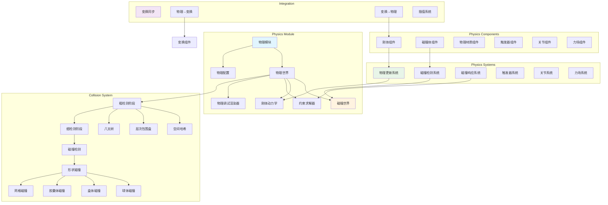

# RenderEngine 物理引擎集成方案设计文档

## 1. 概述

### 1.1 设计目标
基于现有的 RenderEngine 架构，设计并集成一个高性能、模块化的物理引擎系统，实现物理模拟与渲染的无缝协作。

### 1.2 核心原则
- **ECS 架构适配**：充分利用现有的 ECS 架构，通过组件和系统实现物理功能
- **模块化设计**：物理引擎作为独立模块，可选择性启用
- **性能优先**：批量计算、空间分区、多线程优化
- **渲染解耦**：物理模拟与渲染独立更新，支持固定时间步长
- **可扩展性**：支持 2D/3D 物理、刚体/软体、碰撞检测等多种功能

---

## 2. 整体架构设计

### 2.1 系统层次结构

```
Application Framework
    ├── Physics Module (新增)
    │   ├── Physics World
    │   ├── Physics Systems
    │   └── Physics Components
    │
    ├── Core Render Module
    ├── ECS World
    └── Resource Manager
```

### 2.2 物理引擎架构图



---

## 3. 核心组件设计

### 3.1 物理组件定义

#### 3.1.1 RigidBodyComponent (刚体组件)
```cpp
struct RigidBodyComponent {
    // 类型
    enum class BodyType {
        Static,      // 静态物体（不动）
        Kinematic,   // 运动学物体（受脚本控制）
        Dynamic      // 动态物体（受力影响）
    };
    
    BodyType type = BodyType::Dynamic;
    
    // 物理属性
    float mass = 1.0f;
    float inverseMass = 1.0f;
    Vector3 centerOfMass = Vector3::Zero();
    Matrix3 inertiaTensor = Matrix3::Identity();
    Matrix3 inverseInertiaTensor = Matrix3::Identity();
    
    // 运动状态
    Vector3 linearVelocity = Vector3::Zero();
    Vector3 angularVelocity = Vector3::Zero();
    Vector3 force = Vector3::Zero();
    Vector3 torque = Vector3::Zero();
    
    // 阻尼
    float linearDamping = 0.01f;
    float angularDamping = 0.05f;
    
    // 约束
    bool lockPosition[3] = {false, false, false};  // X, Y, Z 轴锁定
    bool lockRotation[3] = {false, false, false};
    
    // 休眠
    bool isSleeping = false;
    float sleepThreshold = 0.01f;
    float sleepTimer = 0.0f;
    
    // 重力
    bool useGravity = true;
    float gravityScale = 1.0f;
};
```

#### 3.1.2 ColliderComponent (碰撞体组件)
```cpp
struct ColliderComponent {
    enum class ShapeType {
        Sphere,
        Box,
        Capsule,
        Mesh,
        ConvexHull
    };
    
    ShapeType shapeType = ShapeType::Box;
    
    // 形状参数
    union ShapeData {
        struct { float radius; } sphere;
        struct { Vector3 halfExtents; } box;
        struct { float radius; float height; } capsule;
        struct { 
            std::shared_ptr<Mesh> mesh;
            bool useConvexHull;
        } mesh;
    } shapeData;
    
    // 碰撞属性
    Vector3 center = Vector3::Zero();     // 局部偏移
    Quaternion rotation = Quaternion::Identity();
    
    bool isTrigger = false;               // 是否为触发器
    int collisionLayer = 0;               // 碰撞层
    int collisionMask = 0xFFFFFFFF;       // 碰撞掩码
    
    // AABB 缓存
    AABB worldAABB;
    bool aabbDirty = true;
    
    // 物理材质引用
    std::shared_ptr<PhysicsMaterial> material;
};
```

#### 3.1.3 PhysicsMaterialComponent (物理材质组件)
```cpp
struct PhysicsMaterial {
    float friction = 0.5f;           // 摩擦系数 [0, 1]
    float restitution = 0.3f;        // 弹性系数 [0, 1]
    float density = 1.0f;            // 密度 (kg/m³)
    
    enum class FrictionCombine {
        Average,
        Minimum,
        Maximum,
        Multiply
    };
    
    enum class RestitutionCombine {
        Average,
        Minimum,
        Maximum,
        Multiply
    };
    
    FrictionCombine frictionCombine = FrictionCombine::Average;
    RestitutionCombine restitutionCombine = RestitutionCombine::Average;
};
```

#### 3.1.4 JointComponent (关节组件)
```cpp
struct JointComponent {
    enum class JointType {
        Fixed,          // 固定关节
        Hinge,          // 铰链关节
        Slider,         // 滑动关节
        Spring,         // 弹簧关节
        Distance,       // 距离关节
        Spherical       // 球形关节
    };
    
    JointType type = JointType::Fixed;
    EntityID connectedBody = NullEntity;  // 连接的另一个物体
    
    // 关节锚点
    Vector3 localAnchor = Vector3::Zero();
    Vector3 connectedAnchor = Vector3::Zero();
    
    // 关节限制
    bool hasLimits = false;
    Vector3 limitMin = Vector3::Zero();
    Vector3 limitMax = Vector3::Zero();
    
    // 关节参数
    float breakForce = INFINITY;
    float breakTorque = INFINITY;
    
    // 类型特定参数
    union JointData {
        struct { 
            Vector3 axis;
            float motorSpeed;
            float motorForce;
            bool useMotor;
        } hinge;
        
        struct {
            float stiffness;
            float damping;
            float restLength;
        } spring;
        
        struct {
            float minDistance;
            float maxDistance;
        } distance;
    } data;
};
```

---

## 4. 物理系统设计

### 4.1 PhysicsUpdateSystem (物理更新系统)

```cpp
class PhysicsUpdateSystem : public System {
public:
    void update(float deltaTime) override {
        // 固定时间步长更新
        accumulator += deltaTime;
        
        while (accumulator >= fixedDeltaTime) {
            // 1. 应用力和重力
            applyForces(fixedDeltaTime);
            
            // 2. 积分速度
            integrateVelocity(fixedDeltaTime);
            
            // 3. 碰撞检测
            collisionDetectionSystem->detect();
            
            // 4. 求解约束
            constraintSolver->solve(fixedDeltaTime);
            
            // 5. 积分位置
            integratePosition(fixedDeltaTime);
            
            // 6. 更新 AABB
            updateAABBs();
            
            // 7. 休眠检测
            updateSleeping(fixedDeltaTime);
            
            accumulator -= fixedDeltaTime;
            physicsTime += fixedDeltaTime;
        }
        
        // 插值渲染位置
        float alpha = accumulator / fixedDeltaTime;
        interpolateTransforms(alpha);
    }
    
private:
    float fixedDeltaTime = 1.0f / 60.0f;  // 固定 60 FPS
    float accumulator = 0.0f;
    float physicsTime = 0.0f;
    
    void applyForces(float dt);
    void integrateVelocity(float dt);
    void integratePosition(float dt);
    void updateAABBs();
    void updateSleeping(float dt);
    void interpolateTransforms(float alpha);
};
```

### 4.2 CollisionDetectionSystem (碰撞检测系统)

```cpp
class CollisionDetectionSystem : public System {
public:
    struct CollisionPair {
        EntityID entityA;
        EntityID entityB;
        ContactManifold manifold;
    };
    
    void detect() {
        // 1. 粗检测阶段 (Broad Phase)
        auto potentialPairs = broadPhase->detectPairs();
        
        // 2. 细检测阶段 (Narrow Phase)
        collisionPairs.clear();
        
        for (auto& pair : potentialPairs) {
            auto [entityA, entityB] = pair;
            
            auto* colliderA = getComponent<ColliderComponent>(entityA);
            auto* colliderB = getComponent<ColliderComponent>(entityB);
            
            if (!shouldCollide(colliderA, colliderB)) continue;
            
            // 执行形状碰撞检测
            ContactManifold manifold;
            if (detectCollision(colliderA, colliderB, manifold)) {
                collisionPairs.push_back({entityA, entityB, manifold});
                
                // 触发碰撞事件
                if (colliderA->isTrigger || colliderB->isTrigger) {
                    triggerSystem->onTrigger(entityA, entityB, manifold);
                } else {
                    eventBus->emit(CollisionEvent{entityA, entityB, manifold});
                }
            }
        }
    }
    
    const std::vector<CollisionPair>& getCollisionPairs() const {
        return collisionPairs;
    }
    
private:
    std::unique_ptr<BroadPhase> broadPhase;
    std::vector<CollisionPair> collisionPairs;
    
    bool shouldCollide(ColliderComponent* a, ColliderComponent* b);
    bool detectCollision(ColliderComponent* a, ColliderComponent* b, ContactManifold& manifold);
};
```

### 4.3 BroadPhase (粗检测实现)

```cpp
class BroadPhase {
public:
    virtual ~BroadPhase() = default;
    virtual std::vector<std::pair<EntityID, EntityID>> detectPairs() = 0;
    virtual void update(const std::vector<Entity>& entities) = 0;
};

// 空间哈希实现
class SpatialHashBroadPhase : public BroadPhase {
public:
    SpatialHashBroadPhase(float cellSize = 5.0f) : cellSize(cellSize) {}
    
    std::vector<std::pair<EntityID, EntityID>> detectPairs() override {
        std::vector<std::pair<EntityID, EntityID>> pairs;
        std::unordered_set<uint64_t> processedPairs;
        
        for (auto& [cell, entities] : spatialHash) {
            // 检查同一格子内的实体
            for (size_t i = 0; i < entities.size(); ++i) {
                for (size_t j = i + 1; j < entities.size(); ++j) {
                    uint64_t pairHash = hashPair(entities[i], entities[j]);
                    if (processedPairs.insert(pairHash).second) {
                        pairs.push_back({entities[i], entities[j]});
                    }
                }
            }
        }
        
        return pairs;
    }
    
    void update(const std::vector<Entity>& entities) override {
        spatialHash.clear();
        
        for (auto entity : entities) {
            auto* collider = entity.getComponent<ColliderComponent>();
            if (!collider) continue;
            
            AABB aabb = collider->worldAABB;
            
            // 计算 AABB 覆盖的格子
            Vector3Int minCell = worldToCell(aabb.min);
            Vector3Int maxCell = worldToCell(aabb.max);
            
            for (int x = minCell.x; x <= maxCell.x; ++x) {
                for (int y = minCell.y; y <= maxCell.y; ++y) {
                    for (int z = minCell.z; z <= maxCell.z; ++z) {
                        uint64_t cellHash = hashCell(x, y, z);
                        spatialHash[cellHash].push_back(entity.id());
                    }
                }
            }
        }
    }
    
private:
    float cellSize;
    std::unordered_map<uint64_t, std::vector<EntityID>> spatialHash;
    
    Vector3Int worldToCell(const Vector3& pos);
    uint64_t hashCell(int x, int y, int z);
    uint64_t hashPair(EntityID a, EntityID b);
};
```

### 4.4 ConstraintSolver (约束求解器)

```cpp
class ConstraintSolver {
public:
    void solve(float dt) {
        // 1. 准备约束
        prepareConstraints(dt);
        
        // 2. 迭代求解
        for (int i = 0; i < solverIterations; ++i) {
            solveVelocityConstraints();
        }
        
        // 3. 积分位置修正
        for (int i = 0; i < positionIterations; ++i) {
            solvePositionConstraints();
        }
    }
    
    void addContactConstraint(const CollisionPair& pair) {
        contactConstraints.push_back(pair);
    }
    
    void addJointConstraint(EntityID entity, const JointComponent& joint) {
        jointConstraints.push_back({entity, joint});
    }
    
private:
    int solverIterations = 10;
    int positionIterations = 4;
    
    std::vector<CollisionPair> contactConstraints;
    std::vector<std::pair<EntityID, JointComponent>> jointConstraints;
    
    void prepareConstraints(float dt);
    void solveVelocityConstraints();
    void solvePositionConstraints();
    
    // 接触约束求解
    void solveContact(const CollisionPair& pair);
    
    // 关节约束求解
    void solveJoint(EntityID entity, const JointComponent& joint);
};
```

---

## 5. 碰撞检测算法

### 5.1 形状碰撞检测

```cpp
class CollisionDetector {
public:
    // 球体 vs 球体
    static bool sphereVsSphere(
        const Vector3& centerA, float radiusA,
        const Vector3& centerB, float radiusB,
        ContactManifold& manifold
    ) {
        Vector3 delta = centerB - centerA;
        float distSq = delta.lengthSquared();
        float radiusSum = radiusA + radiusB;
        
        if (distSq < radiusSum * radiusSum) {
            float dist = std::sqrt(distSq);
            manifold.normal = delta / dist;
            manifold.penetration = radiusSum - dist;
            manifold.contactPoint = centerA + manifold.normal * radiusA;
            return true;
        }
        return false;
    }
    
    // 盒体 vs 盒体 (SAT - Separating Axis Theorem)
    static bool boxVsBox(
        const OBB& boxA,
        const OBB& boxB,
        ContactManifold& manifold
    ) {
        // 实现 SAT 算法
        // 测试 15 个分离轴：
        // - 3 个 boxA 的面法线
        // - 3 个 boxB 的面法线
        // - 9 个边叉积
        
        // ... (详细实现略)
        return false;
    }
    
    // 球体 vs 盒体
    static bool sphereVsBox(
        const Vector3& center, float radius,
        const OBB& box,
        ContactManifold& manifold
    );
    
    // 胶囊体 vs 胶囊体
    static bool capsuleVsCapsule(
        const Capsule& capsuleA,
        const Capsule& capsuleB,
        ContactManifold& manifold
    );
    
    // 射线投射
    static bool raycast(
        const Ray& ray,
        const ColliderComponent* collider,
        RaycastHit& hit
    );
};

struct ContactManifold {
    Vector3 normal;              // 碰撞法线
    float penetration;           // 穿透深度
    Vector3 contactPoint;        // 接触点
    int contactCount = 1;        // 接触点数量
    Vector3 contactPoints[4];    // 最多 4 个接触点
};
```

---

## 6. 物理世界管理

### 6.1 PhysicsWorld

```cpp
class PhysicsWorld {
public:
    PhysicsWorld(ECSWorld* ecsWorld, const PhysicsConfig& config)
        : ecsWorld(ecsWorld), config(config) {
        
        // 创建物理系统
        physicsUpdateSystem = std::make_unique<PhysicsUpdateSystem>();
        collisionDetectionSystem = std::make_unique<CollisionDetectionSystem>();
        collisionResponseSystem = std::make_unique<CollisionResponseSystem>();
        triggerSystem = std::make_unique<TriggerSystem>();
        jointSystem = std::make_unique<JointSystem>();
        
        // 根据配置选择粗检测算法
        switch (config.broadPhaseType) {
            case BroadPhaseType::SpatialHash:
                broadPhase = std::make_unique<SpatialHashBroadPhase>(config.cellSize);
                break;
            case BroadPhaseType::BVH:
                broadPhase = std::make_unique<BVHBroadPhase>();
                break;
            case BroadPhaseType::Octree:
                broadPhase = std::make_unique<OctreeBroadPhase>();
                break;
        }
        
        collisionDetectionSystem->setBroadPhase(broadPhase.get());
    }
    
    void step(float deltaTime) {
        // 物理更新
        physicsUpdateSystem->update(deltaTime);
        
        // 同步物理结果到变换组件
        syncPhysicsToTransform();
    }
    
    // 物理查询
    bool raycast(const Ray& ray, RaycastHit& hit, float maxDistance = INFINITY);
    std::vector<EntityID> overlapSphere(const Vector3& center, float radius);
    std::vector<EntityID> overlapBox(const Vector3& center, const Vector3& halfExtents);
    
    // 力场操作
    void applyForce(EntityID entity, const Vector3& force);
    void applyImpulse(EntityID entity, const Vector3& impulse);
    void applyTorque(EntityID entity, const Vector3& torque);
    
    // 配置
    void setGravity(const Vector3& gravity) { config.gravity = gravity; }
    Vector3 getGravity() const { return config.gravity; }
    
private:
    ECSWorld* ecsWorld;
    PhysicsConfig config;
    
    std::unique_ptr<PhysicsUpdateSystem> physicsUpdateSystem;
    std::unique_ptr<CollisionDetectionSystem> collisionDetectionSystem;
    std::unique_ptr<CollisionResponseSystem> collisionResponseSystem;
    std::unique_ptr<TriggerSystem> triggerSystem;
    std::unique_ptr<JointSystem> jointSystem;
    std::unique_ptr<BroadPhase> broadPhase;
    
    void syncPhysicsToTransform();
};

struct PhysicsConfig {
    Vector3 gravity = Vector3(0, -9.81f, 0);
    float fixedDeltaTime = 1.0f / 60.0f;
    int solverIterations = 10;
    int positionIterations = 4;
    
    BroadPhaseType broadPhaseType = BroadPhaseType::SpatialHash;
    float cellSize = 5.0f;
    
    bool enableCCD = false;  // Continuous Collision Detection
    bool enableSleeping = true;
    float sleepThreshold = 0.01f;
};
```

---

## 7. 物理-渲染同步

### 7.1 变换同步策略

```cpp
class PhysicsTransformSync {
public:
    // 物理 → 变换 (每帧更新)
    void syncPhysicsToTransform(ECSWorld* world) {
        auto view = world->view<TransformComponent, RigidBodyComponent>();
        
        for (auto entity : view) {
            auto& transform = view.get<TransformComponent>(entity);
            auto& rigidbody = view.get<RigidBodyComponent>(entity);
            
            // 只同步动态物体
            if (rigidbody.type != RigidBodyComponent::BodyType::Dynamic) {
                continue;
            }
            
            // 更新位置和旋转
            transform.position = rigidbody.position;
            transform.rotation = rigidbody.rotation;
            transform.markDirty();
        }
    }
    
    // 变换 → 物理 (仅在变换被外部修改时)
    void syncTransformToPhysics(ECSWorld* world) {
        auto view = world->view<TransformComponent, RigidBodyComponent>();
        
        for (auto entity : view) {
            auto& transform = view.get<TransformComponent>(entity);
            auto& rigidbody = view.get<RigidBodyComponent>(entity);
            
            // 运动学物体或静态物体，同步变换到物理
            if (rigidbody.type == RigidBodyComponent::BodyType::Kinematic ||
                rigidbody.type == RigidBodyComponent::BodyType::Static) {
                
                if (transform.isDirty()) {
                    rigidbody.position = transform.position;
                    rigidbody.rotation = transform.rotation;
                    
                    // 运动学物体：计算速度
                    if (rigidbody.type == RigidBodyComponent::BodyType::Kinematic) {
                        rigidbody.linearVelocity = 
                            (rigidbody.position - rigidbody.previousPosition) / deltaTime;
                    }
                }
            }
        }
    }
    
    // 插值 (用于渲染帧率与物理帧率不同步时)
    void interpolateTransforms(ECSWorld* world, float alpha) {
        auto view = world->view<TransformComponent, RigidBodyComponent>();
        
        for (auto entity : view) {
            auto& transform = view.get<TransformComponent>(entity);
            auto& rigidbody = view.get<RigidBodyComponent>(entity);
            
            if (rigidbody.type != RigidBodyComponent::BodyType::Dynamic) {
                continue;
            }
            
            // 线性插值位置
            transform.position = lerp(
                rigidbody.previousPosition,
                rigidbody.position,
                alpha
            );
            
            // 球面插值旋转
            transform.rotation = slerp(
                rigidbody.previousRotation,
                rigidbody.rotation,
                alpha
            );
        }
    }
};
```

---

## 8. 物理调试与可视化

### 8.1 PhysicsDebugRenderer

```cpp
class PhysicsDebugRenderer {
public:
    void render(Renderer* renderer, const PhysicsWorld* world) {
        if (!enabled) return;
        
        auto view = world->getECSWorld()->view<ColliderComponent, TransformComponent>();
        
        for (auto entity : view) {
            auto& collider = view.get<ColliderComponent>(entity);
            auto& transform = view.get<TransformComponent>(entity);
            
            // 渲染碰撞体形状
            switch (collider.shapeType) {
                case ColliderComponent::ShapeType::Sphere:
                    drawSphere(transform.position, collider.shapeData.sphere.radius);
                    break;
                case ColliderComponent::ShapeType::Box:
                    drawBox(transform.position, collider.shapeData.box.halfExtents);
                    break;
                case ColliderComponent::ShapeType::Capsule:
                    drawCapsule(transform.position, 
                               collider.shapeData.capsule.radius,
                               collider.shapeData.capsule.height);
                    break;
            }
            
            // 渲染 AABB
            if (showAABB) {
                drawAABB(collider.worldAABB, Color::Yellow());
            }
        }
        
        // 渲染接触点
        if (showContacts) {
            for (auto& pair : world->getCollisionPairs()) {
                for (int i = 0; i < pair.manifold.contactCount; ++i) {
                    drawSphere(pair.manifold.contactPoints[i], 0.05f, Color::Red());
                    drawLine(pair.manifold.contactPoints[i],
                            pair.manifold.contactPoints[i] + pair.manifold.normal,
                            Color::Green());
                }
            }
        }
        
        // 渲染速度向量
        if (showVelocity) {
            auto rbView = world->getECSWorld()->view<RigidBodyComponent, TransformComponent>();
            for (auto entity : rbView) {
                auto& rb = rbView.get<RigidBodyComponent>(entity);
                auto& transform = rbView.get<TransformComponent>(entity);
                
                drawLine(transform.position,
                        transform.position + rb.linearVelocity,
                        Color::Blue());
            }
        }
    }
    
    void setEnabled(bool enable) { enabled = enable; }
    void setShowAABB(bool show) { showAABB = show; }
    void setShowContacts(bool show) { showContacts = show; }
    void setShowVelocity(bool show) { showVelocity = show; }
    
private:
    bool enabled = false;
    bool showAABB = true;
    bool showContacts = true;
    bool showVelocity = false;
    
    void drawSphere(const Vector3& center, float radius, const Color& color = Color::Green());
    void drawBox(const Vector3& center, const Vector3& halfExtents, const Color& color = Color::Green());
    void drawCapsule(const Vector3& center, float radius, float height, const Color& color = Color::Green());
    void drawAABB(const AABB& aabb, const Color& color);
    void drawLine(const Vector3& start, const Vector3& end, const Color& color);
};
```

---

## 9. 使用示例

### 9.1 创建物理场景

```cpp
// 初始化物理世界
PhysicsConfig config;
config.gravity = Vector3(0, -9.81f, 0);
config.broadPhaseType = BroadPhaseType::SpatialHash;

auto physicsWorld = std::make_unique<PhysicsWorld>(ecsWorld, config);

// 创建地面 (静态物体)
Entity ground = ecsWorld->createEntity();
ground.addComponent<TransformComponent>(
    Vector3(0, -1, 0), 
    Quaternion::Identity(), 
    Vector3(100, 1, 100)
);

auto& groundCollider = ground.addComponent<ColliderComponent>();
groundCollider.shapeType = ColliderComponent::ShapeType::Box;
groundCollider.shapeData.box.halfExtents = Vector3(50, 0.5f, 50);

auto& groundRB = ground.addComponent<RigidBodyComponent>();
groundRB.type = RigidBodyComponent::BodyType::Static;

// 创建动态球体
Entity ball = ecsWorld->createEntity();
ball.addComponent<TransformComponent>(Vector3(0, 10, 0));

auto& ballCollider = ball.addComponent<ColliderComponent>();
ballCollider.shapeType = ColliderComponent::ShapeType::Sphere;
ballCollider.shapeData.sphere.radius = 0.5f;

auto& ballRB = ball.addComponent<RigidBodyComponent>();
ballRB.type = RigidBodyComponent::BodyType::Dynamic;
ballRB.mass = 1.0f;
ballRB.useGravity = true;

auto& ballMaterial = ball.addComponent<PhysicsMaterialComponent>();
ballMaterial.material = std::make_shared<PhysicsMaterial>();
ballMaterial.material->restitution = 0.8f;  // 高弹性
ballMaterial.material->friction = 0.3f;

// 主循环
while (running) {
    float deltaTime = timer.getDeltaTime();
    
    // 更新物理
    physicsWorld->step(deltaTime);
    
    // 渲染
    renderer->render();
}
```

### 9.2 射线投射示例

```cpp
// 从鼠标位置投射射线
Ray ray = camera->screenPointToRay(mousePosition);

RaycastHit hit;
if (physicsWorld->raycast(ray, hit, 100.0f)) {
    std::cout << "Hit entity: " << hit.entity << std::endl;
    std::cout << "Hit point: " << hit.point << std::endl;
    std::cout << "Hit normal: " << hit.normal << std::endl;
    std::cout << "Distance: " << hit.distance << std::endl;
    
    // 在击中点施加力
    physicsWorld->applyImpulse(hit.entity, ray.direction * 10.0f);
}
```

### 9.3 触发器示例

```cpp
// 创建触发区域
Entity trigger = ecsWorld->createEntity();
trigger.addComponent<TransformComponent>(Vector3(0, 0, 0));

auto& triggerCollider = trigger.addComponent<ColliderComponent>();
triggerCollider.shapeType = ColliderComponent::ShapeType::Box;
triggerCollider.shapeData.box.halfExtents = Vector3(5, 5, 5);
triggerCollider.isTrigger = true;

// 监听触发事件
eventBus->subscribe<TriggerEnterEvent>([](const TriggerEnterEvent& event) {
    std::cout << "Entity " << event.other << " entered trigger!" << std::endl;
});

eventBus->subscribe<TriggerExitEvent>([](const TriggerExitEvent& event) {
    std::cout << "Entity " << event.other << " exited trigger!" << std::endl;
});
```

---

## 10. 性能优化策略

### 10.1 多线程优化

```cpp
class ParallelPhysicsSystem {
public:
    void update(float deltaTime) {
        // 1. 并行更新刚体力
        threadPool->parallelFor(rigidBodies.size(), [&](size_t i) {
            applyForces(rigidBodies[i], deltaTime);
        });
        
        // 2. 并行粗检测
        auto pairs = broadPhase->detectPairsParallel(threadPool);
        
        // 3. 并行细检测
        std::vector<CollisionPair> collisions;
        std::mutex mutex;
        
        threadPool->parallelFor(pairs.size(), [&](size_t i) {
            auto [entityA, entityB] = pairs[i];
            ContactManifold manifold;
            
            if (detectCollision(entityA, entityB, manifold)) {
                std::lock_guard<std::mutex> lock(mutex);
                collisions.push_back({entityA, entityB, manifold});
            }
        });
        
        // 4. 串行求解约束 (难以并行化)
        constraintSolver->solve(collisions, deltaTime);
    }
    
private:
    ThreadPool* threadPool;
};
```

### 10.2 休眠优化

```cpp
void PhysicsUpdateSystem::updateSleeping(float dt) {
    auto view = world->view<RigidBodyComponent>();
    
    for (auto entity : view) {
        auto& rb = view.get<RigidBodyComponent>(entity);
        
        if (rb.type != RigidBodyComponent::BodyType::Dynamic) continue;
        
        // 计算动能
        float kineticEnergy = 0.5f * rb.mass * rb.linearVelocity.lengthSquared() +
                              0.5f * rb.angularVelocity.dot(rb.inertiaTensor * rb.angularVelocity);
        
        if (kineticEnergy < rb.sleepThreshold) {
            rb.sleepTimer += dt;
            
            if (rb.sleepTimer > 0.5f) {  // 0.5 秒后进入休眠
                rb.isSleeping = true;
                rb.linearVelocity = Vector3::Zero();
                rb.angularVelocity = Vector3::Zero();
            }
        } else {
            rb.sleepTimer = 0.0f;
            rb.isSleeping = false;
        }
    }
}
```

### 10.3 空间分区优化

```cpp
// 八叉树实现 (适合动态场景)
class OctreeBroadPhase : public BroadPhase {
public:
    OctreeBroadPhase(const AABB& bounds, int maxDepth = 8)
        : root(std::make_unique<OctreeNode>(bounds, 0, maxDepth)) {}
    
    void update(const std::vector<Entity>& entities) override {
        root->clear();
        
        for (auto entity : entities) {
            auto* collider = entity.getComponent<ColliderComponent>();
            if (collider) {
                root->insert(entity.id(), collider->worldAABB);
            }
        }
    }
    
    std::vector<std::pair<EntityID, EntityID>> detectPairs() override {
        std::vector<std::pair<EntityID, EntityID>> pairs;
        root->queryPairs(pairs);
        return pairs;
    }
    
private:
    struct OctreeNode {
        AABB bounds;
        int depth;
        int maxDepth;
        std::vector<std::pair<EntityID, AABB>> objects;
        std::array<std::unique_ptr<OctreeNode>, 8> children;
        
        void insert(EntityID entity, const AABB& aabb);
        void queryPairs(std::vector<std::pair<EntityID, EntityID>>& pairs);
        void subdivide();
        void clear();
    };
    
    std::unique_ptr<OctreeNode> root;
};
```

---

## 11. 项目集成步骤

### 11.1 目录结构
```
RenderEngine/
├── include/
│   └── RenderEngine/
│       ├── Physics/
│       │   ├── PhysicsWorld.h
│       │   ├── PhysicsComponents.h
│       │   ├── PhysicsSystems.h
│       │   ├── CollisionDetection.h
│       │   ├── ConstraintSolver.h
│       │   ├── BroadPhase.h
│       │   └── PhysicsDebugRenderer.h
│       └── ...
├── src/
│   └── Physics/
│       ├── PhysicsWorld.cpp
│       ├── PhysicsSystems.cpp
│       ├── CollisionDetection.cpp
│       ├── ConstraintSolver.cpp
│       ├── BroadPhase.cpp
│       └── PhysicsDebugRenderer.cpp
└── ...
```

### 11.2 CMakeLists.txt 集成

```cmake
# 物理引擎源文件
set(PHYSICS_SOURCES
    src/Physics/PhysicsWorld.cpp
    src/Physics/PhysicsSystems.cpp
    src/Physics/CollisionDetection.cpp
    src/Physics/ConstraintSolver.cpp
    src/Physics/BroadPhase.cpp
    src/Physics/PhysicsDebugRenderer.cpp
)

# 添加到主目标
target_sources(RenderEngine PRIVATE ${PHYSICS_SOURCES})

# 可选：集成第三方物理库 (如 Bullet, PhysX)
option(USE_EXTERNAL_PHYSICS "Use external physics library" OFF)

if(USE_EXTERNAL_PHYSICS)
    find_package(Bullet REQUIRED)
    target_link_libraries(RenderEngine PRIVATE ${BULLET_LIBRARIES})
    target_compile_definitions(RenderEngine PRIVATE USE_BULLET_PHYSICS)
endif()
```

### 11.3 注册物理模块

```cpp
// Application.cpp
void Application::initialize() {
    // ... 现有初始化代码 ...
    
    // 创建物理世界
    PhysicsConfig physicsConfig;
    physicsWorld = std::make_unique<PhysicsWorld>(ecsWorld.get(), physicsConfig);
    
    // 注册物理系统到 ECS
    ecsWorld->registerSystem<PhysicsUpdateSystem>(physicsWorld.get());
    ecsWorld->registerSystem<CollisionDetectionSystem>(physicsWorld.get());
    ecsWorld->registerSystem<CollisionResponseSystem>(physicsWorld.get());
    
    // 创建物理调试渲染器
    physicsDebugRenderer = std::make_unique<PhysicsDebugRenderer>();
    
    // 注册物理模块
    moduleRegistry->registerModule("Physics", std::make_unique<PhysicsModule>(physicsWorld.get()));
}

void Application::update(float deltaTime) {
    // 1. 处理输入
    inputModule->update();
    
    // 2. 更新场景
    sceneManager->update(deltaTime);
    
    // 3. 更新 ECS 系统
    ecsWorld->update(deltaTime);
    
    // 4. 更新物理世界
    physicsWorld->step(deltaTime);
    
    // 5. 渲染
    renderer->render();
    
    // 6. 物理调试渲染
    if (debugMode) {
        physicsDebugRenderer->render(renderer.get(), physicsWorld.get());
    }
}
```

---

## 12. 扩展功能

### 12.1 软体物理 (未来扩展)
- 布料模拟
- 绳索模拟
- 可变形物体

### 12.2 流体模拟 (未来扩展)
- SPH (Smoothed Particle Hydrodynamics)
- Position Based Fluids

### 12.3 车辆物理 (未来扩展)
- 悬挂系统
- 轮胎摩擦模型
- 引擎扭矩模拟

---

## 13. 总结

这个物理引擎集成方案具有以下优势：

1. **架构一致性**：完全基于现有的 ECS 架构，无缝集成
2. **模块化设计**：物理系统作为独立模块，可选择性启用
3. **高性能**：批量计算、空间分区、多线程优化
4. **可扩展性**：支持多种碰撞形状、关节类型、粗检测算法
5. **易用性**：简洁的 API，丰富的调试可视化工具
6. **灵活性**：固定时间步长与插值，确保物理稳定性

通过这个方案，RenderEngine 将成为一个功能完整的游戏引擎，不仅支持高质量渲染，还具备强大的物理模拟能力。