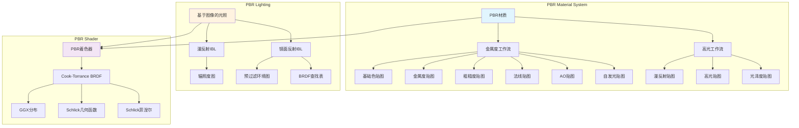
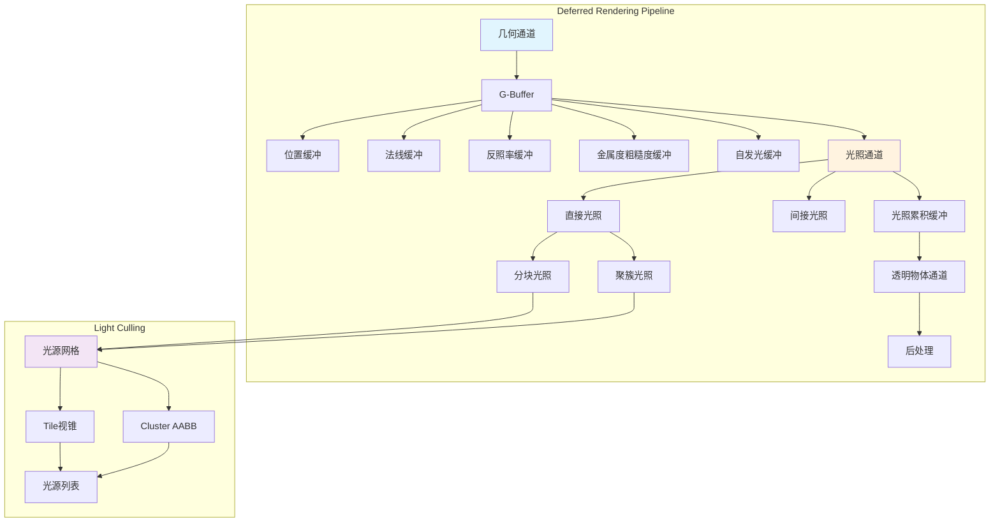
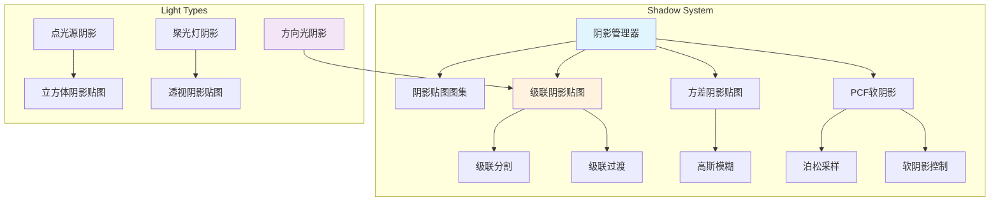
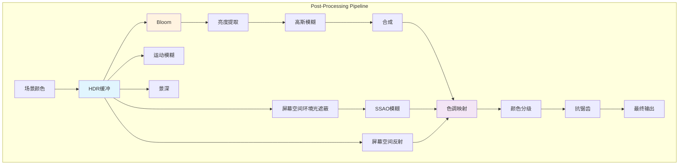
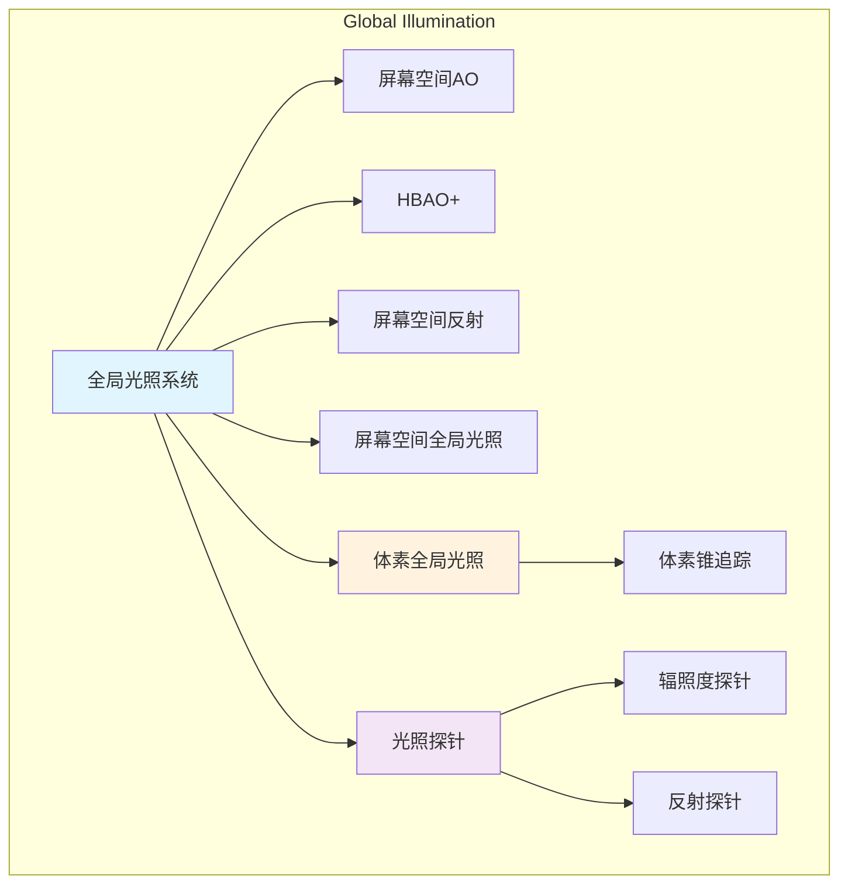
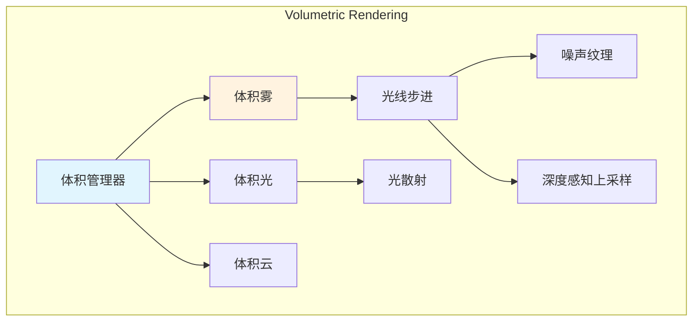
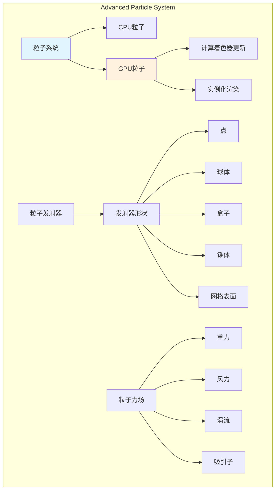
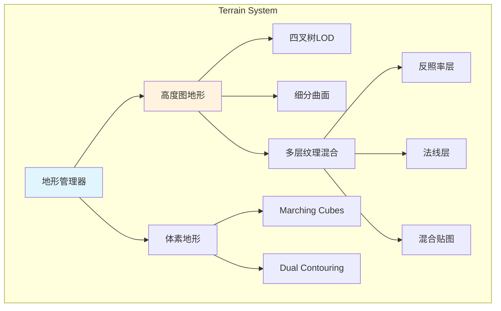
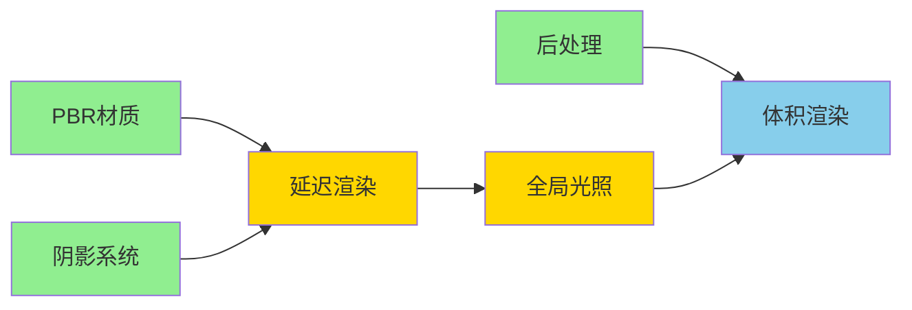

# RenderEngine 高级渲染功能扩展方案

## 1. 项目现状分析

### 1.1 当前架构优势
- ✅ 完整的ECS架构，便于添加新的渲染组件和系统
- ✅ 模块化设计，支持插件式功能扩展
- ✅ LOD系统已经完善，为性能优化打下基础
- ✅ 批处理系统支持多种渲染策略
- ✅ 资源管理系统支持异步加载

### 1.2 可扩展的高级渲染方向
基于现有架构，建议按以下优先级扩展：

1. **基于物理的渲染 (PBR)** - 提升视觉真实感
2. **延迟渲染管线** - 支持大量动态光源
3. **阴影系统增强** - 级联阴影贴图、软阴影
4. **后处理效果** - Bloom、色调映射、抗锯齿
5. **全局光照** - 环境光遮蔽、屏幕空间反射
6. **体积效果** - 体积光、体积雾
7. **高级粒子系统** - GPU粒子、物理模拟
8. **地形渲染系统** - 高度图、多层纹理、细分

---

## 2. 高级渲染功能详细设计

### 2.1 基于物理的渲染 (PBR) 系统

#### 2.1.1 架构设计



#### 2.1.2 核心组件

**PBRMaterial 类**
```cpp
class PBRMaterial : public Material {
public:
    enum class Workflow {
        MetallicRoughness,  // 金属度/粗糙度工作流
        SpecularGlossiness  // 高光/光泽度工作流
    };
    
    struct Parameters {
        // 金属度工作流
        glm::vec3 albedo = glm::vec3(1.0f);
        float metallic = 0.0f;
        float roughness = 0.5f;
        float ao = 1.0f;
        
        // 通用参数
        glm::vec3 emissive = glm::vec3(0.0f);
        float emissiveStrength = 1.0f;
        float normalStrength = 1.0f;
        
        // 纹理
        std::shared_ptr<Texture> albedoMap;
        std::shared_ptr<Texture> metallicMap;
        std::shared_ptr<Texture> roughnessMap;
        std::shared_ptr<Texture> normalMap;
        std::shared_ptr<Texture> aoMap;
        std::shared_ptr<Texture> emissiveMap;
    };
    
private:
    Workflow workflow_;
    Parameters params_;
};
```

**IBL (Image-Based Lighting) 系统**
```cpp
class IBLEnvironment {
public:
    void loadHDRI(const std::string& hdriPath);
    void generateIrradianceMap();
    void generatePrefilteredMap();
    void generateBRDFLookup();
    
    std::shared_ptr<TextureCubemap> getIrradianceMap() const;
    std::shared_ptr<TextureCubemap> getPrefilteredMap() const;
    std::shared_ptr<Texture2D> getBRDFLookup() const;
    
private:
    std::shared_ptr<TextureCubemap> hdriCubemap_;
    std::shared_ptr<TextureCubemap> irradianceMap_;
    std::shared_ptr<TextureCubemap> prefilteredMap_;
    std::shared_ptr<Texture2D> brdfLookup_;
};
```

#### 2.1.3 实现步骤

**阶段1: 基础PBR材质系统 (1-2周)**
1. 实现 `PBRMaterial` 类
2. 创建PBR着色器（Cook-Torrance BRDF）
3. 支持基础纹理输入（albedo, metallic, roughness, normal, ao）
4. 集成到现有的渲染管线

**阶段2: IBL系统 (2-3周)**
1. 实现HDRI加载和立方体贴图转换
2. 生成辐照度图（卷积计算）
3. 生成预过滤环境图（重要性采样）
4. 生成BRDF查找表
5. 着色器集成IBL计算

**阶段3: 高级特性 (1-2周)**
1. 支持自发光材质
2. 清漆层（Clear Coat）效果
3. 次表面散射（Subsurface Scattering）近似
4. 各向异性反射（Anisotropic Reflection）

---

### 2.2 延迟渲染管线 (Deferred Rendering)

#### 2.2.1 架构设计



#### 2.2.2 核心组件

**GBuffer 配置**
```cpp
class GBuffer {
public:
    enum class Layout {
        Standard,      // 标准布局
        Optimized,     // 优化布局（压缩法线、打包数据）
        Thin          // 薄G-Buffer（仅位置+法线）
    };
    
    struct Attachments {
        std::shared_ptr<Texture2D> position;       // RGB: 世界空间位置
        std::shared_ptr<Texture2D> normal;         // RGB: 世界空间法线
        std::shared_ptr<Texture2D> albedo;         // RGB: 反照率, A: AO
        std::shared_ptr<Texture2D> metallicRoughness; // R: 金属度, G: 粗糙度
        std::shared_ptr<Texture2D> emissive;       // RGB: 自发光
        std::shared_ptr<Texture2D> depth;          // Depth buffer
    };
    
    void create(uint32_t width, uint32_t height, Layout layout);
    void bind();
    void clear();
    const Attachments& getAttachments() const;
    
private:
    Layout layout_;
    Attachments attachments_;
    uint32_t fbo_;
};
```

**分块光照（Tiled Lighting）**
```cpp
class TiledLightingSystem {
public:
    struct Config {
        uint32_t tileSize = 16;  // 每个tile的像素大小
        uint32_t maxLightsPerTile = 256;
    };
    
    void initialize(uint32_t screenWidth, uint32_t screenHeight, const Config& config);
    void cullLights(const std::vector<Light*>& lights, const Camera& camera);
    void render(const GBuffer& gbuffer);
    
private:
    void buildTileFrustums();
    void assignLightsToTiles(const std::vector<Light*>& lights);
    
    Config config_;
    std::vector<Frustum> tileFrustums_;
    std::shared_ptr<ComputeShader> lightCullingShader_;
    std::shared_ptr<StorageBuffer> lightListSSBO_;
    std::shared_ptr<StorageBuffer> lightGridSSBO_;
};
```

**聚簇光照（Clustered Lighting）**
```cpp
class ClusteredLightingSystem {
public:
    struct Config {
        uint32_t clusterGridX = 16;
        uint32_t clusterGridY = 9;
        uint32_t clusterGridZ = 24;
        float nearPlane = 0.1f;
        float farPlane = 1000.0f;
        uint32_t maxLightsPerCluster = 128;
    };
    
    void initialize(const Config& config);
    void update(const Camera& camera);
    void cullLights(const std::vector<Light*>& lights);
    void render(const GBuffer& gbuffer);
    
private:
    void buildClusterGrid();
    void computeClusterAABBs(const Camera& camera);
    void assignLightsToCluster(const std::vector<Light*>& lights);
    
    Config config_;
    std::vector<AABB> clusterAABBs_;
    std::shared_ptr<ComputeShader> clusterBuildShader_;
    std::shared_ptr<ComputeShader> lightAssignShader_;
    std::shared_ptr<StorageBuffer> clusterSSBO_;
    std::shared_ptr<StorageBuffer> lightIndicesSSBO_;
};
```

#### 2.2.3 实现步骤

**阶段1: 基础延迟渲染 (2-3周)**
1. 实现GBuffer系统
2. 几何通道渲染
3. 基础光照通道（支持点光源、方向光）
4. 透明物体前向渲染回退

**阶段2: 分块光照 (2周)**
1. 实现Tile划分
2. 光源剔除计算着色器
3. 光照计算优化

**阶段3: 聚簇光照 (2-3周)**
1. 3D聚簇网格构建
2. 深度分片策略（对数/线性）
3. 光源分配计算着色器
4. 性能优化和调试工具

---

### 2.3 高级阴影系统

#### 2.3.1 架构设计



#### 2.3.2 核心组件

**级联阴影贴图（CSM）**
```cpp
class CascadedShadowMap {
public:
    struct Config {
        uint32_t cascadeCount = 4;
        uint32_t resolution = 2048;
        std::vector<float> cascadeSplits = {0.1f, 0.25f, 0.5f, 1.0f};
        float splitLambda = 0.5f;  // 对数/线性混合
        float cascadeBlendDistance = 0.1f;
    };
    
    void initialize(const Config& config);
    void update(const Camera& camera, const DirectionalLight& light);
    void render(const std::vector<Renderable*>& renderables);
    
    const std::vector<glm::mat4>& getLightMatrices() const;
    const std::vector<float>& getCascadeDistances() const;
    std::shared_ptr<Texture2DArray> getShadowMapArray() const;
    
private:
    void computeCascadeSplits(const Camera& camera);
    void computeLightViewProj(const Camera& camera, uint32_t cascadeIndex);
    void optimizeFrustumFit(uint32_t cascadeIndex);
    
    Config config_;
    std::vector<glm::mat4> lightMatrices_;
    std::vector<float> cascadeDistances_;
    std::vector<Frustum> cascadeFrustums_;
    std::shared_ptr<Texture2DArray> shadowMapArray_;
    std::vector<uint32_t> fboArray_;
};
```

**软阴影（PCF）**
```cpp
class SoftShadowRenderer {
public:
    enum class FilterMode {
        PCF,          // Percentage Closer Filtering
        PCSS,         // Percentage Closer Soft Shadows
        VSM,          // Variance Shadow Maps
        ESM           // Exponential Shadow Maps
    };
    
    struct Config {
        FilterMode filterMode = FilterMode::PCF;
        uint32_t sampleCount = 16;
        float filterSize = 2.0f;
        float lightSize = 0.1f;  // For PCSS
    };
    
    void setConfig(const Config& config);
    void generatePoissonDisk(uint32_t sampleCount);
    
    // 在着色器中使用
    std::string generateShaderCode() const;
    
private:
    Config config_;
    std::vector<glm::vec2> poissonDisk_;
};
```

#### 2.3.3 实现步骤

**阶段1: 级联阴影贴图 (2-3周)**
1. 实现基础CSM框架
2. 级联分割算法（对数、线性、混合）
3. 光照矩阵计算和优化
4. 级联过渡消除接缝

**阶段2: 软阴影 (1-2周)**
1. PCF实现（泊松采样）
2. PCSS实现（动态阴影软化）
3. 性能优化（早期退出、自适应采样）

**阶段3: 点光源和聚光灯阴影 (1-2周)**
1. 立方体阴影贴图
2. 全向PCF
3. 阴影图集管理

---

### 2.4 后处理效果系统

#### 2.4.1 架构设计



#### 2.4.2 核心组件

**后处理管理器**
```cpp
class PostProcessingStack {
public:
    void addEffect(std::shared_ptr<PostProcessEffect> effect, int priority = 0);
    void removeEffect(const std::string& name);
    void setEffectEnabled(const std::string& name, bool enabled);
    
    void render(const RenderTarget& input, const RenderTarget& output);
    
private:
    struct EffectEntry {
        std::shared_ptr<PostProcessEffect> effect;
        int priority;
        bool enabled;
    };
    
    std::vector<EffectEntry> effects_;
    std::shared_ptr<RenderTarget> tempTargets_[2];  // Ping-pong buffers
};
```

**Bloom 效果**
```cpp
class BloomEffect : public PostProcessEffect {
public:
    struct Settings {
        float threshold = 1.0f;
        float intensity = 1.0f;
        float softThreshold = 0.5f;
        uint32_t iterations = 6;
        float scatter = 0.7f;
    };
    
    void setSettings(const Settings& settings);
    void render(const RenderTarget& input, const RenderTarget& output) override;
    
private:
    void extractBrightPixels(const RenderTarget& input);
    void downsampleAndBlur();
    void upsampleAndCombine();
    
    Settings settings_;
    std::vector<std::shared_ptr<RenderTarget>> mipChain_;
    std::shared_ptr<Shader> extractShader_;
    std::shared_ptr<Shader> downsampleShader_;
    std::shared_ptr<Shader> upsampleShader_;
};
```

**SSAO 效果**
```cpp
class SSAOEffect : public PostProcessEffect {
public:
    struct Settings {
        float radius = 0.5f;
        float bias = 0.025f;
        uint32_t sampleCount = 64;
        uint32_t blurSize = 4;
        float intensity = 1.0f;
    };
    
    void initialize();
    void setSettings(const Settings& settings);
    void render(const RenderTarget& input, const RenderTarget& output) override;
    
private:
    void generateSampleKernel();
    void generateNoiseTexture();
    void renderSSAO(const RenderTarget& input);
    void blurSSAO();
    
    Settings settings_;
    std::vector<glm::vec3> sampleKernel_;
    std::shared_ptr<Texture2D> noiseTexture_;
    std::shared_ptr<RenderTarget> ssaoTarget_;
    std::shared_ptr<RenderTarget> blurTarget_;
};
```

**色调映射**
```cpp
class ToneMappingEffect : public PostProcessEffect {
public:
    enum class Operator {
        Reinhard,
        ReinhardExtended,
        Uncharted2,
        ACES,
        Filmic
    };
    
    struct Settings {
        Operator toneMappingOperator = Operator::ACES;
        float exposure = 1.0f;
        float whitePoint = 11.2f;
        bool autoExposure = false;
        float adaptationSpeed = 1.0f;
    };
    
    void setSettings(const Settings& settings);
    void render(const RenderTarget& input, const RenderTarget& output) override;
    
private:
    void calculateLuminance(const RenderTarget& input);
    void applyToneMapping(const RenderTarget& input, const RenderTarget& output);
    
    Settings settings_;
    std::shared_ptr<RenderTarget> luminanceTarget_;
    float currentExposure_ = 1.0f;
};
```

#### 2.4.3 实现步骤

**阶段1: 基础框架 (1周)**
1. 实现后处理栈系统
2. Ping-pong缓冲管理
3. 效果优先级排序

**阶段2: 核心效果 (3-4周)**
1. Bloom效果（亮度提取、高斯模糊、合成）
2. SSAO效果（样本生成、深度采样、模糊）
3. 色调映射（多种算子、自动曝光）
4. 颜色分级（LUT支持）

**阶段3: 高级效果 (2-3周)**
1. 屏幕空间反射（SSR）
2. 运动模糊
3. 景深（DOF）
4. 色差、晕影等镜头效果

---

### 2.5 全局光照系统

#### 2.5.1 架构设计



#### 2.5.2 核心组件

**光照探针系统**
```cpp
class LightProbeSystem {
public:
    struct ProbeVolume {
        glm::vec3 minBounds;
        glm::vec3 maxBounds;
        glm::ivec3 probeCount;
        std::vector<glm::vec3> probePositions;
    };
    
    void createProbeVolume(const ProbeVolume& volume);
    void bakeProbes(const Scene& scene);
    void updateDynamicProbes(const std::vector<Light*>& lights);
    
    glm::vec3 sampleIrradiance(const glm::vec3& position, const glm::vec3& normal) const;
    
private:
    std::vector<IrradianceProbe> probes_;
    std::shared_ptr<Texture3D> irradianceField_;
};

class IrradianceProbe {
public:
    void capture(const glm::vec3& position, const Scene& scene);
    void generateSphericalHarmonics();
    
    const std::array<glm::vec3, 9>& getSHCoefficients() const;
    
private:
    glm::vec3 position_;
    std::array<glm::vec3, 9> shCoefficients_;  // 9个SH基函数系数
    std::shared_ptr<TextureCubemap> environmentMap_;
};
```

**体素全局光照**
```cpp
class VoxelGISystem {
public:
    struct Config {
        uint32_t voxelResolution = 128;
        glm::vec3 volumeSize = glm::vec3(100.0f);
        uint32_t coneCount = 6;
        float maxTraceDistance = 50.0f;
    };
    
    void initialize(const Config& config);
    void voxelize(const Scene& scene);
    void injectLighting(const std::vector<Light*>& lights);
    void propagateLight();
    void render(const GBuffer& gbuffer);
    
private:
    void generateMipmaps();
    void coneTracing(const glm::vec3& position, const glm::vec3& normal);
    
    Config config_;
    std::shared_ptr<Texture3D> voxelAlbedo_;
    std::shared_ptr<Texture3D> voxelNormal_;
    std::shared_ptr<Texture3D> voxelRadiance_;
};
```

#### 2.5.3 实现步骤

**阶段1: 光照探针 (2-3周)**
1. 探针网格生成
2. 辐照度捕获（立方体贴图）
3. 球谐函数展开
4. 运行时插值

**阶段2: 屏幕空间GI (2-3周)**
1. SSAO增强（HBAO+）
2. 屏幕空间反射（SSR）
3. 屏幕空间全局光照（SSGI）

**阶段3: 体素GI (3-4周)** *(可选高级功能)*
1. 场景体素化
2. 光照注入
3. 锥追踪实现
4. 多级细化和优化

---

### 2.6 体积渲染系统

#### 2.6.1 架构设计



#### 2.6.2 核心组件

**体积雾**
```cpp
class VolumetricFog {
public:
    struct Settings {
        float density = 0.01f;
        float heightFalloff = 0.1f;
        glm::vec3 scatteringColor = glm::vec3(1.0f);
        float anisotropy = 0.3f;  // 相位函数各向异性
        uint32_t sampleCount = 64;
        float maxDistance = 100.0f;
    };
    
    void setSettings(const Settings& settings);
    void render(const Camera& camera, const std::vector<Light*>& lights);
    
private:
    void rayMarch(const Camera& camera);
    void integrate(const std::vector<Light*>& lights);
    void temporalFilter();
    
    Settings settings_;
    std::shared_ptr<Texture3D> densityVolume_;
    std::shared_ptr<RenderTarget> volumeTarget_;
};
```

**体积光（God Rays）**
```cpp
class VolumetricLight {
public:
    struct Settings {
        uint32_t sampleCount = 100;
        float decay = 0.95f;
        float weight = 0.5f;
        float exposure = 0.2f;
    };
    
    void render(const DirectionalLight& sun, const Camera& camera);
    
private:
    void renderOccluders();
    void radialBlur(const glm::vec2& lightScreenPos);
    
    Settings settings_;
    std::shared_ptr<RenderTarget> occlusionTarget_;
};
```

#### 2.6.3 实现步骤

**阶段1: 基础体积雾 (2周)**
1. 光线步进实现
2. 深度感知合成
3. 基础光散射

**阶段2: 体积光 (1-2周)**
1. 遮挡物渲染
2. 径向模糊
3. 与场景合成

**阶段3: 高级效果 (2-3周)** *(可选)*
1. 3D噪声生成
2. 时间滤波降噪
3. 体积云渲染

---

### 2.7 高级粒子系统

#### 2.7.1 架构设计



#### 2.7.2 核心组件

**GPU粒子系统**
```cpp
class GPUParticleSystem {
public:
    struct Particle {
        glm::vec3 position;
        float life;
        glm::vec3 velocity;
        float size;
        glm::vec4 color;
        glm::vec3 acceleration;
        float rotation;
    };
    
    struct EmitterConfig {
        uint32_t maxParticles = 10000;
        float emissionRate = 100.0f;
        float lifetime = 5.0f;
        float lifetimeVariance = 1.0f;
        glm::vec3 initialVelocity;
        float velocityVariance;
    };
    
    void initialize(const EmitterConfig& config);
    void update(float deltaTime);
    void render(const Camera& camera);
    
private:
    void emit(uint32_t count);
    void updateParticlesOnGPU();
    void sortParticles(const Camera& camera);
    
    EmitterConfig config_;
    std::shared_ptr<StorageBuffer> particleBuffer_;
    std::shared_ptr<ComputeShader> updateShader_;
    std::shared_ptr<ComputeShader> emitShader_;
    uint32_t aliveCount_ = 0;
};
```

#### 2.7.3 实现步骤

**阶段1: GPU粒子基础 (2周)**
1. 粒子存储缓冲（SSBO）
2. 计算着色器更新
3. 实例化渲染

**阶段2: 物理模拟 (1-2周)**
1. 力场系统
2. 碰撞检测
3. 粒子间交互

**阶段3: 高级特性 (1-2周)**
1. 粒子排序（深度排序）
2. 粒子光照
3. 软粒子（深度淡化）

---

### 2.8 地形渲染系统

#### 2.8.1 架构设计



#### 2.8.2 核心组件

**高度图地形**
```cpp
class HeightmapTerrain {
public:
    struct Config {
        std::string heightmapPath;
        float heightScale = 100.0f;
        float tileSize = 1.0f;
        uint32_t patchResolution = 64;
        uint32_t maxLODLevel = 5;
    };
    
    void load(const Config& config);
    void update(const Camera& camera);
    void render();
    
    float getHeight(float x, float z) const;
    glm::vec3 getNormal(float x, float z) const;
    
private:
    void buildQuadTree();
    void selectLOD(const Camera& camera);
    void generateMesh(uint32_t lodLevel);
    
    Config config_;
    std::shared_ptr<Texture2D> heightmap_;
    std::unique_ptr<TerrainQuadTree> quadTree_;
    std::vector<std::shared_ptr<Mesh>> lodMeshes_;
};
```

**纹理混合**
```cpp
class TerrainSplatting {
public:
    struct Layer {
        std::shared_ptr<Texture2D> albedo;
        std::shared_ptr<Texture2D> normal;
        std::shared_ptr<Texture2D> roughness;
        float tiling = 1.0f;
    };
    
    void addLayer(const Layer& layer);
    void setSplatMap(std::shared_ptr<Texture2D> splatMap);
    void setTriplanarMapping(bool enabled);
    
    void bindTextures(const Shader& shader);
    
private:
    std::vector<Layer> layers_;
    std::shared_ptr<Texture2D> splatMap_;
    bool triplanarMapping_ = false;
};
```

#### 2.8.3 实现步骤

**阶段1: 基础地形 (2-3周)**
1. 高度图加载
2. 基础网格生成
3. 四叉树LOD系统

**阶段2: 纹理系统 (2周)**
1. 多层纹理混合
2. 混合贴图支持
3. 三平面映射

**阶段3: 高级特性 (2-3周)** *(可选)*
1. 曲面细分
2. 位移贴图
3. 地形编辑工具

---

## 3. 实现路线图

### 3.1 开发优先级建议

**第一阶段 (核心渲染提升) - 8-10周**
1. ✅ **PBR材质系统** (3周)
   - Week 1-2: 基础PBR材质
   - Week 3: IBL系统

2. ✅ **后处理系统** (3周)
   - Week 1: 框架 + Bloom
   - Week 2: SSAO + 色调映射
   - Week 3: 颜色分级 + 抗锯齿

3. ✅ **阴影系统增强** (2-3周)
   - Week 1-2: 级联阴影贴图
   - Week 3: PCF软阴影

**第二阶段 (性能与光照) - 6-8周**
4. ✅ **延迟渲染管线** (4-5周)
   - Week 1-2: 基础延迟渲染
   - Week 3: 分块光照
   - Week 4-5: 聚簇光照

5. ✅ **光照探针系统** (2-3周)
   - 辐照度探针
   - 反射探针

**第三阶段 (高级效果) - 6-8周** *(可选)*
6. **体积渲染** (2-3周)
7. **GPU粒子系统** (2周)
8. **地形系统** (2-3周)

### 3.2 技术依赖关系



**图例**:
- 🟢 绿色: 第一阶段（必须）
- 🟡 黄色: 第二阶段（推荐）
- 🔵 蓝色: 第三阶段（可选）

---

## 4. 集成指南

### 4.1 与现有系统集成

**ECS组件扩展**
```cpp
// 新增渲染组件
struct PBRMaterialComponent : public Component {
    std::shared_ptr<PBRMaterial> material;
};

struct PostProcessVolumeComponent : public Component {
    std::shared_ptr<PostProcessingStack> effects;
    AABB bounds;  // 影响范围
    float blendDistance = 1.0f;
};

struct LightProbeComponent : public Component {
    std::shared_ptr<IrradianceProbe> probe;
    bool isDynamic = false;
};
```

**渲染系统扩展**
```cpp
class AdvancedRenderSystem : public System {
public:
    void initialize() override {
        // 初始化高级渲染管线
        deferredRenderer_ = std::make_unique<DeferredRenderer>();
        postProcessStack_ = std::make_unique<PostProcessingStack>();
        shadowManager_ = std::make_unique<ShadowManager>();
        
        // 添加后处理效果
        postProcessStack_->addEffect(std::make_shared<BloomEffect>(), 100);
        postProcessStack_->addEffect(std::make_shared<SSAOEffect>(), 90);
        postProcessStack_->addEffect(std::make_shared<ToneMappingEffect>(), 80);
    }
    
    void update(float deltaTime) override {
        // 查询需要渲染的实体
        auto view = world_->view<TransformComponent, PBRMaterialComponent>();
        
        // 阴影渲染
        shadowManager_->renderShadows(view);
        
        // 延迟渲染
        deferredRenderer_->renderGeometry(view);
        deferredRenderer_->renderLighting();
        
        // 后处理
        postProcessStack_->render(deferredRenderer_->getOutput(), finalOutput_);
    }
    
private:
    std::unique_ptr<DeferredRenderer> deferredRenderer_;
    std::unique_ptr<PostProcessingStack> postProcessStack_;
    std::unique_ptr<ShadowManager> shadowManager_;
};
```

### 4.2 着色器管理

**着色器变体系统**
```cpp
class ShaderVariantManager {
public:
    struct Defines {
        bool USE_PBR = false;
        bool USE_NORMAL_MAP = false;
        bool USE_AO_MAP = false;
        bool USE_EMISSIVE_MAP = false;
        uint32_t SHADOW_CASCADE_COUNT = 4;
        bool USE_PCF_SOFT_SHADOWS = false;
    };
    
    std::shared_ptr<Shader> getOrCreateVariant(
        const std::string& baseName,
        const Defines& defines
    );
    
private:
    std::unordered_map<std::string, std::shared_ptr<Shader>> variantCache_;
    std::string generateDefineString(const Defines& defines);
};
```

### 4.3 性能配置

**渲染质量预设**
```cpp
enum class RenderQuality {
    Low,
    Medium,
    High,
    Ultra
};

struct RenderQualitySettings {
    // 阴影设置
    uint32_t shadowMapResolution;
    uint32_t cascadeCount;
    bool softShadows;
    
    // 后处理设置
    bool enableBloom;
    bool enableSSAO;
    uint32_t ssaoSampleCount;
    
    // LOD设置
    float lodBias;
    
    static RenderQualitySettings getPreset(RenderQuality quality) {
        switch (quality) {
            case RenderQuality::Low:
                return {1024, 2, false, false, false, 16, 0.5f};
            case RenderQuality::Medium:
                return {2048, 3, true, true, true, 32, 0.0f};
            case RenderQuality::High:
                return {2048, 4, true, true, true, 64, 0.0f};
            case RenderQuality::Ultra:
                return {4096, 4, true, true, true, 64, -0.5f};
        }
    }
};
```

---

## 5. 性能优化建议

### 5.1 GPU优化

1. **批处理优化**
   - 延迟渲染天然支持批处理
   - 相同材质的物体分组渲染
   - 使用实例化渲染重复对象

2. **内存优化**
   - G-Buffer压缩（法线压缩、颜色打包）
   - 纹理压缩（BC7/ASTC）
   - 流式纹理加载

3. **带宽优化**
   - Early-Z pass
   - 深度预渲染
   - 降低G-Buffer分辨率（可选）

### 5.2 CPU优化

1. **多线程渲染**
   ```cpp
   class ParallelRenderQueue {
   public:
       void submit(RenderCommand cmd, uint32_t threadId);
       void execute();  // 在主线程执行所有命令
       
   private:
       std::vector<std::vector<RenderCommand>> perThreadQueues_;
   };
   ```

2. **剔除优化**
   - 视锥剔除
   - 遮挡剔除（可选）
   - LOD距离计算批处理

### 5.3 调试工具

**渲染调试器**
```cpp
class RenderDebugger {
public:
    enum class DebugView {
        None,
        Albedo,
        Normal,
        Metallic,
        Roughness,
        AO,
        Emissive,
        Depth,
        ShadowCascades,
        Overdraw,
        LightHeatmap
    };
    
    void setDebugView(DebugView view);
    void drawUI();  // ImGui面板
    
private:
    DebugView currentView_ = DebugView::None;
    bool showStats_ = true;
    bool showLightVolumes_ = false;
};
```

---

## 6. 测试与验证

### 6.1 视觉测试场景

建议创建以下测试场景：

1. **PBR材质测试**
   - 金属球阵列（金属度0-1，粗糙度0-1）
   - 不同材质对比（金属、塑料、木头、布料）

2. **光照测试**
   - 多光源场景（测试延迟渲染性能）
   - IBL环境测试（室内、室外、夜晚）

3. **阴影测试**
   - 级联过渡测试
   - 软阴影质量测试
   - 性能压力测试

### 6.2 性能基准测试

```cpp
class PerformanceBenchmark {
public:
    struct Metrics {
        float frameTime;
        float geometryPassTime;
        float lightingPassTime;
        float shadowPassTime;
        float postProcessTime;
        uint32_t drawCalls;
        uint32_t triangles;
    };
    
    void startFrame();
    void endFrame();
    Metrics getMetrics() const;
    void exportToCSV(const std::string& filename);
    
private:
    std::vector<Metrics> frameHistory_;
};
```

---

## 7. 文档与示例

### 7.1 需要编写的文档

1. **API文档**
   - 各系统的公共接口
   - 组件使用说明
   - 着色器接口规范

2. **教程文档**
   - PBR材质创建教程
   - 后处理效果配置指南
   - 性能优化最佳实践

3. **技术白皮书**
   - 延迟渲染实现细节
   - 阴影算法对比
   - 性能分析报告

### 7.2 示例代码

**示例1: 创建PBR材质**
```cpp
// 创建PBR材质
auto material = std::make_shared<PBRMaterial>();
material->setAlbedo(glm::vec3(0.8f, 0.1f, 0.1f));
material->setMetallic(0.0f);
material->setRoughness(0.5f);
material->loadAlbedoMap("textures/metal_albedo.png");
material->loadNormalMap("textures/metal_normal.png");

// 应用到实体
auto entity = world->createEntity();
entity.addComponent<PBRMaterialComponent>(material);
```

**示例2: 配置后处理**
```cpp
// 创建后处理栈
auto postProcess = std::make_shared<PostProcessingStack>();

// 添加Bloom
auto bloom = std::make_shared<BloomEffect>();
bloom->setIntensity(0.8f);
bloom->setThreshold(1.2f);
postProcess->addEffect(bloom);

// 添加色调映射
auto toneMapping = std::make_shared<ToneMappingEffect>();
toneMapping->setOperator(ToneMappingEffect::Operator::ACES);
toneMapping->setExposure(1.5f);
postProcess->addEffect(toneMapping);
```

---

## 8. 未来扩展方向

### 8.1 短期扩展 (6-12个月)

1. **光线追踪支持**
   - 实时光线追踪反射
   - 光线追踪阴影
   - 光线追踩全局光照

2. **虚拟纹理系统**
   - Sparse Virtual Textures
   - 流式纹理加载
   - 内存管理优化

3. **高级动画系统**
   - 骨骼动画
   - 顶点动画
   - 布料模拟

### 8.2 长期愿景 (1-2年)

1. **完整的PBR工作流**
   - 材质编辑器
   - 节点式着色器编辑
   - 实时预览

2. **电影级渲染**
   - 路径追踪
   - 双向路径追踪
   - 光子映射

3. **世界渲染**
   - 大规模地形
   - 海洋渲染
   - 大气散射
   - 天空盒系统

---

## 9. 总结

### 9.1 核心价值

这套高级渲染功能扩展方案具有以下特点：

1. **渐进式实现** - 按优先级分阶段开发，每个阶段都有可用成果
2. **模块化设计** - 各功能独立，可按需启用
3. **性能优先** - 考虑了移动端和低端设备的兼容性
4. **可扩展性强** - 为未来功能预留接口

### 9.2 推荐实施步骤

**立即开始**:
1. PBR材质系统 - 提升视觉质量的最快方式
2. 后处理系统 - 低成本高回报的视觉提升

**短期目标** (3个月):
3. 阴影系统增强 - 显著改善场景真实感
4. 延迟渲染管线 - 为大量光源打下基础

**中期目标** (6个月):
5. 全局光照系统 - 达到现代渲染标准

**长期目标** (12个月):
6. 体积渲染、粒子、地形等专项系统

### 9.3 预期效果

完成第一阶段后，您的渲染引擎将达到：
- ✅ 现代游戏的视觉质量标准
- ✅ 良好的性能表现
- ✅ 灵活的材质系统
- ✅ 丰富的后处理效果

完成第二阶段后，将支持：
- ✅ 大规模动态光照
- ✅ 全局光照效果
- ✅ 接近AAA游戏的渲染质量

---
