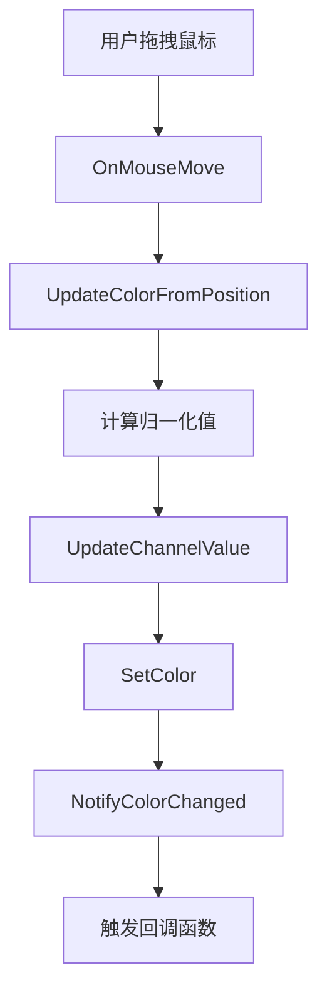

# UIColorPicker 颜色选择器使用指南

## 概述

`UIColorPicker` 是一个支持交互式颜色选择的 UI 控件，参考了 Blender 的颜色选择器实现。支持 RGB 颜色空间，提供直观的颜色预览和通道拖拽调节功能。

## 功能特性

- ✅ **RGB 颜色选择**: 支持红、绿、蓝三个颜色通道的独立调节
- ✅ **Alpha 通道支持**: 可选显示和调节透明度通道
- ✅ **颜色预览**: 实时显示当前选中的颜色
- ✅ **鼠标拖拽交互**: 支持通过鼠标拖拽调节颜色通道值
- ✅ **回调通知**: 颜色变化时触发回调函数
- ✅ **HSV 转换**: 内置 RGB 与 HSV 颜色空间转换函数
- ✅ **主题系统集成**: 自动适配 UI 主题

## 基本使用

### 1. 创建颜色选择器

```cpp
#include "render/ui/widgets/ui_color_picker.h"

// 创建颜色选择器
auto colorPicker = std::make_unique<UI::UIColorPicker>("myColorPicker");

// 设置初始颜色（RGBA，范围 0.0 - 1.0）
colorPicker->SetColor(Color(0.2f, 0.6f, 0.9f, 1.0f));

// 设置尺寸（可选，有默认值）
colorPicker->SetPreferredSize(Vector2(300.0f, 200.0f));
```

### 2. 配置显示选项

```cpp
// 显示颜色预览块（默认：true）
colorPicker->SetShowPreview(true);

// 显示 Alpha 通道（默认：false）
colorPicker->SetShowAlpha(true);

// 设置颜色模式（默认：RGB，HSV 模式尚未完全实现）
colorPicker->SetColorMode(UI::UIColorPicker::ColorMode::RGB);
```

### 3. 设置颜色变化回调

```cpp
// 设置颜色变化回调
colorPicker->SetOnChanged([](UI::UIColorPicker& cp, const Color& color) {
    Logger::GetInstance().InfoFormat(
        "[ColorPicker] 颜色已更改为: R=%.2f, G=%.2f, B=%.2f, A=%.2f",
        color.r, color.g, color.b, color.a
    );
    
    // 在这里处理颜色变化事件
    // 例如：更新材质颜色、更新灯光颜色等
});
```

### 4. 添加到 UI 树

```cpp
// 将颜色选择器添加到父容器
parentWidget->AddChild(std::move(colorPicker));
```

## 交互方式

### 颜色通道区域布局

颜色选择器界面分为以下几个交互区域：

```
┌──────────────────────────────────────┐
│ ┌────┐                               │
│ │预览│ R: 0.20  [========░░░░░░]     │  ← 红色通道
│ │色块│ G: 0.60  [==================] │  ← 绿色通道
│ └────┘ B: 0.90  [=====================] │  ← 蓝色通道
│        A: 1.00  [=======================] │  ← Alpha通道（可选）
└──────────────────────────────────────┘
```

### 鼠标操作

1. **点击预览色块**: 预留接口，未来可打开完整颜色选择面板
2. **拖拽颜色通道**: 
   - 在 R/G/B/A 通道区域按住鼠标左键并拖动
   - 水平拖动调节该通道的值（0.0 - 1.0）
   - 实时更新颜色预览和数值显示

### 键盘操作

暂不支持键盘操作（未来版本可能添加）

## API 参考

### 颜色设置

```cpp
// 设置 RGBA 颜色
void SetColor(const Color& color);
void SetRGBA(float r, float g, float b, float a);
void SetRGB(float r, float g, float b);  // Alpha 保持不变

// 获取颜色
const Color& GetColor() const;
float GetR() const;
float GetG() const;
float GetB() const;
float GetA() const;
```

### 显示配置

```cpp
// 是否显示 Alpha 通道
void SetShowAlpha(bool showAlpha);
bool IsShowAlpha() const;

// 是否显示颜色预览块
void SetShowPreview(bool showPreview);
bool IsShowPreview() const;

// 设置颜色模式（RGB/HSV）
void SetColorMode(ColorMode mode);
ColorMode GetColorMode() const;
```

### 状态查询

```cpp
// 是否鼠标悬停
bool IsHovered() const;

// 是否正在拖拽
bool IsDragging() const;

// 是否启用
bool IsEnabled() const;
```

### 回调设置

```cpp
// 设置颜色变化回调
using ChangeHandler = std::function<void(UIColorPicker&, const Color&)>;
void SetOnChanged(ChangeHandler handler);
```

## 完整示例

### 示例 1: 基础材质颜色编辑器

```cpp
// 创建颜色选择器用于材质颜色编辑
auto materialColorPicker = std::make_unique<UI::UIColorPicker>("materialColor");
materialColorPicker->SetColor(Color(0.8f, 0.2f, 0.2f, 1.0f));
materialColorPicker->SetShowPreview(true);
materialColorPicker->SetShowAlpha(false);

// 绑定到材质
auto* material = GetCurrentMaterial();
materialColorPicker->SetOnChanged([material](UI::UIColorPicker& cp, const Color& color) {
    if (material) {
        material->SetDiffuseColor(color);
        Logger::GetInstance().Info("[Material] 漫反射颜色已更新");
    }
});

panel->AddChild(std::move(materialColorPicker));
```

### 示例 2: 带透明度的光源颜色编辑器

```cpp
// 创建颜色选择器用于光源颜色编辑
auto lightColorPicker = std::make_unique<UI::UIColorPicker>("lightColor");
lightColorPicker->SetColor(Color(1.0f, 0.9f, 0.7f, 0.8f));
lightColorPicker->SetShowPreview(true);
lightColorPicker->SetShowAlpha(true);  // 显示 Alpha 通道
lightColorPicker->SetPreferredSize(Vector2(350.0f, 220.0f));

// 绑定到光源
auto* light = GetCurrentLight();
lightColorPicker->SetOnChanged([light](UI::UIColorPicker& cp, const Color& color) {
    if (light) {
        light->SetColor(Vector3(color.r, color.g, color.b));
        light->SetIntensity(color.a);  // Alpha 用作强度
        Logger::GetInstance().InfoFormat(
            "[Light] 颜色: (%.2f, %.2f, %.2f), 强度: %.2f",
            color.r, color.g, color.b, color.a
        );
    }
});

panel->AddChild(std::move(lightColorPicker));
```

### 示例 3: 在现有示例中的使用

颜色选择器已集成到 `examples/60_ui_framework_showcase.cpp` 示例中：

```cpp
// 在 UIRuntimeModule 中的使用示例
auto colorPicker = std::make_unique<UI::UIColorPicker>("ui.panel.colorPicker");
colorPicker->SetColor(Color(0.2f, 0.6f, 0.9f, 1.0f));
colorPicker->SetShowPreview(true);
colorPicker->SetShowAlpha(false);
colorPicker->SetOnChanged([](UI::UIColorPicker& cp, const Color& color) {
    Logger::GetInstance().InfoFormat(
        "[UIRuntimeModule] ColorPicker '%s' color changed to (%.2f, %.2f, %.2f, %.2f)",
        cp.GetId().c_str(), color.r, color.g, color.b, color.a
    );
});

advancedControlsRow->AddChild(std::move(colorPicker));
```

运行示例：
```bash
# 编译并运行
cmake --build build --config Debug --target 60_ui_framework_showcase
./build/bin/Debug/60_ui_framework_showcase.exe
```

## 渲染效果

颜色选择器的渲染由 `UIRendererBridge` 自动处理：

- **颜色预览块**: 使用圆角矩形渲染，显示当前颜色
- **RGB 数值**: 使用文本渲染，显示精确的颜色值
- **边框**: 使用主题系统的轮廓颜色
- **悬停效果**: 鼠标悬停时改变边框颜色

## 内部实现

### 交互区域检测

```cpp
// 颜色选择器将控件区域划分为多个交互区域
enum class InteractionZone {
    None,          // 无交互区域
    Preview,       // 颜色预览块
    RedChannel,    // 红色通道
    GreenChannel,  // 绿色通道
    BlueChannel,   // 蓝色通道
    AlphaChannel   // Alpha 通道
};

// 根据鼠标位置判断交互区域
InteractionZone GetZoneAtPosition(const Vector2& position) const;
```

### 颜色更新流程



### HSV 转换（预留接口）

```cpp
// RGB 转 HSV
void RGBToHSV(float r, float g, float b, float& h, float& s, float& v) const;

// HSV 转 RGB
void HSVToRGB(float h, float s, float v, float& r, float& g, float& b) const;
```

## 限制和注意事项

1. **颜色模式**: 当前仅完整支持 RGB 模式，HSV 模式的转换函数已实现但未集成到 UI 交互中
2. **颜色精度**: 颜色值使用浮点数表示（0.0 - 1.0），显示时保留两位小数
3. **拖拽范围**: 鼠标拖拽超出控件范围时会继续更新颜色（通过 OnMouseMove 持续触发）
4. **性能**: 每次拖拽都会触发回调和重新渲染，频繁的回调可能影响性能

## 下一步改进（参考设计文档）

根据 `UI_SYSTEM_BLENDER_REFERENCE_UPDATE_PLAN.md`，未来版本计划：

- [ ] 完整的 HSV 颜色选择器（色相环 + 饱和度/明度矩形）
- [ ] 颜色历史记录（最近使用的颜色）
- [ ] 颜色预设（常用颜色面板）
- [ ] 十六进制颜色输入
- [ ] 颜色吸管工具（从屏幕取色）
- [ ] 颜色选择面板（弹出式完整编辑器）
- [ ] 键盘输入支持（直接输入数值）

## 相关文档

- [UI 系统 Blender 参考更新计划](../application/UI_SYSTEM_BLENDER_REFERENCE_UPDATE_PLAN.md)
- [UI 框架基础设施文档](../guides/UI_FRAMEWORK_FOUNDATION_PLAN.md)
- Blender 源码参考: `third_party/blender/source/blender/editors/interface/regions/interface_region_color_picker.cc`

## 故障排查

### 问题：颜色选择器不响应鼠标拖拽

**解决方案**:
1. 确保 `InputModule` 已注册并正常工作
2. 确保 `UIInputRouter` 正确设置了 `WidgetTree`
3. 检查控件是否启用 (`IsEnabled()`)
4. 检查控件是否被其他控件遮挡

### 问题：颜色变化回调未触发

**解决方案**:
1. 确保已通过 `SetOnChanged()` 设置回调函数
2. 检查颜色值是否真的发生了变化（内部有 0.001f 的阈值判断）
3. 确认拖拽的是通道区域而非预览块

### 问题：颜色显示不正确

**解决方案**:
1. 确认颜色值范围是 0.0 - 1.0（而非 0 - 255）
2. 检查主题系统是否正确初始化
3. 查看渲染日志确认渲染命令是否正确生成

## 总结

`UIColorPicker` 提供了一个功能完整的颜色选择解决方案，支持：
- ✅ 直观的交互方式
- ✅ 实时颜色预览
- ✅ 灵活的配置选项
- ✅ 完整的回调机制
- ✅ 主题系统集成

现在就可以在你的 UI 中使用颜色选择器了！

